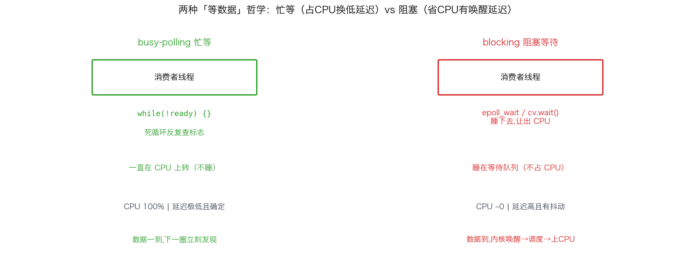
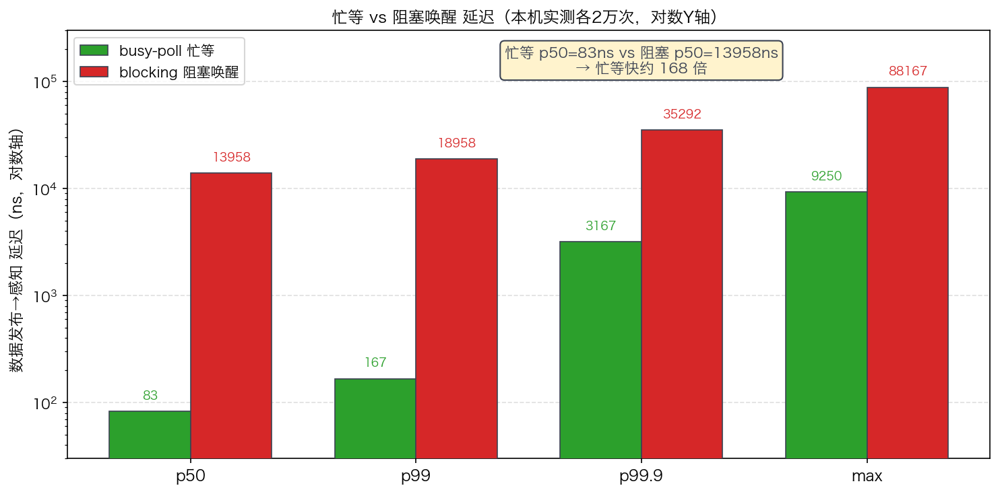
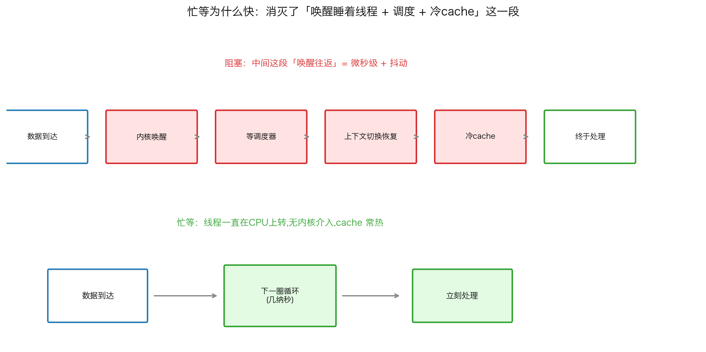
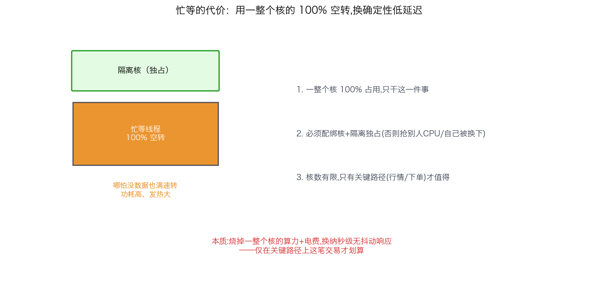

## busy-polling 忙等 vs 阻塞：用 CPU 换确定性低延迟

> 阶段 O4 · 中断与内核旁路 ｜ 难度 🔴 硬核 ｜ 档位 A·低延迟核心
> 出处级别：忙等/阻塞唤醒的调度延迟差为**本机实测**（Apple Silicon，复现脚本见文末）；epoll/内核唤醒机制由 Linux man 手册一手定义。
> **面试分水岭题**：「忙等（busy-polling）为什么比 epoll 阻塞延迟低？代价是什么？」——这题答得好不好，直接区分"看过书"和"做过真实低延迟系统"。

---

### 一、两种"等数据"的方式

交易系统里，消费者线程要等生产者的数据（行情线程等网卡的包、策略线程等行情）。怎么"等"，有两种根本不同的哲学：

| | busy-polling（忙等/忙轮询） | blocking（阻塞等待） |
|---|---|---|
| 怎么等 | `while(!ready) {}` 死循环反复查标志 | `epoll_wait` / `cv.wait()` 睡下去，让出 CPU |
| CPU 占用 | **100%**（一直空转） | 几乎 0（睡着不占 CPU） |
| 数据来了 | 下一圈循环立刻发现 | 内核**唤醒**它：从睡眠→就绪→被调度回 CPU |
| 延迟 | **极低且确定** | 高且有抖动（含调度延迟） |
| 适用 | 交易关键线程 | 普通服务、非热路径 |

阻塞是常规编程的默认选择——省 CPU、优雅。但低延迟系统偏偏反其道用忙等。为什么？看实测。

---

### 二、实测：忙等到底快多少

我在本机做了对照实验：生产者每隔 80µs 发布一个带时间戳的数据，消费者分别用忙等和阻塞（`condition_variable`）两种方式感知，测「数据发布 → 消费者感知到」的延迟（**本机真实数据，各 2 万次**）：

| 方式 | p50（中位数） | p99 | p99.9 | max |
|---|---|---|---|---|
| **busy-poll 忙等** | **83 ns** | 167 ns | 3167 ns | 9250 ns |
| **blocking 阻塞唤醒** | **13958 ns（14 µs）** | 18958 ns | 35292 ns | 88167 ns |

**忙等的中位数 83ns，阻塞的中位数 13958ns——忙等快了约 168 倍。** 而且不只是中位数，各个分位、乃至最坏情况，忙等都碾压阻塞。

**这 14µs 的差距从哪来？** 阻塞唤醒的代价链条：数据来 → 内核标记消费者线程"可运行" → 等调度器下次调度 → 线程从睡眠状态恢复上 CPU（含上下文切换 + 冷 cache，正是 O2 那 1.2µs）。这一整套"唤醒往返"是微秒级的，且**取决于调度器什么时候翻你的牌**——所以还带抖动。忙等完全没有这个链条：线程本来就在 CPU 上转圈，数据一到，下一圈就看见了。

---

### 三、忙等为什么快：没有"唤醒"这个动作

核心洞见:**阻塞的延迟大头不是"检查数据"，是"把睡着的线程弄醒并弄回 CPU"这个动作。** 忙等把这个动作彻底消灭了。

- **阻塞**：线程睡在等待队列里，不在 CPU 上。数据来了要经历"内核唤醒 → 调度 → 上下文切换恢复 → 冷 cache"，微秒级且抖动。
- **忙等**：线程一直霸占着 CPU 空转，寄存器、cache 全是热的。数据一到，下一次循环迭代（几纳秒）就发现了，无需任何内核介入。

忙等还有个额外好处:**cache 一直是热的**。阻塞线程被换下去期间，它的数据可能被别的线程从 cache 挤掉，唤醒后第一次访问都是 cache miss；忙等线程独占核、cache 常驻，处理数据时直接命中。

---

### 四、代价：CPU 100% 空转，且必须配绑核

天下没有免费的低延迟。忙等的代价很实在:

1. **一整个 CPU 核 100% 占用**：忙等线程死循环，哪怕没数据也在满速空转。这个核**只能干这一件事**，功耗高、发热大。
2. **必须配绑核 + 核隔离**：忙等线程必须钉死在一个隔离核上独占（O2）。否则:① 它会和别的线程抢 CPU，把别人饿死;② 它自己被调度器换下去，忙等就失去意义了。
3. **不能滥用**：核数有限，只有**真正的关键路径线程**（行情接收、下单）才值得为它牺牲一整个核。普通线程、非热路径老老实实用阻塞。

**这就是"用 CPU 换确定性低延迟"的本质**:你烧掉一整个核的算力（和电费），换来纳秒级、无抖动的响应。在高频交易里，一个核的成本 vs 抢到价格的收益，这笔账划算——但也仅在关键路径上划算。

> 进阶:忙等常和 **kernel bypass**（O4-22）配合到极致——用户态直接忙轮询网卡的接收队列（DPDK/Solarflare onload），数据从网卡 DMA 到用户态内存，忙等线程死循环检查队列，**连中断和内核协议栈都绕过**，把 tick 感知延迟压到极限。忙等是 kernel bypass 收包模型的核心。

---

### 五、面试怎么答（分水岭题）

被问"忙等为什么比 epoll 延迟低、代价是什么"，这样答满分:

1. **快在哪**：阻塞的延迟大头是"唤醒往返"——内核唤醒睡着的线程 + 调度 + 上下文切换恢复 + 冷 cache，微秒级且抖动（可引本课实测忙等 83ns vs 阻塞 14µs，差 168 倍）。忙等线程一直在 CPU 上转，数据一到下一圈就看见，无内核介入。
2. **额外好处**:忙等线程 cache 常驻热的，阻塞唤醒后往往冷 cache。
3. **代价**:一整个核 100% 空转，功耗高;必须配绑核+隔离独占一个核，否则抢别人 CPU 或自己被换下。
4. **边界**:只有关键路径（行情/下单）值得，普通线程用阻塞。核数有限不能滥用。
5. **进阶**:和 kernel bypass 配合——用户态忙轮询网卡队列，绕过中断和协议栈，延迟压到极限。

> 一句话记牢:**「忙等快，是因为消灭了『唤醒睡着线程 + 调度 + 冷 cache』这个微秒级往返——线程一直在核上转，数据到了下一圈就见。代价是烧掉一整个核 100% 空转、必须绑核独占，只在关键路径上用这笔交易才划算。」**

---

### 六、和其他知识点的关系

- **上游**:O2-8/9 绑核隔离（忙等的前提——必须独占一个隔离核）、O2-7 上下文切换开销（阻塞唤醒延迟的组成）、O1-4 epoll（阻塞方的代表）。
- **配套/进阶**:O4-22 kernel bypass、O4-24 DPDK（忙等是用户态收包的核心模型）、O4-23 Solarflare onload。
- **呼应**:O8-47 tail latency（忙等换的正是确定的尾部延迟）、O5-30 tick-to-trade（忙轮询网卡队列压 T2T 起点）。

---

### 证据清单

| 声明 | 来源 | 级别 |
|---|---|---|
| 忙等 p50=83ns / 阻塞 cv p50=13958ns，忙等快约 168 倍 | 本机 benchmark 实测（`scripts/bench_busypoll.cpp`，Apple Silicon） | 一手（本机实测） |
| 阻塞唤醒延迟含内核唤醒+调度+上下文切换恢复+冷 cache | Linux 调度/futex 唤醒机制 + O2 上下文切换实测 | 一手（内核机制）+ 本机实测交叉印证 |
| epoll_wait/condition_variable 阻塞让出 CPU，数据到达由内核唤醒 | Linux man7 `epoll_wait(2)` + C++ `condition_variable` cppreference | 一手（手册+标准） |
| 忙等占满一个核 100% CPU，需绑核独占 | 领域公认（忙轮询设计常识）+ O2 绑核章节 | 领域公认 |
| 忙等是 kernel bypass（DPDK/onload）用户态收包的核心模型 | DPDK/Solarflare onload 官方文档（poll-mode driver） | 一手（库文档） |
| 「要求到 A 档才考」的深度标定 | 领域经验判断，非真实 JD 原文 | 经验归纳 |
