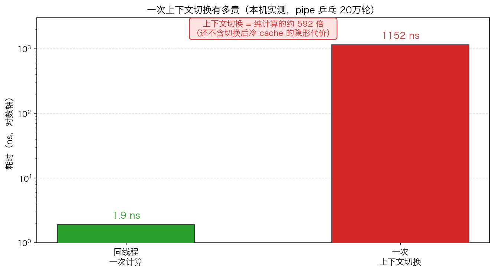
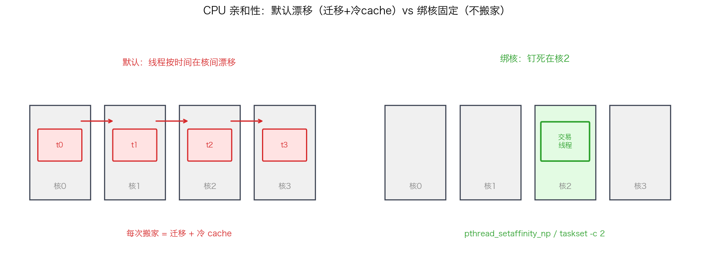
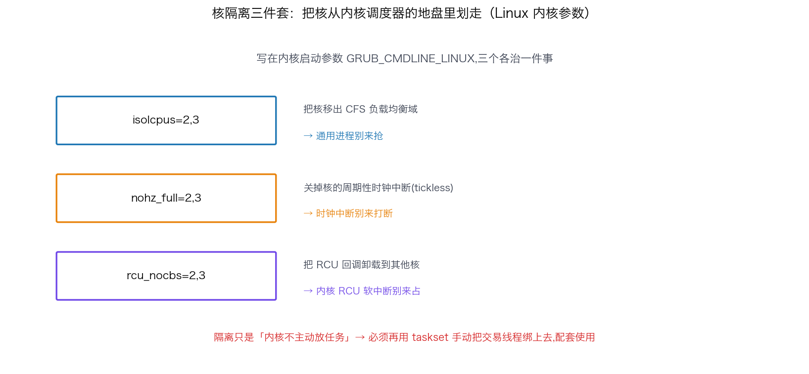
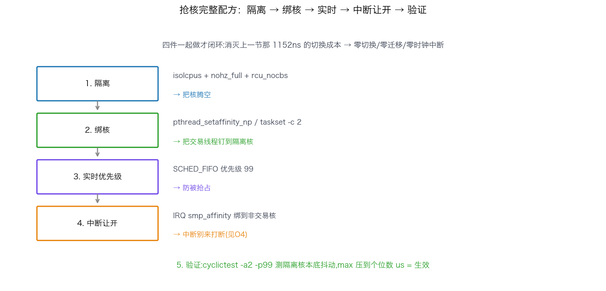

## CPU 亲和性与核隔离：把交易核从内核调度器手里抢出来

> 阶段 O2 · 进程调度与 CPU ｜ 难度 🔴 硬核 ｜ 档位 A·低延迟核心
> 出处级别：`sched_setaffinity`/`isolcpus`/`nohz_full`/`SCHED_FIFO` 由 Linux 内核文档与 man7 手册页一手定义；上下文切换开销为**本机实测**（Apple Silicon，复现脚本见文末）。**本机为 macOS，绑核/隔离命令为 Linux 标准用法，未在本机执行，已诚实标注。**
> **面试必考题**：「怎么把一个线程钉死在固定核上、让内核别来打扰它？」——绑核 + 核隔离是低延迟系统的绝对地基，答不上直接出局。

---

### 一、先算一笔账：一次上下文切换有多贵

低延迟系统最怕的不是"算得慢",是"算到一半被打断"。线程被调度器换下 CPU、过一会儿再换回来,这个动作叫**上下文切换（context switch）**。它到底多贵?我在本机实测了一下（**本机真实数据**）:

用一对 pipe 让两个线程乒乓传 1 字节,每传一次强制一次上下文切换,测 20 万轮:

| 项目 | 耗时 |
|---|---|
| 一次上下文切换 | **约 1152 ns** |
| 对照：同线程一次定量计算 | 1.9 ns |
| **切换 / 计算 倍数** | **约 592 倍** |



**一次切换约 1.2 微秒,是一次纯计算的近 600 倍。** 而且这 1152ns 只是直接成本(保存/恢复寄存器 + 调度器决策 + syscall)。**真正的隐形杀手是切换后的「冷 cache」**:线程换回来时,它之前热在 L1/L2 里的数据可能已被别的线程挤掉,接下来的访存全是 cache miss——这部分代价不体现在切换本身的计时里,但会拖慢切换之后的一大段执行。

结论很硬:**对交易关键线程,目标是「零上下文切换」。** 而要做到零切换,就得把这个核从内核调度器手里彻底抢出来——这就是绑核 + 核隔离要干的事。

---

### 二、第一步:CPU 亲和性——把线程钉死在一个核上

默认情况下,Linux 的 CFS 调度器会为了"公平"把你的线程在多个核之间搬来搬去(load balancing)。每次搬家 = 一次迁移 + 冷 cache。**CPU 亲和性（affinity）就是告诉内核:这个线程只准在指定的核上跑,别搬。**



三种设置方式:

```bash
# 1. 命令行启动时绑：taskset 把进程绑到 2、3 号核
taskset -c 2,3 ./trading_app

# 2. 对运行中的进程/线程绑
taskset -cp 2 <PID>
```

```cpp
// 3. 代码里绑当前线程到 2 号核（最精确，可按线程分别绑）
cpu_set_t set;
CPU_ZERO(&set);
CPU_SET(2, &set);
pthread_setaffinity_np(pthread_self(), sizeof(set), &set);
```

绑核解决了"别搬家",但还不够——**别的进程、内核线程、中断,依然可能被调度到这个核上来抢你。** 光绑核,你只是"优先"在这个核跑,不是"独占"。

---

### 三、第二步:核隔离——把核从调度器的地盘里划走

要做到真正独占,得在内核启动参数里把核"隔离"出去。这是一组组合拳,写在 `/etc/default/grub` 的 `GRUB_CMDLINE_LINUX`:



```
isolcpus=2,3 nohz_full=2,3 rcu_nocbs=2,3
```

三个参数各治一件事:

| 参数 | 作用 | 治什么 |
|---|---|---|
| **`isolcpus=2,3`** | 把 2、3 号核从 CFS 调度器的负载均衡域里移除——内核默认不再往这俩核上放任何任务 | 通用进程别来抢 |
| **`nohz_full=2,3`** | 关掉这俩核的周期性时钟中断（tickless）。默认每个核每秒有几百次时钟中断打断你 | 时钟中断别来打断 |
| **`rcu_nocbs=2,3`** | 把 RCU 回调处理从这俩核卸载到别的核 | 内核 RCU 软中断别来占 |

隔离之后,这俩核变成"干净核"——内核不主动往上放东西。你再用 `taskset` 把交易线程手动绑上去,它就几乎独享这个核。

> **关键顺序**:`isolcpus` 只是让内核"不主动放任务",不是"禁止你放"。所以隔离 + 手动绑核是配套的:隔离把核腾空,绑核把交易线程放进去。少了绑核,隔离出来的核就闲置了。

---

### 四、第三步:实时调度类——防止被抢占

即便绑了核、隔离了,某些内核线程或高优先级任务偶尔仍可能上来。最后一道保险是把交易线程设成**实时调度类**,优先级高到几乎不会被抢占:

```cpp
struct sched_param param;
param.sched_priority = 99;                    // 实时优先级 1-99
pthread_setschedparam(pthread_self(), SCHED_FIFO, &param);
// SCHED_FIFO：先进先出实时策略，除非自己让出或被更高优先级抢，否则一直跑
```

- **`SCHED_FIFO`**:实时先进先出。一旦这个线程就绪,除非它自己阻塞/让出,或有更高优先级的实时线程,否则调度器不会把它换下来。
- **`SCHED_RR`**:实时轮转,同优先级的实时线程之间时间片轮转。

> **危险提示**:`SCHED_FIFO` + 高优先级 + 死循环忙等 = 这个核被你**完全霸占**,连内核关键任务都可能饿死。所以必须配合核隔离(把它关在隔离核上,别影响系统核),且要留好退出机制。这也是为什么绑核/隔离/实时调度是**一整套**,不能只用其中一个。

---

### 五、四步组合:完整的"抢核"配方

把上面串成一套低延迟系统的标准做法:



1. **隔离**（启动参数）:`isolcpus=2,3 nohz_full=2,3 rcu_nocbs=2,3` 把核腾空。
2. **绑核**（代码/taskset）:`pthread_setaffinity_np` 把交易线程钉到隔离核 2。
3. **实时优先级**（代码）:`SCHED_FIFO` 优先级 99,防被抢占。
4. **中断也要让开**（配套）:把网卡中断绑到非隔离核(见 O4 中断亲和性那节),否则中断还是会来打断——绑核和中断亲和性要一起做才闭环。
5. **验证**:`cyclictest -a2 -p99` 在隔离核上测本底抖动,看 max 是否压到个位数微秒(见 O7/O8)。

做完这套,交易线程在它的独占核上几乎"零切换、零迁移、零时钟中断",上一节那 1152ns 的切换成本被彻底消灭。

---

### 六、面试怎么答

被问"怎么把线程钉死在核上、让内核别打扰",按"为什么→四步→验证"答:

1. **动机**:上下文切换约 1µs 且带冷 cache 代价(可引本课实测的 592 倍),交易线程要零切换。
2. **绑核**:`sched_setaffinity`/`pthread_setaffinity_np`/`taskset`,让线程不在核间漂移。
3. **隔离**:`isolcpus`(移出负载均衡)+ `nohz_full`(关时钟中断)+ `rcu_nocbs`(卸 RCU),把核腾空。
4. **实时**:`SCHED_FIFO` 高优先级防抢占,但要警惕霸占整核、必须配隔离。
5. **配套**:中断亲和性把 IRQ 赶到别的核,否则功亏一篑。
6. **验证**:`cyclictest` 测隔离核本底抖动确认生效。

> 一句话记牢:**「绑核让线程不漂移、isolcpus/nohz_full/rcu_nocbs 把核腾空、SCHED_FIFO 防抢占、中断亲和性把 IRQ 赶走——四件一起做,才能把交易核从调度器手里真正抢出来,实现零切换。」**

---

### 七、和其他知识点的关系

- **上游**:O2-6 CFS 调度器（理解默认为什么会漂移和引入抖动）、O2-7 上下文切换开销（本课的动机基础）。
- **配套**:O4-20 中断亲和性（把中断赶到非交易核，与绑核互补，缺一不可）、O3 内存预热（绑核后还要防缺页，见内存那节）。
- **验证/呼应**:O7-41 延迟尖峰溯源（调度抢占正是三大凶手之一，本课是其治本手段）、O8-48 系统级抖动消除清单（本课是清单里的核心几项）。

---

### 证据清单

| 声明 | 来源 | 级别 |
|---|---|---|
| 上下文切换约 1152ns、是纯计算的 592 倍 | 本机 benchmark 实测（`scripts/bench_ctxsw.cpp`，Apple Silicon） | 一手（本机实测） |
| `sched_setaffinity`/`pthread_setaffinity_np` 绑定线程到指定 CPU | Linux man7 `sched_setaffinity(2)`/`pthread_setaffinity_np(3)` | 一手（手册页） |
| `isolcpus` 将 CPU 移出调度器负载均衡域 | Linux 内核 `kernel-parameters.txt` | 一手（内核文档） |
| `nohz_full` 关闭指定核周期性时钟中断（tickless） | Linux 内核 `Documentation/timers/no_hz.rst` | 一手（内核文档） |
| `rcu_nocbs` 卸载 RCU 回调到其他核 | Linux 内核 RCU 文档 | 一手（内核文档） |
| `SCHED_FIFO` 实时先进先出、除非让出/被更高优先级抢否则不被换下 | Linux man7 `sched(7)` | 一手（手册页） |
| 上下文切换伴随冷 cache 代价 | 计算机体系结构公认硬知识 | 领域公认 |
| **绑核/隔离命令本机未执行**（macOS 无 isolcpus/taskset/SCHED_FIFO 语义） | 平台限制声明 | 诚实标注 |
| 「要求到 A 档才考」的深度标定 | 领域经验判断，非真实 JD 原文 | 经验归纳 |
