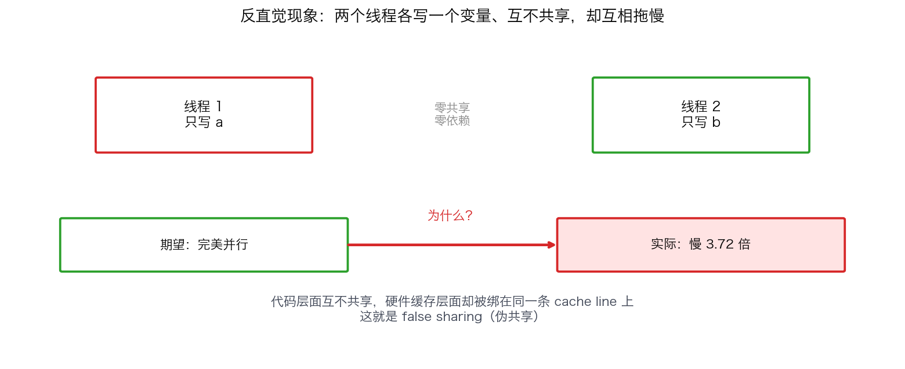
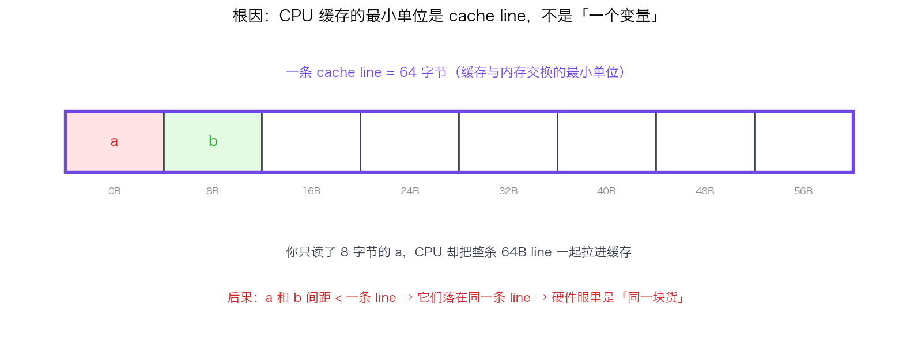
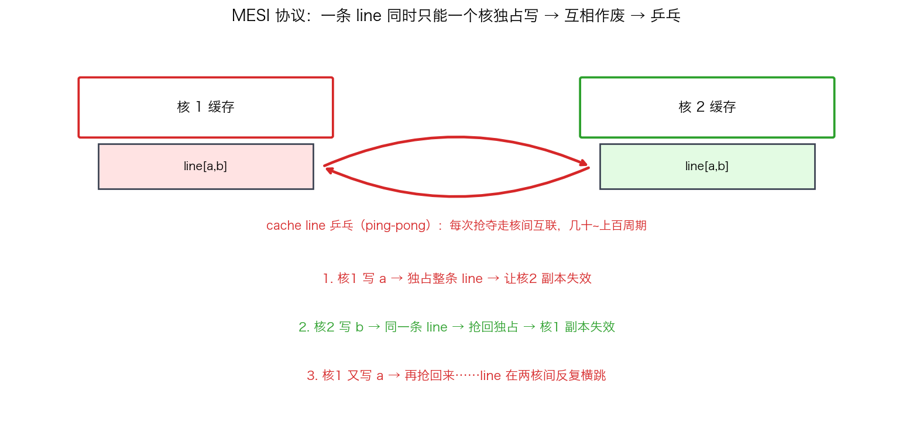
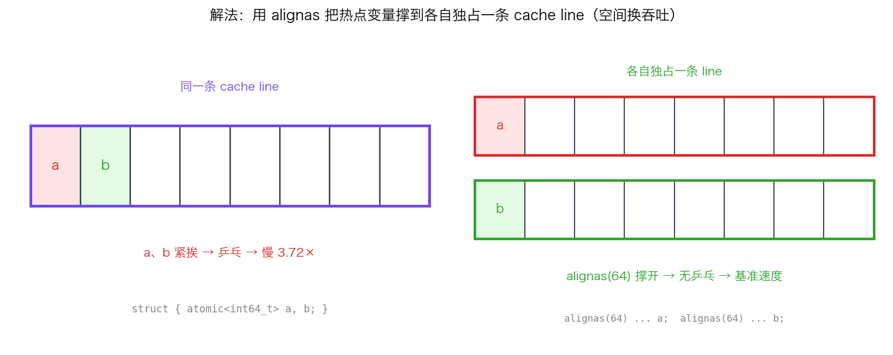
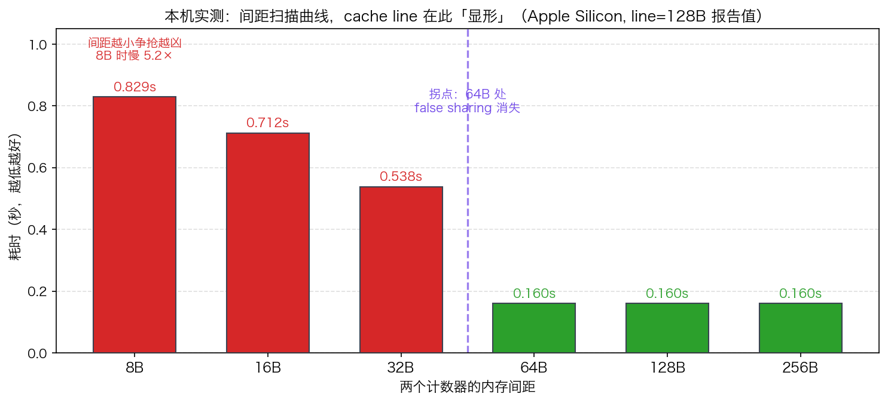

## False Sharing 与 Cache Line 对齐：两个线程各写一个变量为什么会变慢

> 阶段 C4 · 内存模型与并发 ｜ 难度 🔴 硬核 ｜ 档位 A·低延迟核心
> 出处级别：cache line 64B / `alignas(64)` / `hardware_destructive_interference_size` 由 cppreference 标准库条目与 Erik Rigtorp《Correctly implementing a ring buffer》一手确认；MESI 缓存一致性为体系结构公认硬知识。本课所有性能数字均为**本机实测**（Apple Silicon，复现脚本见文末），非引用、非估算。
> **面经高频题**：「两个线程各自只写一个变量、互不共享数据，为什么还是变慢了？」——能答 false sharing 并说清 cache line 粒度，是区分「写过多线程」和「写过高性能多线程」的分水岭。

---

### 一、一个反直觉的现象：互不共享，却互相拖慢

先看一段代码。两个线程，一个只加 `a`，一个只加 `b`，**它们碰都没碰对方的变量**：

```cpp
struct Counters {
    std::atomic<int64_t> a{0};   // 线程 1 专用
    std::atomic<int64_t> b{0};   // 线程 2 专用
};

Counters c;
std::thread t1([&]{ for (int64_t i=0;i<N;++i) c.a.fetch_add(1, std::memory_order_relaxed); });
std::thread t2([&]{ for (int64_t i=0;i<N;++i) c.b.fetch_add(1, std::memory_order_relaxed); });
```

从程序逻辑看，这是「完美并行」：两个线程零共享、零依赖，理应各跑各的、互不影响。但实测下来，它比「把 `a`、`b` 拆开放」的版本**慢了 3.7 倍**。

明明没有共享任何数据，性能却像在抢同一把锁。这就是 **false sharing（伪共享）**——「假的」共享。变量在代码层面不共享，但在**硬件缓存层面**被绑在了一起。



---

### 二、根因：CPU 缓存的最小单位不是「变量」，是「cache line」

要理解 false sharing，先得放下一个错误的直觉：**CPU 不是按「一个变量」为单位在缓存里搬运数据的。**

CPU 和内存之间隔着多级缓存（L1/L2/L3）。缓存与内存交换数据的**最小单位是一条 cache line**——一块连续的、地址对齐的内存，典型大小 **64 字节**（本机 Apple Silicon 是 128 字节，x86 服务器普遍 64 字节）。你读一个 8 字节的 `int64_t`，CPU 实际会把它所在的**整条 64B line** 一起拉进缓存。



关键后果：**如果 `a` 和 `b` 两个变量在内存里挨得很近（间距 < 一条 line），它们就会落在同一条 cache line 上。** 此时这两个变量在硬件眼里是「同一块货」——缓存系统没法只同步其中一个。

---

### 三、MESI：为什么「同一条 line」会导致互相作废

多核 CPU 用 **缓存一致性协议**（最经典的是 MESI）保证各个核看到的内存是一致的。它的核心规则只有一条你需要记住：

> **一条 cache line 在任意时刻，只能有一个核持有它的「可写」副本（Modified/Exclusive 状态）。一个核要写某条 line，必须先让所有其他核里这条 line 的副本失效（Invalidate）。**

现在把这条规则套到 false sharing 上：



1. 核 1 要写 `a` → 它必须独占 `a` 所在的那条 line → 通知核 2「你那份副本作废」。
2. 核 2 要写 `b` → 但 `b` 和 `a` **在同一条 line** → 核 2 必须把这条 line 重新抢回来、独占 → 反过来让核 1 的副本作废。
3. 核 1 下一次写 `a` 又要抢回来……

这条 line 就在两个核的缓存之间**反复横跳**——业界叫 **cache line 乒乓（ping-pong）**。每一次抢夺都要走核间互联（甚至到 L3 / 内存控制器），代价是几十到上百个时钟周期。两个本该全速并行的线程，被这条共享 line 拖成了串行级的争抢。

**注意：`a` 和 `b` 的值从头到尾都是正确的**——MESI 保证了一致性。false sharing 不是正确性 bug，是**纯粹的性能塌方**：你为一个根本不存在的「逻辑共享」付出了真实的同步代价。

---

### 四、解法：用 padding / 对齐，把变量撑到各自独占一条 line

解法直白：**让 `a` 和 `b` 分别落在不同的 cache line 上**，乒乓就消失了。手段是对齐（alignment）——用 `alignas` 把每个变量按 cache line 大小对齐：

```cpp
struct Counters {
    alignas(64) std::atomic<int64_t> a{0};   // 独占一条 line
    alignas(64) std::atomic<int64_t> b{0};   // 独占另一条 line
};
```

`alignas(64)` 强制 `a` 的地址按 64 对齐，又强制 `b` 也按 64 对齐——于是 `b` 至少在 `a` 后面 64 字节，两者天然落到不同 line。代价是 `sizeof` 变大（本例从 16 字节涨到 128 字节）：**用空间换吞吐，在低延迟系统里这笔交易几乎永远划算。**

别再硬编码 64。C++17 给了标准常量：

```cpp
#include <new>
alignas(std::hardware_destructive_interference_size) std::atomic<int64_t> a{0};
```

`hardware_destructive_interference_size` = 「两个对象隔多远就不会 false sharing」的官方推荐值。它表达的是意图（避免破坏性干扰），比裸写 64 更可移植。



---

### 五、本机实测：拐点在哪、慢多少（都是真数字）

光说不练是耍流氓。我在本机（Apple Silicon，`hw.cachelinesize=128`）跑了两个实验，**以下全部是实测输出，复现脚本见文末**。

**实验一：相邻 vs 对齐**，两个 atomic 各自 `fetch_add` 2 亿次：

| 版本 | 布局 | 耗时 | 相对 |
|---|---|---|---|
| Packed | `a`、`b` 紧挨（间距 8B，同一条 line） | 1.184 s | **慢 3.72×** |
| Padded | `alignas(64)` 各占一条 line | 0.318 s | 基准 |

**实验二：扫描间距找拐点**，把两个计数器按不同间距摆放，看 false sharing 何时消失：

| 间距 | 耗时 | 是否还在 false sharing |
|---|---|---|
| 8 B | 0.829 s | 是（慢 5.2×） |
| 16 B | 0.712 s | 是 |
| 32 B | 0.538 s | 是 |
| **64 B** | **0.160 s** | **否（已消失）** |
| 128 B | 0.160 s | 否 |
| 256 B | 0.160 s | 否 |



两个值得记的观察：

1. **间距越小、争抢越凶**：8B 时慢 5.2 倍，随间距拉大单调缓解，到 64B 一刀切归零。这条曲线就是 cache line 在「显形」。
2. **一个反直觉的坑**：本机 `hw.cachelinesize` 报的是 **128**，但实测 **64B 间距就足以消除 false sharing**，而且这台机器的 `std::hardware_destructive_interference_size` 编译出来正好是 **64**。说明「报告的 line size」「一致性争用的有效粒度」「编译器给的干扰常量」三者**未必相等**——**所以结论永远来自实测，不是背一个数字。** 写跨平台代码用 `hardware_destructive_interference_size`，要榨极致就在目标机上扫一遍拐点。

---

### 六、量化场景：这刀砍在哪

false sharing 在交易系统里是**最隐蔽的性能杀手之一**，因为代码读起来「明明是并行的」。高发现场：

- **无锁队列的读写索引**：SPSC ring buffer 的 `writeIdx`（生产者写）和 `readIdx`（消费者写）若挨在一起，生产/消费线程会疯狂乒乓——这是 Rigtorp 的 ring buffer 文章里专门 `alignas` 隔开两个索引的原因（见 C4-21 SPSC 那节）。
- **每线程统计计数器**：行情处理条数、下单数等 per-thread 计数器若放在一个数组里紧挨，多个工作线程互相拖慢。正解是每个计数器对齐到独占 line，或干脆 thread_local。
- **多线程共享的状态结构体**：一个 struct 里几个字段被不同线程各写各的，无意中挤进同一条 line。

排查工具：`perf c2c`（cache-to-cache，专门定位 false sharing 的核间 line 争用）、`perf stat` 看 cache-miss 异常升高。验证修复用前后对比 benchmark（就像本课这样）。

---

### 七、面试怎么答 + 决策清单

被问「两个线程各写一个变量为什么变慢」，按这个顺序答，层层见功底：

1. **现象命名**：这是 false sharing。
2. **根因**：CPU 缓存以 cache line（典型 64B）为最小单位，两个变量挨太近会落在同一条 line。
3. **机制**：MESI 一致性协议下，一条 line 同时只能一个核独占可写，两个核各写各的变量会让这条 line 在核间乒乓、反复失效，每次走核间互联代价几十上百周期。
4. **强调**：值始终是对的，这不是正确性问题，是纯性能塌方。
5. **解法**：`alignas(std::hardware_destructive_interference_size)` 把热点变量撑到各自独占 line；用 `perf c2c` 定位。
6. **加分**：补一句「line size 别硬编码，不同架构不同（x86 多为 64，Apple Silicon 报 128），该实测拐点」——直接证明你真跑过。

> 一句话记牢：**false sharing = 逻辑上不共享、物理上共享一条 cache line，被 MESI 协议拖成核间乒乓。解法是对齐到独占 line，用空间换吞吐。**

---

### 八、和其他知识点的关系

- **上游**：C4-17 `std::atomic`（false sharing 在原子变量上最常见）、本课依赖对 cache line / MESI 的体系结构认知。
- **直接应用**：C4-21 SPSC ring buffer（读写索引必须分 line）、C4-22 MPMC/Disruptor（LMAX Disruptor 的核心优化之一就是消除 false sharing）。
- **OS 侧呼应**：O3-15 同一主题从内存管理角度再讲一遍（C++ 和 OS 两条线在此交汇）。
- **工具呼应**：C6-35 `perf`（`perf c2c` 定位）、C6-36 TSan（注意 TSan 查的是真竞争，不是 false sharing；false sharing 要用 perf）。

---

### 证据清单

| 声明 | 来源 | 级别 |
|---|---|---|
| cache line 典型 64B；`alignas(64)` 消除 false sharing | Erik Rigtorp《Correctly implementing a ring buffer》一手原文 | 一手（领域权威） |
| `std::hardware_destructive_interference_size` 语义（避免破坏性干扰的最小间距） | cppreference 标准库条目 | 一手（标准文档） |
| MESI 缓存一致性协议：一条 line 同时仅一个核可独占写，写需 invalidate 其他副本 | 计算机体系结构公认硬知识（Hennessy & Patterson 等教材级） | 领域公认 |
| 本机 `hw.cachelinesize=128`、`hardware_destructive_interference_size=64` | 本机 `sysctl` + 编译输出实测 | 一手（本机实测） |
| Packed vs Padded 慢 3.72×；间距扫描 64B 处拐点、8B 慢 5.2× | 本机 benchmark 实测（`scripts/bench_false_sharing.cpp`、`probe_cacheline.cpp`） | 一手（本机实测） |
| `perf c2c` 用于定位 false sharing | Linux perf 工具文档 | 一手（工具文档） |
| 「要求到 A 档才考」的深度标定 | 领域经验判断，非真实 JD 原文 | 经验归纳 |
