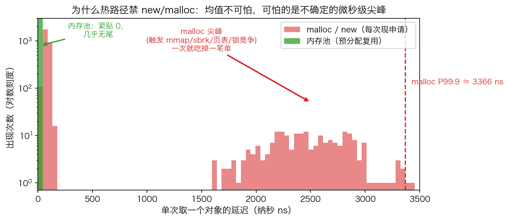
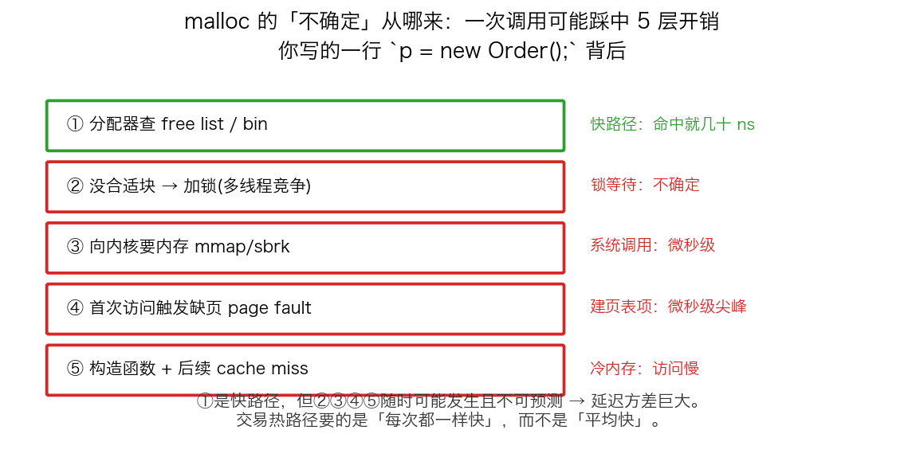
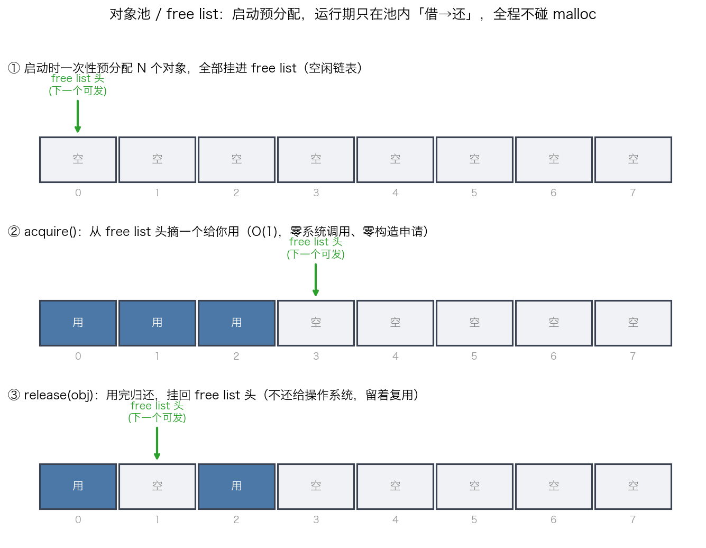
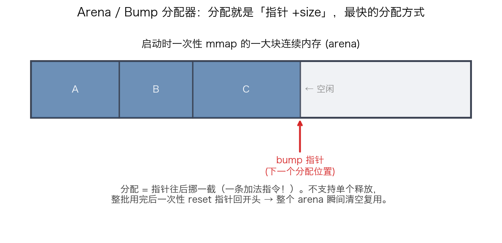
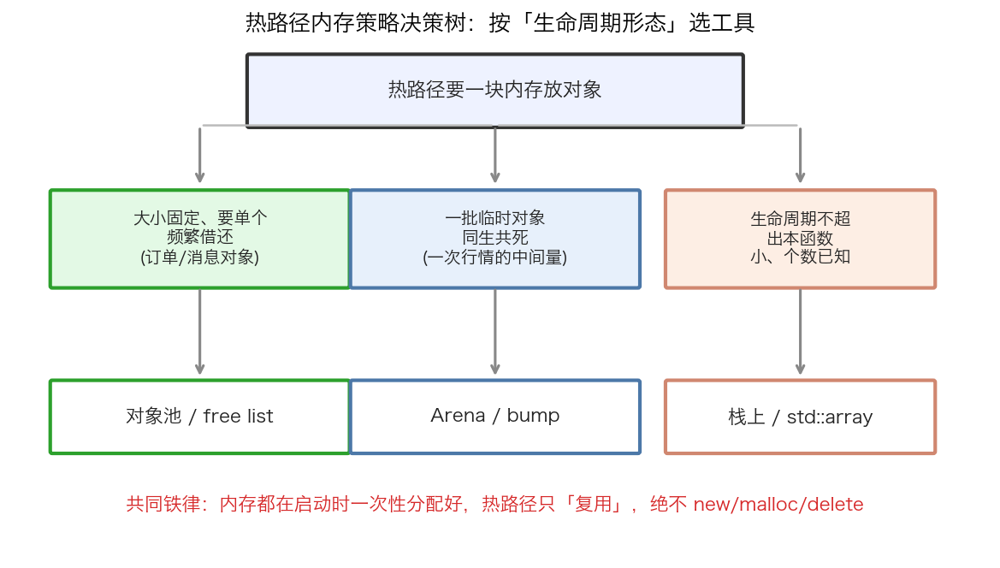

## 热路径零分配：为什么交易系统绝不在关键路径 new/malloc

> 阶段 C5 · 性能优化 ｜ 难度 🔴 硬核（必考）｜ 档位 A·低延迟核心 / B·HPC平台
> 出处级别：malloc 实现机制（glibc/jemalloc/tcmalloc 公开文档）+ 操作系统缺页/系统调用机制（man7 + Linux 内核文档）。文末附证据清单与级别。

---

### 一、一句话先把结论钉死

**在交易系统最在意延迟的那条链路（热路径）上，绝对禁止 `new` / `malloc` / `delete` / `free`，所有内存在程序启动时一次性分配好，运行期只「复用」。** 这是低延迟岗的工程铁律，也是面试高频题「如何在交易路径做到零分配」的标准答案起点。

为什么这么绝对？不是因为 malloc「慢」——它平均其实不慢。问题在于它**不确定**。

---

### 二、问题的本质：不是「慢」，是「方差大」

先看一张延迟分布图，对比「每次现申请」和「内存池预分配复用」：

绿色（内存池）紧贴 0、几乎没有尾巴；红色（malloc）大多数时候也不慢，**但拖着一条长尾，偶尔飙到微秒级**。

回到这个专栏反复强调的核心心智：**交易系统不在乎「平均多快」，在乎「最坏的那几次有多慢」**（P99.9 / P99.99 尾延迟）。因为最慢的那一次，可能正好是行情剧烈波动、你最想成交的那一刻——一次微秒级的卡顿，单子就被别人抢走、或者价格滑走了。malloc 平均 80ns 很好看，但它**偶发的 2-3 微秒尖峰**才是真正吃掉你 alpha 的杀手。

> 这与 C4 内存序、SPSC 那几节是同一个世界观：低延迟工程的核心不是优化均值，是**消灭尾部的不确定性**。每一处可能产生不确定延迟的来源，都要在热路径上拔掉。

---

### 三、malloc 一次调用背后藏了多少不确定开销

为什么 malloc 会有这种偶发尖峰？因为你写的一行 `p = new Order();`，背后是一条可能踩中多层开销的链路：

1. **查 free list / bin（快路径）**：分配器（glibc malloc / jemalloc / tcmalloc）内部维护着按大小分类的空闲块链表。命中就只要几十纳秒——这是好情况。
2. **加锁（多线程竞争）**：多线程同时申请内存时，分配器内部要加锁保护元数据（即便有 per-thread cache，跨线程释放、cache 耗尽时仍要回主堆抢锁）。锁等待时间不确定。
3. **向内核要内存（mmap/sbrk）**：池子里没合适的块了，分配器要发系统调用向操作系统讨新内存。一次用户态→内核态切换是微秒级。
4. **缺页 page fault**：刚拿到的虚拟内存还没真正映射物理页，**第一次访问它**会触发缺页中断，内核现场建立页表项——又是微秒级尖峰。
5. **构造 + cache miss**：新内存是「冷」的，不在 CPU cache 里，访问它本身就慢。

①是快路径，但 ②③④⑤ **随时可能发生、且你无法预测哪一次会中招**。这正是延迟方差的来源。热路径要的是「每次都一样快」，而 malloc 给不了这个保证。

---

### 四、解法一：对象池 / free list（大小固定、频繁借还）

最常用的武器是**对象池**。思路极简单：把 malloc 干的「维护空闲块链表」这件事，自己针对**一种固定大小的对象**做一遍，并且把所有不确定的部分（向内核要内存、缺页）全部挪到启动阶段。

1. **启动预分配**：程序启动时，一次性分配 N 个对象（比如 100 万个 Order），全部串进一个「空闲链表」（free list）。这一步可能触发系统调用和缺页，**但发生在启动阶段，不影响运行期**。
2. **acquire()**：要用一个对象时，从 free list 头摘一个给你。这是 O(1) 的指针操作——零系统调用、零内存申请、零缺页（因为这块内存启动时已经被「预热」过了）。
3. **release(obj)**：用完归还，挂回 free list 头。**注意：不还给操作系统**，留在池子里等下次复用。

整个运行期，内存只在池子内部「借→还」打转，**永远不碰 malloc**。延迟稳定、可预测。

> 实务细节：① 池子要在启动时**预热**——分配后立刻 touch 一遍每一页（写个 0），把缺页提前在启动阶段触发掉，呼应 OS 课 O3-14「page fault 与内存预热」。② 配合 `mlockall` 锁页防止被换出（O3-16）。③ 池子大小要按峰值需求 + 安全余量设定，**池子耗尽时的降级策略**（拒绝/告警/慢路径兜底）必须想清楚，不能在热路径里偷偷 fallback 到 malloc。

---

### 五、解法二：Arena / Bump 分配器（一批对象同生共死）

另一类场景：处理一笔行情时，会临时产生一批中间对象，它们**同生共死**——这一轮处理完，全部一起作废。这种用对象池逐个借还反而啰嗦，更适合用 **arena（竞技场）/ bump（碰撞）分配器**：

- 启动时一次性 mmap 一大块连续内存（arena）。
- **分配 = 把一个「bump 指针」往后挪 size 字节**——本质就是一条加法指令，这是理论上最快的分配方式，比对象池还快。
- **不支持单个释放**。整批用完后，一次性把 bump 指针 reset 回开头，整个 arena 瞬间「清空」可复用。

代价是失去了单个对象的释放能力，所以它只适合「一批临时对象生命周期一致」的场景。好处是分配极快、且内存连续（cache 友好，呼应 C5-30 数据导向设计）。

---

### 六、怎么选：按「生命周期形态」决策

三种工具（含最朴素的栈分配）按对象的生命周期形态来选：

- **对象池 / free list**：对象大小固定、需要单个频繁借还、生命周期各不相同（如订单对象、行情消息对象）。
- **Arena / bump**：一批临时对象同生共死（如处理一次行情产生的中间计算量）。
- **栈上 / `std::array`**：生命周期不超出当前函数、对象小且个数已知——最简单，连池子都不用，直接放栈上或定长数组。

**共同铁律不变**：内存都在启动时一次性分配好，热路径只「复用」，绝不 `new`/`malloc`/`delete`。

---

### 七、配套手段与验证

零分配不是孤立技巧，要和这些配合才完整：

- **预留容器容量**：`std::vector::reserve()` 在启动时一次性把容量备足，避免运行期扩容时偷偷 malloc + 搬迁。或干脆用定长容器（`std::array`、自研 ring buffer）。
- **避免隐式分配**：`std::function` 可能堆分配（呼应 C1-3）、`std::string` 短字符串优化之外会分配、`std::map`/`unordered_map` 每插入一个节点都 malloc——热路径统统避开，用 `string_view`、函数指针/模板回调、开放寻址哈希替代。
- **怎么验证真的零分配**：① 用 `perf` / `strace` 抓运行期有没有 `brk`/`mmap` 系统调用；② 重载全局 `operator new` 在热路径阶段直接 `abort()`，跑一遍压测——只要热路径偷偷分配，立刻崩给你看；③ 用 jemalloc 的 stats 看运行期分配计数是否为 0。**「我以为没分配」和「我验证了没分配」是两回事**——交付前必须实测，这是本专栏一贯的纪律。

---

### 八、和其他知识点的关系

- **上游（先理解）**：C1-1 RAII/智能指针（理解对象生命周期）、C1-3 `std::function` 的堆分配陷阱。
- **同层呼应**：C5-30 数据导向设计（arena 的连续内存天然 cache 友好）、C5-26 热/冷路径分离。
- **系统侧呼应**：O3-14 缺页与内存预热、O3-16 `mlockall` 锁页、O3-18 自定义内存池（同一件事的 OS 视角）。
- **世界观呼应**：C4-21 SPSC「预分配、热路径不分配」、O8-47 尾延迟思维——零分配是「消灭尾部不确定性」这个总纲下的一个具体战术。

---

### 证据清单

| 声明 | 来源 | 级别 |
|---|---|---|
| malloc 内部维护按大小分类的空闲块链表（bins/free list），命中为快路径 | glibc malloc 内部文档 / jemalloc 设计文档 | 一手（实现文档） |
| 池耗尽/跨线程释放时分配器需加锁保护元数据 | glibc/jemalloc/tcmalloc 并发设计文档 | 一手（实现文档） |
| 分配器在堆不足时用 brk/sbrk 或 mmap 向内核申请内存 | man brk(2) / mmap(2) | 一手（man 手册） |
| 新映射内存首次访问触发 page fault，由内核建立页表项 | Linux 内核内存管理文档 / man mmap(2) | 一手（内核文档） |
| 一次 syscall（用户态↔内核态切换）为百ns~微秒量级 | 体系结构常识，可用 perf/strace 实测核验 | 领域常识+可实测 |
| 预热（touch 全部页）+ mlockall 可消除运行期缺页与换出 | man mlockall(2) + Linux 内核文档 | 一手（man/内核文档） |
| std::function/std::map 等存在隐式堆分配 | cppreference + 标准库实现 | 一手（标准/实现） |
| 「热路径绝对禁 malloc」「要求到 A/B 档」的标定 | 领域工程共识 + 经验判断，非真实 JD 原文 | 经验归纳 |
