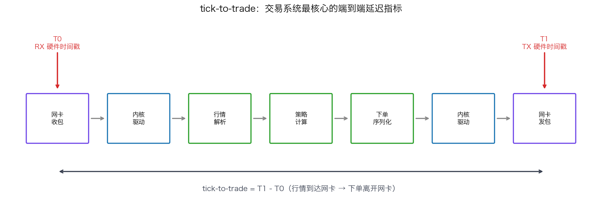
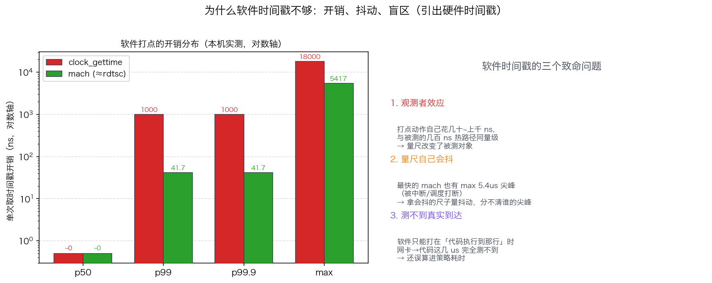
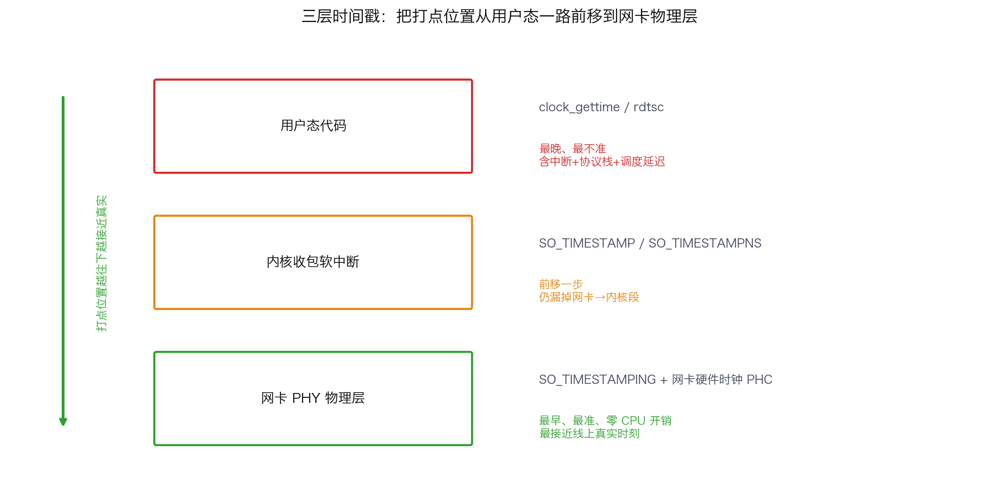
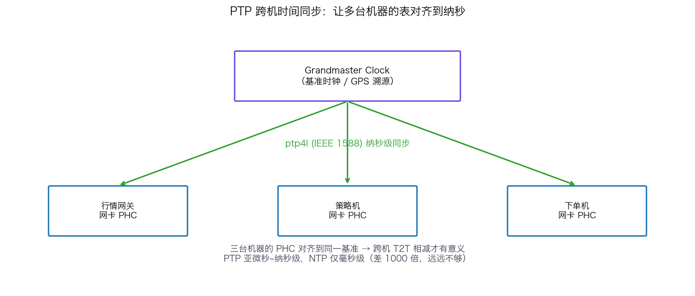

## 硬件时间戳与 tick-to-trade：如何精确测量交易系统的纳秒延迟

> 阶段 O5 · 网络深入 ｜ 难度 🔴 硬核 ｜ 档位 A·低延迟核心
> 出处级别：`SO_TIMESTAMPING`、网卡硬件时间戳、PTP 同步为 Linux 内核一手文档定义（本机为 macOS，**这部分无法本机实测，已诚实标注**）；软件打点开销/分辨率为**本机实测**（Apple Silicon，复现脚本见文末）。
> **OS 侧分水岭题**：「如何精确测量 tick-to-trade 延迟」——能区分软件时间戳与硬件时间戳、说清各自误差来源，是 A 档低延迟岗的标志性问题。

---

### 一、先定义：什么是 tick-to-trade

**tick-to-trade（T2T）** = 从「交易所行情（tick）到达本机网卡的那一刻」，到「本机的下单包离开网卡的那一刻」之间的总耗时。这是低延迟交易系统**最核心的端到端指标**——它直接决定你能不能在别人之前吃到那个价格。



T2T 内部可拆成几段：网卡收包 → 内核/驱动 → 用户态行情解析 → 策略计算 → 下单序列化 → 内核/驱动 → 网卡发包。优化 T2T 的前提是**先能精确测量每一段**——测不准就无从优化。问题来了：**用什么时钟去打这些时间点？精度够吗？误差在哪？**

---

### 二、第一层：软件时间戳，以及它为什么不够

最朴素的做法是在代码里取系统时间。常见两种：

- **`clock_gettime(CLOCK_MONOTONIC)`**：单调时钟，不受系统时间调整影响，是软件打点的标准选择。但它是一次函数调用（可能走 vDSO 避免完整 syscall，仍有开销）。
- **`rdtsc`（x86）/ `mach_absolute_time`（本机 ARM）**：直接读 CPU 的时间戳计数器（TSC），是软件能拿到的**最快、最细**的时间源。

我在本机实测了「取一次时间戳」本身的开销和分辨率（**以下为本机真实输出**）：

| 时钟源 | 有效分辨率 | 单次开销 p50 | p99 | **max（尾部尖峰）** |
|---|---|---|---|---|
| `clock_gettime(MONOTONIC)` | ~1 µs（本机粗） | 0 ns* | 1000 ns | **18000 ns** |
| `mach_absolute_time`（≈rdtsc） | **41.7 ns** | 0 ns* | 41.7 ns | **5417 ns** |

> *p50=0 是因为这两次调用间隔小于时钟分辨率，差值被量化成 0——这本身说明 `clock_gettime` 在本机的分辨率不足以测纳秒级事件。



这张表暴露了软件时间戳的**致命问题**，正是要上硬件时间戳的根本原因：

1. **打点动作本身有开销，且会污染被测对象**：你为了测延迟而插入的 `clock_gettime`，自己就要花几十到上千纳秒。测一个本身只有几百纳秒的热路径段，**测量工具的开销和被测量对象同量级**——这叫「观测者效应」。
2. **打点动作本身就有尾部尖峰**：即便是最快的 `mach_absolute_time`，max 也飙到 5.4µs（被中断/调度打断）。**你拿一个会抖动的尺子去量抖动**，根本分不清尖峰是被测代码的、还是量尺自己的。

更要命的是：软件时间戳只能打在**用户态代码执行到那一行的时刻**，而不是**数据包真正到达网卡的时刻**。从网卡收到包到你的代码执行 `clock_gettime`，中间隔了中断、协议栈、调度——**这段几微秒的延迟，软件打点完全测不到、还误算进了你的策略耗时**。

---

### 三、第二层：内核软件时间戳（SO_TIMESTAMP 系列）

为了把打点时刻往「数据真正到达」推近，Linux 提供了套接字时间戳选项，让**内核在收包路径上**替你打时间，通过辅助消息（`cmsg`）随数据一起返回：

- **`SO_TIMESTAMP` / `SO_TIMESTAMPNS`**：内核在**软中断处理收包时**打时间戳——比用户态 `clock_gettime` 更早、更接近真实到达，但仍是「内核软件时钟」，包含了网卡到内核这段不可见延迟。
- **`SO_TIMESTAMPING`**：功能最全的接口，可同时请求**软件时间戳**和**硬件时间戳**（见下一节），是测 T2T 的正式工具。

> 这一步把打点时刻从「用户代码执行时」前移到「内核收包软中断时」，砍掉了协议栈和调度的延迟，但**网卡到内核驱动这一段仍不可见**。要彻底测准，必须让网卡自己来打时间。

---

### 四、第三层：网卡硬件时间戳——测量的终点

> **诚实声明**：以下基于 Linux 内核文档（`Documentation/networking/timestamping.rst`）与低延迟网卡（Solarflare/Mellanox/Exablaze）官方资料。**本机为 macOS，无 `SO_TIMESTAMPING` 与网卡 PHC，无法实测，仅讲机制。**

支持硬件时间戳的网卡（NIC）内置一个 **PHC（PTP Hardware Clock）**，能在**数据帧通过网卡 PHY 的物理瞬间**就打上时间戳——这是整条链路上**最接近「线上真实时刻」**的打点位置，绕开了 CPU、内核、调度的一切干扰。



通过 `SO_TIMESTAMPING` 配合网卡硬件时间戳，你能拿到：

- **RX 硬件时间戳**：行情包到达网卡 PHY 的精确时刻（T2T 的起点）。
- **TX 硬件时间戳**：下单包离开网卡 PHY 的精确时刻（T2T 的终点）。
- 二者相减 = **真正的 tick-to-trade**，且测量本身不占用 CPU、不引入观测者效应。

硬件时间戳的优势总结：① 打点位置在物理层，最接近真实；② 不消耗 CPU、不污染热路径；③ 分辨率到纳秒甚至亚纳秒；④ 不受中断/调度抖动影响——它是硬件独立时钟。

---

### 五、第四层：PTP 跨机时间同步——让两台机器的表对齐

硬件时间戳解决了「单机内精确打点」，但 T2T 分析经常要跨机：行情网关一台机、策略机另一台、对比交易所时间又是第三方。**不同机器的时钟必须对齐到纳秒，否则跨机相减毫无意义。**

这就是 **PTP（Precision Time Protocol, IEEE 1588）** 的职责：

- 用 `ptp4l`（linuxptp）让本机网卡 PHC 与基准时钟（grandmaster clock）同步，精度可达**亚微秒到纳秒级**（NTP 只能到毫秒，远远不够）。
- 配合 `phc2sys` 把网卡 PHC 同步到系统时钟，让软件读到的时间也对齐。



> 量化合规与分析双重价值：① 跨机 T2T 分析需要统一时间基准；② 监管（如 MiFID II）要求交易事件打点精度到微秒级并可追溯，PTP 是合规打点的基础设施。

---

### 六、把四层串起来：一个完整的 T2T 测量方案

```
[网卡 PHY] --RX硬件时间戳(PHC)--> 起点 T0
    |
[内核驱动] (SO_TIMESTAMPING 软件时间戳作为旁证)
    |
[用户态] 行情解析 + 策略 (rdtsc/mach 打细分段, 注意扣除打点开销)
    |
[内核驱动]
    |
[网卡 PHY] --TX硬件时间戳(PHC)--> 终点 T1

tick-to-trade = T1(TX硬件) - T0(RX硬件)   ← 纳秒级、零观测者效应
跨机对齐: ptp4l 把各机 PHC 同步到 grandmaster
统计: 收集 N 万次, 算 P50/P99/P99.9 分布 (见 O7-41 延迟尖峰溯源)
```

**关键原则**：

1. **端到端的两端用硬件时间戳**（RX/TX PHC），这是 T2T 的权威值。
2. **内部细分段用 rdtsc/TSC**（最快），但**必须先标定并扣除打点本身的开销**（本课实测的几十纳秒），否则细分段会被系统性高估。
3. **关心分布不关心均值**：T2T 要看 P99/P99.9（一次尾部尖峰就吃滑点），这与 O7-41、O8-47 的 tail latency 思维一脉相承。
4. **跨机必须 PTP 对齐**，否则相减无意义。

---

### 七、面试怎么答

被问「如何精确测量 tick-to-trade」，按打点位置由粗到精答，层层见功底：

1. **明确指标**：T2T = 行情到达网卡到下单离开网卡的端到端延迟。
2. **软件时间戳不够**：用户态 `clock_gettime`/rdtsc 有观测者效应（打点本身几十~上千 ns、自身有尾部尖峰），且测不到网卡到代码这段。
3. **内核时间戳更近**：`SO_TIMESTAMPING` 让内核在收包软中断打点，前移但仍漏掉网卡到内核段。
4. **硬件时间戳是终点**：支持 PHC 的网卡在物理层打点，最接近线上真实、零 CPU 开销、不受抖动影响——RX/TX 硬件时间戳相减得权威 T2T。
5. **跨机用 PTP**：`ptp4l` 纳秒级对齐多机时钟，NTP 毫秒级远不够。
6. **统计看分布**：收集后算 P99/P99.9，不看均值。

> 一句话记牢：**「测 T2T 的精髓是把打点位置从用户态一路前移到网卡物理层——软件时间戳有观测者效应和盲区，硬件时间戳（网卡 PHC）零开销且最接近真实，跨机用 PTP 纳秒对齐，最后看 P99 分布而非均值。」**

---

### 八、和其他知识点的关系

- **上游**：O4-21 syscall 开销（软件打点为何有成本）、O5-29 网卡多队列/RSS（行情流锁核才能稳定测量）。
- **直接呼应**：O7-41 延迟尖峰溯源（拿到 T2T 分布后怎么定位尖峰）、O8-45 TSC 时钟源（rdtsc 细分段的时钟基础）、O8-47 tail latency 思维（为什么看 P99）。
- **硬件**：O4-23 Solarflare/Mellanox（这些低延迟网卡正是硬件时间戳的载体）。
- **合规**：PTP 打点同时服务于监管时间戳要求。

---

### 证据清单

| 声明 | 来源 | 级别 |
|---|---|---|
| `SO_TIMESTAMPING` 可同时请求软件与硬件时间戳；网卡 PHC 在物理层打点 | Linux 内核 `Documentation/networking/timestamping.rst` | 一手（内核文档） |
| `SO_TIMESTAMP`/`SO_TIMESTAMPNS` 内核软中断收包打点 | Linux man7 `socket(7)` / 内核网络时间戳文档 | 一手（手册+内核文档） |
| PTP（IEEE 1588）纳秒级跨机同步，ptp4l/phc2sys（linuxptp） | linuxptp 官方文档 + IEEE 1588 标准 | 一手（标准+项目文档） |
| 软件打点开销与分辨率（clock_gettime 粗到 1µs、max 18µs；mach 41.7ns、max 5.4µs） | 本机 benchmark 实测（`scripts/bench_timestamp.cpp`，Apple Silicon） | 一手（本机实测） |
| **硬件时间戳/PTP 部分本机无法实测**（macOS 无 SO_TIMESTAMPING/PHC） | 平台限制声明 | 诚实标注 |
| NTP 毫秒级、PTP 亚微秒~纳秒级 | NTP/PTP 协议设计指标 | 领域公认 |
| MiFID II 等监管要求微秒级可追溯时间戳 | 监管框架（领域认知，非逐条引用法条） | 经验归纳 |
| 「要求到 A 档才考」的深度标定 | 领域经验判断，非真实 JD 原文 | 经验归纳 |
