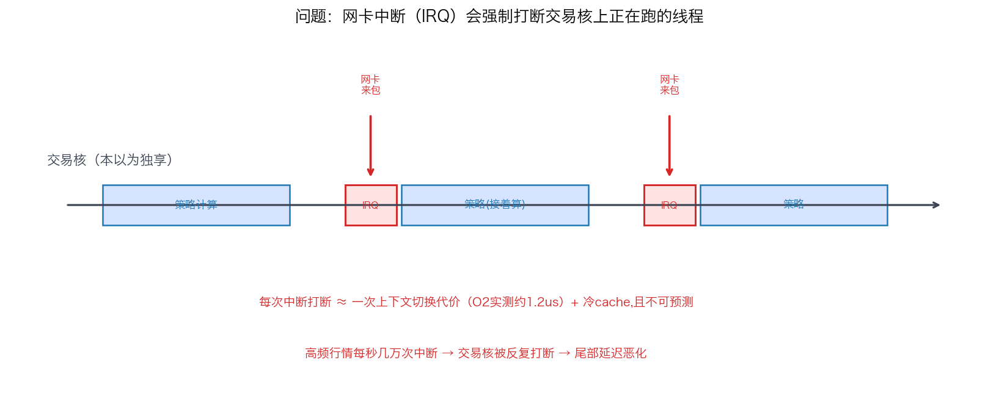
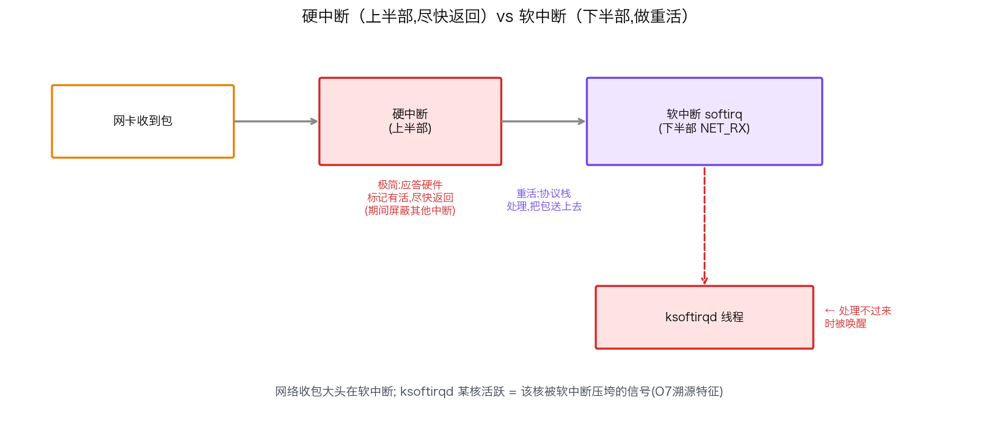
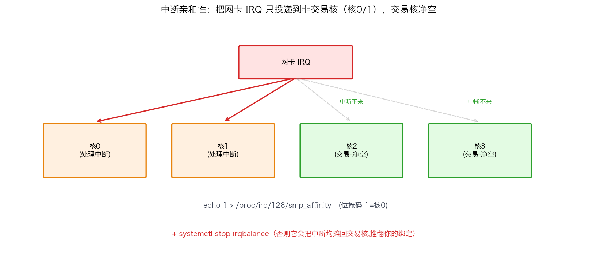
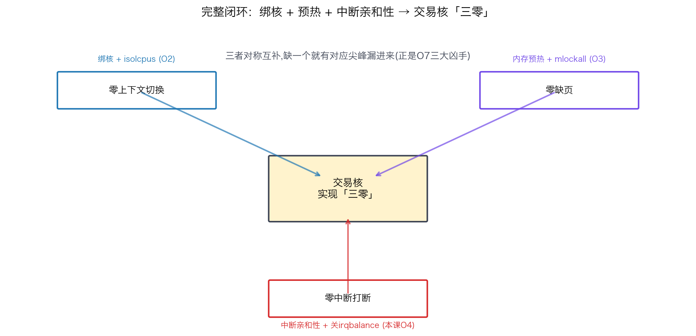

## 中断亲和性与 softirq：把网卡中断赶出交易核

> 阶段 O4 · 中断与内核旁路 ｜ 难度 🔴 硬核 ｜ 档位 A·低延迟核心
> 出处级别：硬中断/软中断机制、`/proc/irq/*/smp_affinity`、ksoftirqd 由 Linux 内核中断子系统文档与 man 手册一手定义。**本机为 macOS，中断亲和性绑定为 Linux 专属操作，未在本机执行，已诚实标注；相关延迟代价复用本专栏已实测的上下文切换（O2）与尖峰（O7）数据交叉印证。**
> **延迟尖峰三大凶手之一**：中断是 O7 延迟尖峰溯源里「中断」那一类的治本手段。网卡中断如果落在交易核上，每个包都可能打断你的策略计算。

---

### 一、问题：网卡中断会打断你的交易线程

你把交易线程绑核、隔离、预热都做好了（O2/O3），自以为这个核已经独享。但还有一个隐形的入侵者——**硬件中断（IRQ）**。

网卡每收到一批数据包，就向 CPU 发一个硬件中断，强制当前正在这个核上跑的线程**立刻停下**，转去执行中断处理程序（ISR）。如果网卡中断恰好绑在你的交易核上：



- 你的策略正算到一半 → 网卡来包 → 硬中断打断 → 保存现场、跑中断处理 → 回来时 cache 可能已冷。
- 这个打断的代价，量级和一次上下文切换相当（本专栏 O2 实测约 1.2µs + 冷 cache），而且**不可预测**——中断什么时候来，取决于网络流量。
- 高频行情下，网卡中断每秒可能几万次，交易核被反复打断，尾部延迟直接恶化（正是 O7 里那类"和网络活动时间对齐"的尖峰）。

**讽刺的是**：低延迟系统恰恰是网络密集的——行情组播、下单回报，全靠网卡。中断量特别大。所以"中断落在哪个核"这件事，必须精心安排。

---

### 二、先搞清楚：硬中断 vs 软中断

Linux 把中断处理拆成两半，理解这个才能优化：



| | 硬中断（hard IRQ，上半部 top half） | 软中断（softirq，下半部 bottom half） |
|---|---|---|
| 谁触发 | 硬件（网卡收到包） | 硬中断处理完后，延后调度 |
| 做什么 | 极简：应答硬件、标记"有活要干"，尽快返回 | 真正的重活：协议栈处理、把包送上去 |
| 为什么拆 | 硬中断期间会屏蔽其他中断，必须尽量短 | 重活放到软中断，可被更灵活地调度 |
| 相关线程 | ISR | **ksoftirqd**（软中断处理不过来时内核拉起的线程） |

**关键**：网络收包的大头开销在**软中断（NET_RX softirq）**里。当软中断量大到当前上下文处理不完，内核会唤醒 **ksoftirqd** 内核线程来接手——所以**"ksoftirqd 某个核上很活跃"是判断该核被网络软中断压垮的信号**（呼应 O7 溯源里的中断特征）。硬中断和软中断都要赶出交易核。

---

### 三、解法：中断亲和性（IRQ affinity）

和绑核（把线程钉到核）对称，中断也能"绑核"——**把某个中断只投递到指定的核上处理**，这叫中断亲和性。核心就是把网卡中断绑到**非交易核**：



```bash
# 1. 找到网卡的中断号（IRQ number）
cat /proc/interrupts | grep eth0
#   输出里每行是一个中断源，列是各 CPU 核上的中断计数

# 2. 把该 IRQ（假设是 128）绑到 0 号核（非交易核）
#    smp_affinity 是位掩码：0x1 = 核0，0x2 = 核1，0x4 = 核2 ...
echo 1 > /proc/irq/128/smp_affinity        # 十六进制掩码，1 = 只用核0
# 或用可读的列表形式：
echo 0 > /proc/irq/128/smp_affinity_list   # 直接写核编号

# 3. 关掉 irqbalance（它会自动把中断均摊到各核，破坏你的手动绑定）
systemctl stop irqbalance
systemctl disable irqbalance
```

三个动作缺一不可：

1. **绑硬中断**：`smp_affinity` 把网卡 IRQ 投递到非交易核。
2. **绑软中断**：软中断通常跟随硬中断所在核处理，所以绑好硬中断，软中断（含 ksoftirqd）也就落到非交易核了；配合网卡 RSS 多队列可进一步把不同队列的中断分散到多个非交易核（见 O5-29）。
3. **关 irqbalance**：这个守护进程会"好心"地把中断动态均摊到所有核——包括你的交易核。**必须关掉**，否则你的手动绑定随时被它推翻。

---

### 四、完整闭环：绑核 + 中断亲和性是一对

这一课和 O2 绑核是**对称互补**的一对，合起来才能让交易核真正"干净"：



| 动作 | 治理对象 | 章节 |
|---|---|---|
| 绑核 + isolcpus | 把交易线程钉到隔离核、赶走其他任务 | O2 |
| **中断亲和性 + 关 irqbalance** | **把网卡中断赶到非交易核** | **本课 O4** |
| 内存预热 + mlockall | 消灭缺页尖峰 | O3 |

**三者合一,交易核才实现"三零"**：零上下文切换（绑核隔离）、零缺页（预热锁页）、零中断打断（中断亲和性）。缺任何一个，都会有对应的尖峰漏进来——这正是 O7 延迟尖峰溯源里三大凶手，本课补齐了最后一个「中断」的治本手段。

> 常见误区：只做了绑核隔离、忘了中断亲和性。结果交易线程是不被别的**线程**抢了，但网卡**中断**照样往这个核上砸——延迟尖峰依旧。面试时能主动指出"绑核和中断亲和性要配套"，是懂不懂实战的分水岭。

---

### 五、面试怎么答

被问"怎么防止网卡中断干扰交易线程"，按"问题→机制→解法→配套"答：

1. **问题**：网卡硬中断会打断交易核上的线程，代价约 1µs + 冷 cache 且不可预测，高频行情下每秒几万次。
2. **硬/软中断**：硬中断（上半部）极简尽快返回，软中断（下半部 NET_RX）做协议栈重活，压垮时 ksoftirqd 活跃。
3. **解法**：`/proc/irq/N/smp_affinity` 把网卡 IRQ 绑到非交易核；配 RSS 多队列分散；**关掉 irqbalance** 防它推翻绑定。
4. **配套**：中断亲和性必须和 O2 绑核隔离一起做——绑核防线程抢占，中断亲和性防中断打断，缺一不可。
5. **验证**：`watch cat /proc/interrupts` 看交易核那列中断计数是否不再增长；`/proc/softirqs` 看软中断分布。

> 一句话记牢：**「网卡中断会打断交易核，硬中断尽快返回、软中断(NET_RX)是大头、ksoftirqd 活跃是压垮信号。用 smp_affinity 把网卡 IRQ 绑到非交易核、关 irqbalance 防推翻，和绑核隔离配套，交易核才能真正净空。」**

---

### 六、和其他知识点的关系

- **上游**：O4-19 硬中断/软中断（本课的机制基础）、O2-8/9 绑核隔离（对称互补的一对）。
- **配套**：O5-29 网卡多队列/RSS（把不同流的中断分散到多个非交易核）、O4-22 kernel bypass（更极端时直接绕过内核中断走用户态轮询，见 busy-polling 那节）。
- **呼应**：O7-41 延迟尖峰溯源（中断是三大凶手之一，本课是其治本手段）、O8-48 抖动清单（IRQ 亲和是清单核心项）。

---

### 证据清单

| 声明 | 来源 | 级别 |
|---|---|---|
| 网卡硬中断打断当前核线程，代价约上下文切换量级 + 冷 cache | Linux 中断子系统文档 + 本专栏 O2 实测（上下文切换约1152ns） | 一手（内核文档）+ 本机实测交叉印证 |
| 硬中断（上半部）尽快返回、软中断（下半部）做重活，网络收包大头在 NET_RX softirq | Linux 内核中断处理文档（top/bottom half） | 一手（内核文档） |
| ksoftirqd 在软中断处理不过来时被唤醒，活跃度是核被软中断压垮的信号 | Linux 内核 softirq/ksoftirqd 文档 | 一手（内核文档） |
| `/proc/irq/N/smp_affinity`（位掩码）/ `smp_affinity_list` 设置中断亲和性 | Linux 内核 `Documentation/core-api/irq/irq-affinity.rst` | 一手（内核文档） |
| irqbalance 动态均摊中断，手动绑定需关闭它 | irqbalance 项目文档 + 内核 IRQ 亲和文档 | 一手（项目+内核文档） |
| **中断亲和性绑定本机未执行**（macOS 无 /proc/irq、smp_affinity） | 平台限制声明 | 诚实标注 |
| 「要求到 A 档才考」的深度标定 | 领域经验判断，非真实 JD 原文 | 经验归纳 |
