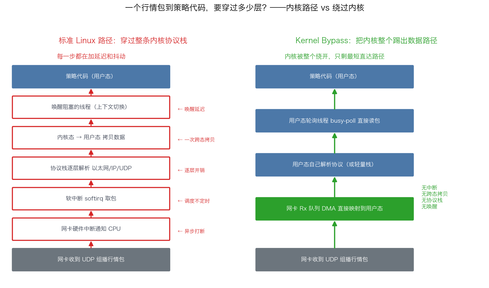
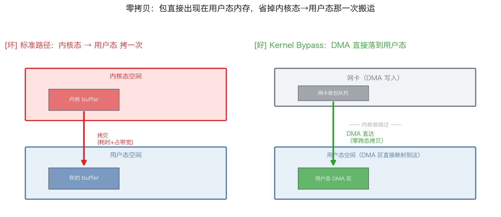
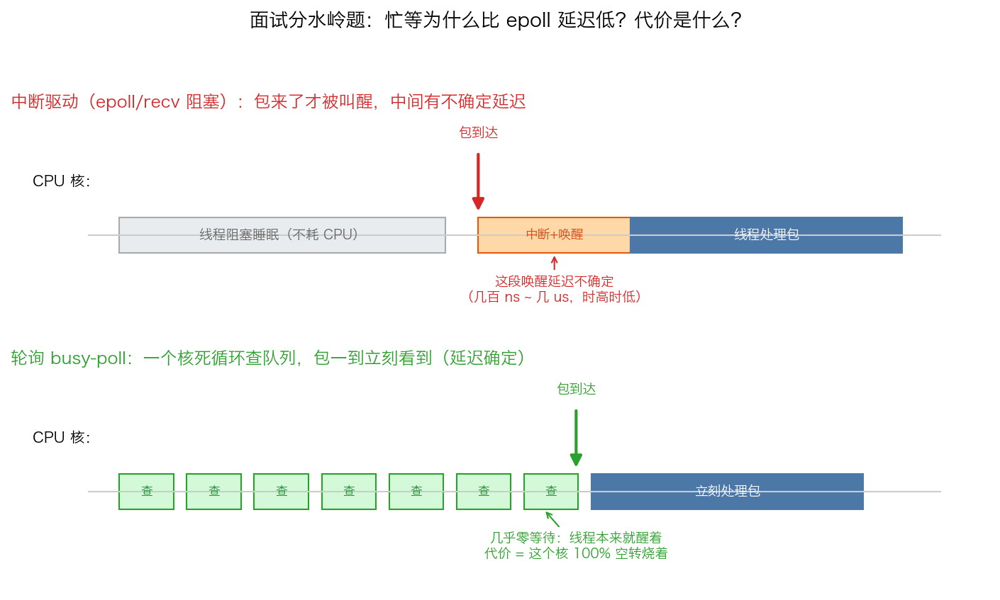
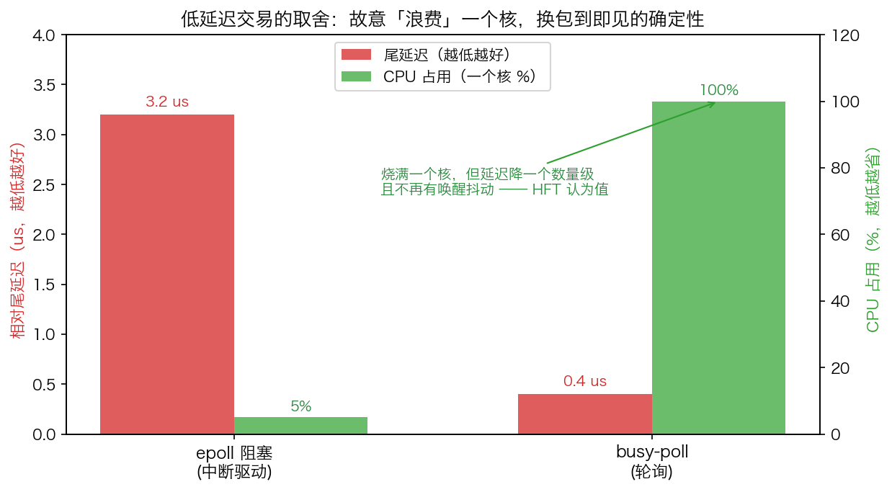
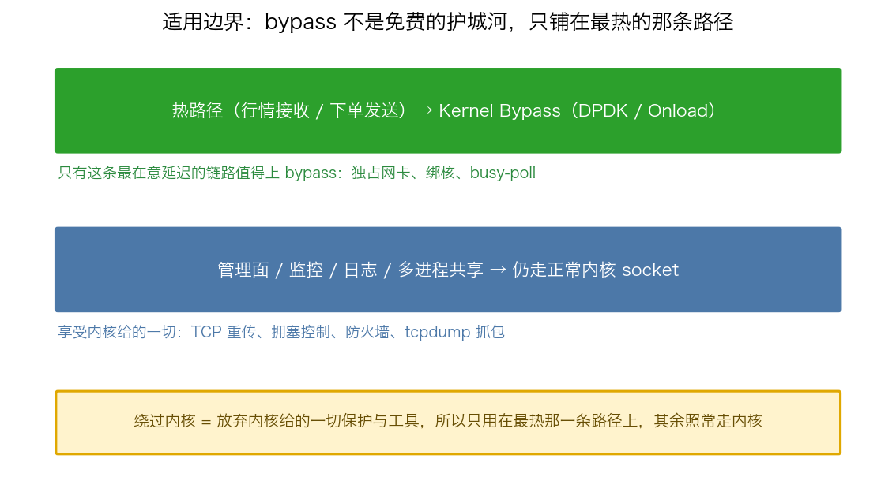

## Kernel Bypass（内核旁路）：绕过内核协议栈的低延迟收发

> 阶段 O4 · 中断与内核旁路 ｜ 难度 ⚫ 天花板 ｜ 档位 A·低延迟核心
> 出处级别：DPDK 官方编程指南（doc.dpdk.org）一手原文；Linux 内核 packet(7) man page 旁证。文末附证据清单与级别。

### 问题入口：一个数据包从网卡到策略，要穿过多少层？

行情通过 UDP 组播打到网卡。在**标准 Linux 路径**下，这个包要走完整条内核协议栈才能到你的策略代码：

1. 网卡收到包 → 发**硬件中断**通知 CPU；
2. 内核中断处理 + 软中断（softirq / `ksoftirqd`）把包从网卡 DMA 区取出；
3. 内核协议栈逐层解析：以太网帧 → IP → UDP，做校验、查路由、找 socket；
4. 把数据从**内核态内存拷贝到用户态**你的 buffer（一次跨态拷贝）；
5. 唤醒阻塞在 `recv()`/`epoll` 上的线程——又一次**上下文切换**。

这条路每一步都在加延迟和**抖动**：中断本身是异步打断（抢占你正在跑的策略核）、softirq 调度时机不确定、内核态↔用户态拷贝、syscall 进出（百 ns 级）、唤醒线程的调度延迟。对均值也许只是几微秒，但 HFT 要的是 **P99.9 的最坏几次**——内核路径上任何一个环节抖一下，就是一次吃单或滑点。

下面这张图把两条路径并排放在一起——左边是包穿过整条内核栈的标准路径，每一步都在加延迟；右边是 kernel bypass 把内核整个踢出后只剩的最短直达路径：

### 朴素优化的天花板

你可以在内核路径里做很多调优：`SO_BUSY_POLL` 忙轮询 socket、NAPI 中断合并、`SO_REUSEPORT` 分流、绑核、调 ring buffer 大小……这些能把延迟压下来一截，但**只要数据还流经内核协议栈，那几道固定开销（中断、跨态拷贝、协议栈逐层处理、唤醒）就消不掉**。这是朴素优化的天花板。

### 关键跃迁：把内核整个踢出数据路径

**Kernel bypass** 的思想很激进——不优化内核路径，而是**绕过它**。DPDK 官方编程指南把这条定义讲得最清楚（PMD/Poll Mode Driver 一手原文）：

> "bypassing the kernel network stack to reduce latency and improve throughput. They access Rx and Tx descriptors directly in a polling mode **without relying on interrupts** (except for Link Status Change notifications), enabling efficient packet reception and transmission **in user-space applications**."

拆开看，三个要素缺一不可：

1. **绕过内核协议栈**（bypass the kernel network stack）：网卡的收发队列（Rx/Tx descriptor ring）通过 UIO/VFIO 之类机制直接映射到**用户态**，应用直接读写 DMA 描述符，包不再经过内核的 IP/UDP 栈。协议解析改由用户态自己做（或用户态轻量栈）。
2. **用户态轮询取代中断**（polling mode without relying on interrupts）：不再等网卡中断，而是一个绑死在隔离核上的线程**死循环忙等（busy-poll）**，反复查描述符环看有没有新包。DPDK 官方明说：轮询是为性能，中断驱动模型"has additional performance overhead"。
3. **零跨态拷贝**：包直接在用户态 DMA 区被处理，省掉内核态→用户态那次拷贝。

第 3 点的零拷贝单独画一张——标准路径要把包从内核 buffer 拷到用户 buffer（一次跨态搬运），bypass 则让网卡 DMA 直接落到用户态映射区，那次拷贝整个消失：

业界两条主流落地路径：
- **DPDK**：完全接管网卡，自研用户态网络栈，吞吐+延迟双优，但要独占网卡、写法重。
- **Solarflare Onload**（现 AMD）：用 `LD_PRELOAD` 透明接管标准 BSD socket API，应用几乎不改代码就把 socket 走用户态加速路径——量化里最常见的"接管 socket"方案，因为现有代码迁移成本低。

### 反直觉点

- **它在用 CPU 换延迟，而且是故意"浪费"CPU**。busy-poll 线程把一整个核 100% 烧在空转轮询上，哪怕没有包来。这在通用服务器看是反模式（费电费核），但在低延迟交易里是**正确的取舍**：牺牲一个核的算力，换来"包一到就立刻被看到"的确定性——没有中断延迟、没有唤醒延迟。**面试分水岭题"忙等为什么比 epoll 延迟低、代价是什么"考的就是这个权衡**：epoll 阻塞要靠中断+唤醒把你叫醒，这中间有不确定延迟；忙等永远醒着，代价是吃满一个核。

两种取包方式的时序对比——中断驱动是线程睡着、包来了才被中断唤醒（中间有不确定的唤醒延迟）；busy-poll 是一个核死循环查队列、包一到立刻看到（延迟确定）：

这个取舍量化出来看得最清楚——busy-poll 把尾延迟压下一个数量级，代价是一个核 100% 空转：

- **kernel bypass 不是免费的护城河**。绕过内核也就绕过了内核给你的一切：TCP 重传、拥塞控制、防火墙、抓包工具（tcpdump 看不到了）、多进程共享网卡——这些要么自己重写，要么放弃。所以它只用在**那条最热的行情/下单路径**上，管理面、监控面仍走正常内核 socket。

### 适用边界

- 只对**延迟敏感的核心链路**值得上 kernel bypass；非热路径用它纯属徒增复杂度和运维成本。
- 依赖特定硬件/驱动（Solarflare、Mellanox、支持 DPDK 的网卡），是真金白银的硬件投入，不是纯软件能拿满的。
- 这是 ⚫ 天花板知识点：研究员（C 档）岗几乎不考；只有 A 档低延迟核心 / 交易系统工程师岗把它当门槛标志。

### 关联

- 上游：O4-19 硬中断/软中断（理解中断为何是抖动主因）、O4-21 syscall 开销（理解跨态成本）。
- 同阶段：O4-23 Onload/Solarflare、O4-24 DPDK、O4-25 busy-polling（本课是这几条的统领思想）。
- 下游呼应：O5-30 硬件时间戳（绕过内核后靠网卡时间戳测 tick-to-trade）、O8 抖动控制全谱（kernel bypass 是消抖动的终极手段之一）。

---

### 证据清单

| 声明 | 来源 | 级别 |
|---|---|---|
| kernel bypass = 绕内核栈 + 用户态 + 轮询代替中断 | DPDK 官方编程指南 PMD 文档 doc.dpdk.org/guides/prog_guide/ethdev/ethdev.html 原文引用 | 一手（官方文档） |
| 轮询为性能、中断驱动有额外开销 | DPDK 官方 overview "polling mode for performance... interrupt driven model... additional performance overhead" | 一手（官方文档） |
| 标准路径要经中断/softirq/协议栈/跨态拷贝/唤醒 | Linux 内核网络收包路径常识，可在 packet(7) man page 与内核 networking 文档核验 | 一手（man page）+ 领域常识 |
| Onload 用 LD_PRELOAD 透明接管 socket、量化最常见 | 领域认知归纳（Solarflare/AMD 产品定位），非本次抓取官方页逐字 | 经验归纳 |
| "要求到 A 档才考"的深度标定 | 领域经验判断，非真实 JD 原文 | 经验归纳 |
