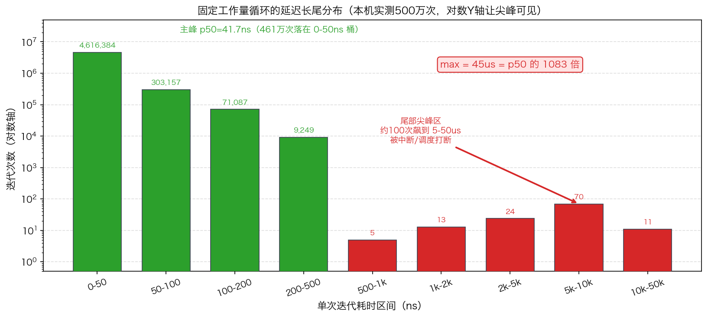
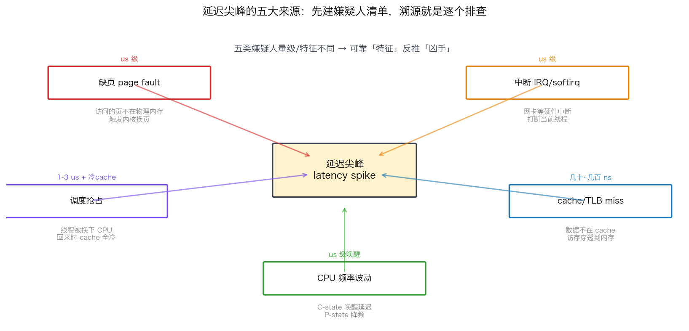
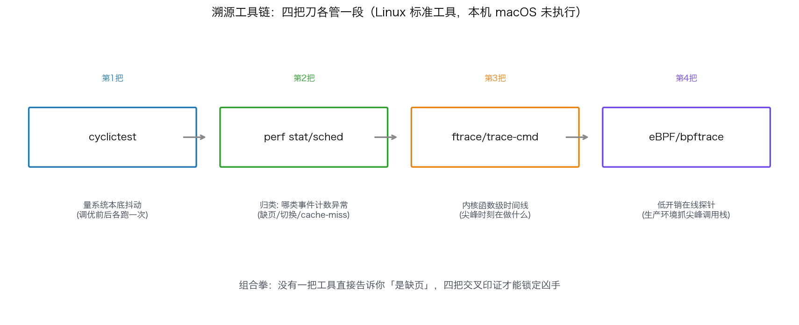
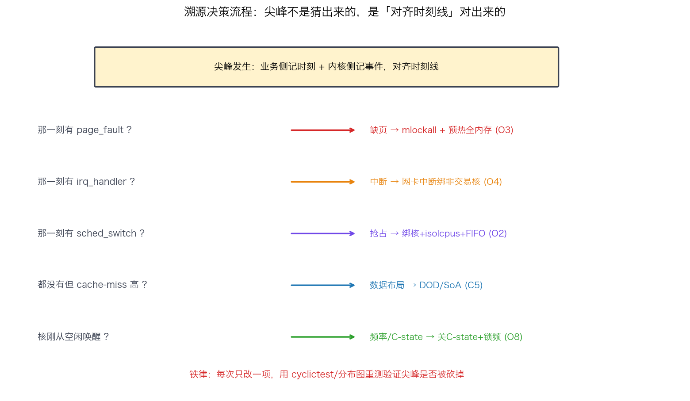

## 延迟尖峰溯源：一次尖峰到底是缺页、中断还是调度引起的

> 阶段 O7 · 性能分析 ｜ 难度 🔴 硬核（综合题）｜ 档位 A·低延迟核心
> 出处级别：perf/ftrace/eBPF/cyclictest 工具能力由各自官方文档定义；延迟尖峰来源（缺页/中断/调度/cache/频率）为低延迟领域公认硬知识。本课延迟分布数字为**本机实测**（Apple Silicon，复现脚本见文末），工具命令为 Linux 标准用法（本机 macOS 无 perf/ftrace，命令未本机执行，已诚实标注）。
> **OS 侧分水岭综合题**：「一个延迟尖峰，你怎么定位它是缺页、中断还是调度引起的？」——这题要求把 ftrace/eBPF/perf/cyclictest 串成一套方法论，是 A 档岗位综合能力的试金石。

---

### 一、先认清敌人：尾部尖峰长什么样

低延迟系统关心的从来不是平均延迟，而是**最坏的那几次**。我在本机跑了一个最简单的实验：一个循环，**每次迭代做完全相同的固定工作量**（约 40ns 的定量计算），测 500 万次每次的耗时。理论上每次都该一样——但实测结果（**本机真实数据**）：

| 分位 | 延迟 |
|---|---|
| p50（中位数） | 41.7 ns |
| p90 | 41.7 ns |
| p99 | 125 ns |
| p99.9 | 208 ns |
| **max（最坏一次）** | **45125 ns（45 µs）** |

**max 是 p50 的 1083 倍。** 同样的工作量，绝大多数 41.7ns 跑完，但偶尔某一次飙到 45µs。这就是尾部尖峰（tail latency spike）——它不是你的代码变慢了，是**系统在那一刻插了一脚**。



> **画这张图的纪律**：主峰（461 万次落在 0-50ns）和尖峰（5-50µs 只有约 100 次）相差 4-5 个数量级。**必须用对数 Y 轴**——线性轴下，占比百分之零点几的尖峰会被压成贴着地面的一条线，肉眼根本看不见，反而把要证明的论点藏起来。对数轴让尖峰真正"立起来"成簇可见。

**为什么这事致命**：交易系统里，平均延迟再低也没用——只要那一次 45µs 的尖峰恰好发生在行情剧烈波动、你要抢单的瞬间，你就吃了滑点、错过了价格。**尖峰直接等于钱。** 所以低延迟工程的核心，不是把均值压低，是**把这条长尾砍断**——而砍断的前提，是先搞清楚每个尖峰是谁造成的。

---

### 二、尖峰的五大嫌疑人

延迟尖峰的来源就那么几类，先建立"嫌疑人清单"，溯源就是逐个排查：



| 嫌疑人 | 机制 | 典型量级 | 信号特征 |
|---|---|---|---|
| **缺页（page fault）** | 访问的页不在物理内存，触发内核换页 | µs 级（major fault 更高） | 首次访问新内存、未预热 |
| **中断（IRQ/softirq）** | 网卡等硬件中断打断当前线程 | µs 级 | 与网络/IO 活动相关，ksoftirqd 活跃 |
| **调度抢占（context switch）** | 线程被调度器换下 CPU，回来时 cache 全冷 | 1-3 µs + 冷 cache 代价 | 关键线程没绑核/没隔离 |
| **cache/TLB miss** | 数据不在 cache，访存穿透到内存 | 几十~几百 ns | 随机访问、数据集超 cache |
| **CPU 频率波动** | C-state 唤醒延迟、P-state 降频、turbo 波动 | µs 级唤醒 | 核空闲后被唤醒、没锁频 |

**关键认知**：这五类的量级和信号特征不同，**所以可以靠"特征"反推"凶手"**。比如一个尖峰恰好和一次网卡中断在时间上对齐 → 中断嫌疑最大；一个尖峰只在某段内存首次访问时出现 → 缺页嫌疑最大。溯源的本质，就是**把尖峰发生的时刻，和系统事件的时刻线对齐**。

---

### 三、溯源工具链：四把刀，各管一段

没有一把工具能直接告诉你"这个尖峰是缺页"。你需要一套组合拳，每把工具看一个侧面，交叉印证。

> **诚实声明**：以下命令为 Linux 标准用法（本机为 macOS，无 perf/ftrace/eBPF/cyclictest，**命令未在本机执行，仅讲方法论与典型用法**）。



**1. `cyclictest` —— 先量「系统本底抖动」**

在跑业务前，先用 cyclictest 测这台机器的调度延迟基线：

```bash
cyclictest -p99 -t1 -a2 -n -D60   # 优先级99, 绑核2, 跑60秒, 输出 min/avg/max
```

它周期性睡眠+唤醒，测「实际唤醒时刻 - 应该唤醒时刻」的偏差——这就是系统强加给你的本底抖动。**调优前后各跑一次 cyclictest，是验证 isolcpus/nohz_full/关 C-state 是否生效的标准手段**（呼应 O8 抖动消除清单）。max 从几十 µs 压到个位数 µs，说明调优起效了。

**2. `perf` —— 看「尖峰时 CPU 在忙什么」**

```bash
perf stat -e cache-misses,context-switches,page-faults ./your_app   # 总览各类事件计数
perf record -g ./your_app && perf report                            # 热点+调用栈
perf sched record ./your_app && perf sched latency                  # 调度延迟分析
```

`perf stat` 一眼看出是 cache-miss 多、还是 context-switch 多、还是 page-fault 多——**直接把嫌疑人范围缩小**。`perf sched` 专门看调度延迟，定位"被谁抢占了"。

**3. `ftrace` / `trace-cmd` —— 内核函数级时间线**

```bash
trace-cmd record -e sched -e irq -e exceptions ./your_app   # 记录调度/中断/异常事件
trace-cmd report                                            # 看带时间戳的事件时间线
```

ftrace 能记录内核里每个事件（调度切换、中断进出、缺页异常）的**精确时间戳**。把你的尖峰时刻和这条时间线对齐，**直接看到那一刻内核在做什么**——是 `irq_handler_entry`？是 `sched_switch`？还是 `page_fault`？这是"对齐时刻线"方法论的核心工具。

**4. `eBPF` / `bpftrace` —— 低开销在线精准探针**

```bash
# 统计每次调度延迟的分布直方图
bpftrace -e 'tracepoint:sched:sched_switch { @[comm] = hist(nsecs); }'
# 抓 page fault 的调用栈
bpftrace -e 'tracepoint:exceptions:page_fault_user { @[ustack] = count(); }'
```

eBPF 是现代利器：**开销极低**（适合生产环境在线观测）、可编程、能精确挂到调度/缺页/syscall/网络任意事件上，直接产出分位数直方图或尖峰时的调用栈。它在生产环境定位偶发尖峰的能力，是 perf/ftrace 的进化版。

---

### 四、溯源方法论：把尖峰时刻与系统事件对齐

把工具串成流程，回答「这个尖峰是谁造成的」：



1. **先建基线**：cyclictest 测本底抖动。如果系统本底就有大尖峰，先做 O8 调优（isolcpus/绑核/关 C-state），别急着怀疑业务代码。
2. **总览归类**：`perf stat` 看 page-faults / context-switches / cache-misses 哪类计数异常高 → 圈定头号嫌疑。
3. **时间线对齐**：业务代码里在尖峰发生时记下时间戳（用上一课 O5-30 的硬件/TSC 时间戳），用 ftrace/eBPF 抓同一时刻的内核事件，**对齐时刻**：
   - 尖峰时刻有 `page_fault` → 缺页：上 `mlockall` + 预热全内存（O3-14/16）。
   - 尖峰时刻有 `irq_handler` → 中断：把网卡中断绑到非交易核（O4-20 中断亲和性）。
   - 尖峰时刻有 `sched_switch` → 抢占：绑核 + isolcpus + SCHED_FIFO（O2-8/9/11）。
   - 都没有但 cache-miss 高 → 数据布局问题：DOD/SoA 优化（C5-30）。
   - 核刚从空闲唤醒 → 频率/C-state：关 C-state + 锁频（O8-44）。
4. **改一项、再测一次**：每次只改一个变量，用 cyclictest/分布图验证尖峰是否被砍掉。**别一次改五个，否则不知道是哪个起的效。**

> 这套方法论的精髓：**尖峰不是猜出来的，是「对齐时刻线」对出来的。** 业务侧记尖峰时刻 + 内核侧记事件时刻 + 两者对齐 = 凶手现形。

---

### 五、面试怎么答

被问这道综合题，按"分类→工具→对齐→验证"答，展现的是体系化能力：

1. **先分类嫌疑人**：缺页 / 中断 / 调度抢占 / cache-miss / 频率波动，各自量级和特征不同。
2. **先量本底**：cyclictest 测系统抖动基线，区分"系统的锅"还是"业务的锅"。
3. **perf 归类**：`perf stat` 看哪类事件计数异常，缩小范围。
4. **对齐时刻线**：ftrace/eBPF 抓内核事件时间戳，和尖峰发生时刻对齐——看那一刻是 page_fault、irq 还是 sched_switch。
5. **对症下药 + 验证**：缺页→mlockall预热、中断→IRQ亲和、抢占→绑核隔离，每改一项重测一次。
6. **强调看分布**：始终盯 P99.9/max 而非均值（一次尖峰就吃滑点）。

> 一句话记牢：**「延迟尖峰溯源 = 先 cyclictest 量本底、perf stat 归类嫌疑、ftrace/eBPF 把尖峰时刻和内核事件（缺页/中断/调度）对齐找出凶手、对症下药后重测验证——核心是对齐时刻线，不是猜。」**

---

### 六、和其他知识点的关系

- **上游**：O5-30 硬件/TSC 时间戳（拿到尖峰发生的精确时刻才能对齐）、O7-35~40（perf/ftrace/eBPF/cyclictest 各工具的单点用法）。
- **下游/对症**：O3-14 缺页预热、O4-20 中断亲和性、O2-8/9 绑核隔离、O8 抖动消除清单——本课是把这些治理手段"按嫌疑人对症"串起来。
- **思维呼应**：O8-47 tail latency P99/P999 思维（为什么只盯尾部）、C5-31 延迟测量（rdtsc 测细分段）。

---

### 证据清单

| 声明 | 来源 | 级别 |
|---|---|---|
| 固定工作量循环延迟分布 p50=41.7ns、max=45µs、max/p50=1083× | 本机 benchmark 实测（`scripts/bench_latency_spike.cpp`，Apple Silicon） | 一手（本机实测） |
| 长尾/尖峰分布需对数 Y 轴才能让尖峰可见 | 数据可视化通则 + 本专栏既有纪律 | 领域公认 |
| 尖峰五大来源（缺页/中断/调度/cache/频率）及典型量级 | 低延迟系统领域公认硬知识（与 O2/O3/O4/O8 各节呼应） | 领域公认 |
| cyclictest 测调度延迟/系统抖动 | cyclictest（rt-tests）官方文档 | 一手（工具文档） |
| perf stat/record/sched 的事件计数与调度延迟分析能力 | Linux perf 官方文档 | 一手（工具文档） |
| ftrace/trace-cmd 记录 sched/irq/exceptions 带时间戳事件 | Linux ftrace 内核文档 | 一手（内核文档） |
| eBPF/bpftrace 低开销在线观测、可挂调度/缺页/syscall tracepoint | bpftrace/BCC 官方文档 | 一手（工具文档） |
| **perf/ftrace/eBPF/cyclictest 命令本机未执行**（macOS 无这些工具） | 平台限制声明 | 诚实标注 |
| 「要求到 A 档才考」的深度标定 | 领域经验判断，非真实 JD 原文 | 经验归纳 |
