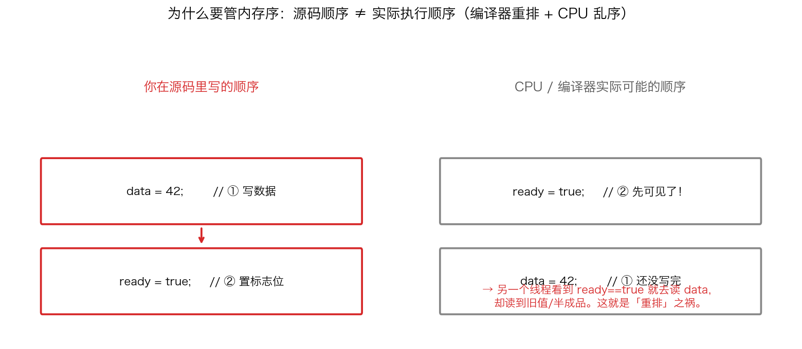
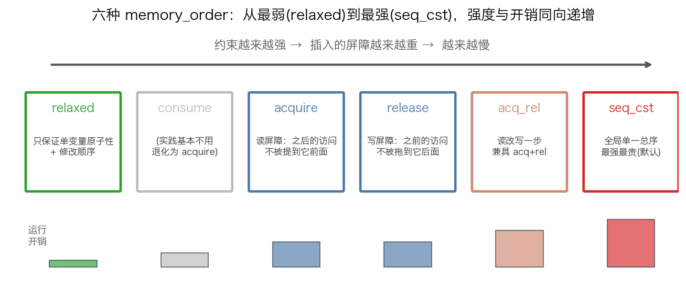
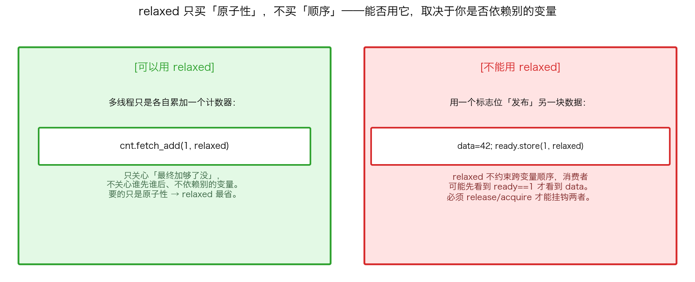
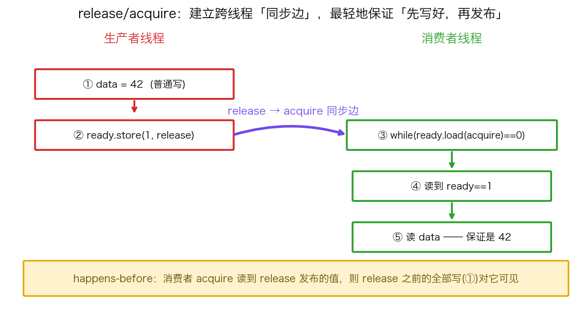
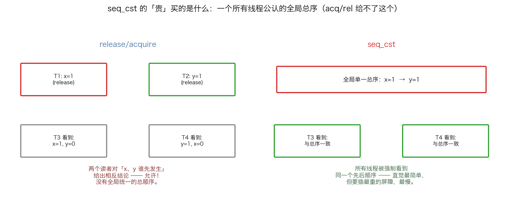

## 六种 memory_order：无锁代码的「内存可见性」语言

> 阶段 C4 · 内存模型与并发 ｜ 难度 🔴 硬核（核心）｜ 档位 A·低延迟核心
> 出处级别：C++ 标准内存模型（cppreference `std::memory_order` 条目）一手定义 + Intel SDM 内存序章节旁证。文末附证据清单与级别。

---

### 一、先想明白：为什么需要「内存序」这个东西

你写的代码，**不会**严格按你写的顺序执行。这件事对单线程没影响，对多线程是致命的。

看一段最朴素的「发布数据」代码：

```cpp
// 生产者
data = 42;          // ① 先把数据准备好
ready = true;       // ② 再举手说"好了"
```

```cpp
// 消费者
while (!ready) {}   // 等举手
use(data);          // 用数据
```

你的本意是：先写好 `data`，再把 `ready` 置真。消费者看到 `ready` 就放心地用 `data`。逻辑天衣无缝。

**但现代 CPU 和编译器为了快，会对这两条指令重排。** 有两层重排：

1. **编译器重排**：优化器发现 ① 和 ② 在单线程视角下互不依赖，可能调换它们的生成顺序。
2. **CPU 乱序 / 缓存可见性**：哪怕指令顺序没动，多核之间「谁先看到谁的写」也不保证按程序顺序——一个核写 ① 和 ② 后，另一个核可能**先看到 ②、后看到 ①**。

后果就是下面这张图右半边：



消费者看到 `ready == true` 兴冲冲去读 `data`，结果 `data` 还没写完，**读到旧值或半成品**。程序在你本地跑一万次都对，上了生产环境、换了 CPU 架构，偶尔崩一次——这是最难查的 bug。

`memory_order` 就是 C++ 给你的工具：**精确告诉编译器和 CPU「这条原子操作周围，哪些重排是禁止的」**。它不是性能调优的奢侈品，是无锁代码**正确性**的地基。

> 关键认知：`std::atomic` 默认每个操作都是 `seq_cst`（最强、最安全、最慢）。你写 `x.store(1)` 不带参数，就等于 `x.store(1, std::memory_order_seq_cst)`。所谓"用 memory_order 优化"，本质是**在保证正确的前提下，从最强往下松绑到刚好够用**，省掉多余的屏障开销。

---

### 二、六种 memory_order 的强弱谱系

C++ 提供六个枚举值，从最弱（约束最少、最快）到最强（约束最多、最慢）排成一条谱系：



| order | 一句话语义 | 典型用途 |
|---|---|---|
| `relaxed` | 只保证这一个变量的操作是**原子的**，不约束它和别的变量的相对顺序 | 纯计数器、统计量 |
| `consume` | 理论上比 acquire 弱（只约束有数据依赖的后续读），**但所有主流编译器都把它直接升级成 acquire**，实践基本不用 | （几乎不用） |
| `acquire` | **读屏障**：这条 load 之后的内存访问，不会被重排到它前面 | 读「发布标志」一侧 |
| `release` | **写屏障**：这条 store 之前的内存访问，不会被重排到它后面 | 写「发布标志」一侧 |
| `acq_rel` | 用于「读-改-写」操作（如 `fetch_add`/CAS），同时具备 acquire + release | 无锁栈/队列的 CAS |
| `seq_cst` | 在 acq_rel 之上再加一条：**所有 seq_cst 操作存在一个全局统一的总顺序**，所有线程都认同 | 拿不准时的安全默认 |

记忆框架：**relaxed 是「只要原子，不要顺序」，acquire/release 是「成对建立单向顺序」，seq_cst 是「全局统一顺序」。** 越往右，CPU 要插入的屏障指令越重，越慢。

---

### 三、relaxed：什么时候「只要原子性」就够了

`relaxed` 是最容易用错的一个。它**只保证单个变量的读写是原子的、不会撕裂**（不会读到写了一半的值），以及对同一个变量的所有修改有一个一致的先后（modification order）。但它**完全不管这个变量和其他变量的相对顺序**。

判断能不能用 relaxed，就看一个问题：**你是否依赖「这个原子变量」和「别的数据」之间的先后关系？**



- **能用（左）**：多线程各自往一个计数器累加，最后看总数。你只关心「最终加够没有」，不关心谁先谁后、也不靠它去同步别的数据。这种纯统计场景，`fetch_add(1, relaxed)` 最省——省掉了完全用不上的屏障。
- **不能用（右）**：你用 `ready` 标志去「发布」`data`。这就建立了跨变量的依赖：消费者必须保证「看到 ready==1」⇒「看到 data 写好了」。`relaxed` 给不了这个保证，消费者可能先看到 `ready==1` 而 `data` 还是旧的。这里必须上 release/acquire。

> 量化场景：无锁队列里的「序号自增」、监控用的「处理条数计数」可以 relaxed；但「writeIdx 发布数据槽」绝不能 relaxed，必须 release/acquire（这正是 SPSC 那节用的）。

---

### 四、release / acquire：成对建立「同步边」

这是低延迟代码里用得最多、也是面试最爱挖的一对。它们**必须配对使用**才有意义：

- **release**（用在 store 上）：像一道封口。**封口之前的所有内存写，都不会被重排到封口之后。**
- **acquire**（用在 load 上）：像一次开封。**开封之后的所有内存读，都不会被重排到开封之前。**

当 **acquire 读到了 release 写出的那个值**，二者就建立了一条跨线程的 **「同步边」（synchronizes-with）**，进而形成 **happens-before** 关系：



铁保证：**只要消费者通过 acquire 读到了生产者 release 发布的 `ready==1`，那么生产者在 release 之前写的一切（包括 `data=42`），消费者都一定看得到。** 半成品问题被根除。

注意这个保证是**单向、配对、且依赖「真的读到了那个值」**的：

- 单向：release 只挡「之前的写往后跑」，acquire 只挡「之后的读往前跑」。合在一起刚好把中间这段封死。
- 配对：只有 release 没有 acquire（或反之），同步边建立不起来，保证失效。
- 依赖读到：如果消费者那次 acquire 读到的是旧值（还没被 release 更新），同步边就没建立，这一轮不保证可见——所以代码里通常是 `while` 循环转着读，直到读到新值。

> 为什么不无脑用 seq_cst？因为 release/acquire 只约束「这一对之间」的顺序，CPU 插的屏障更轻。在 x86 上，store-release 和 load-acquire 几乎是免费的（x86 是 TSO 强内存模型，本就不怎么乱序）；但在 ARM（弱内存模型）上它们会落成真实屏障指令——所以**代码里该写的 memory_order 一个都不能省**，同一份代码要能跨架构正确。能讲清「这里为什么 relaxed 不够、acquire/release 刚好够、不需要 seq_cst」，是 A 档面试的分水岭题。

---

### 五、seq_cst：多花的钱买的是「全局总序」

`seq_cst` 是默认值，也是最强的。它在 acquire/release 的基础上**额外**保证一件事：**所有 seq_cst 操作存在一个唯一的全局总顺序，所有线程都看到同一个顺序。**

这个「额外」听着抽象，但它解决的是 release/acquire 解决不了的一类问题。经典反例（业界叫 IRIW，Independent Reads of Independent Writes）：



- **左（release/acquire）**：T1 把 x 置 1、T2 把 y 置 1，两个无关的写。旁观的 T3 和 T4 各自去读 x、y。在 acquire/release 模型下，**T3 可以看到「x 先、y 后」，T4 同时看到「y 先、x 后」——两个读者对同一组事件得出相反的先后结论，这是被标准允许的**。因为 release/acquire 只保证「每对同步边」局部有序，不保证存在一个全局公认的顺序。
- **右（seq_cst）**：所有线程被强制看到**同一个**全局总序（比如都看到 x 先于 y）。直觉最简单，代价是要插入最重的屏障（x86 上 seq_cst store 要用 `XCHG` 或 `MFENCE`，比普通 store 贵得多）。

实务结论：**绝大多数无锁数据结构（SPSC/MPSC 队列、引用计数、自旋锁）用 release/acquire + relaxed 就完全够，不需要 seq_cst。** 只有当你的正确性真的依赖「多个独立变量之间存在全局一致顺序」时（这类场景很少，且往往说明设计可以简化）才需要 seq_cst。但反过来——**拿不准、不确定够不够时，用默认的 seq_cst 是安全的**，先正确再优化，别为了省几纳秒引入难复现的内存序 bug。

---

### 六、面试与实战的决策顺序

把上面收敛成一个可操作的判断流程：

1. **默认从 seq_cst 起步**（就是 atomic 的默认值），保证正确。
2. 这个原子变量**只是个独立计数/统计**，不和别的数据挂钩？→ 降到 `relaxed`。
3. 它是**「发布/获取」一块数据的标志位**？→ 写端 `release`、读端 `acquire`。
4. 它是个**读-改-写**（CAS、fetch_add 且要同步数据）？→ `acq_rel`。
5. 你**确实**需要多个独立变量的全局一致顺序，且无法用单个变量重构？→ 才留 `seq_cst`。
6. 改完用 **TSan（ThreadSanitizer）** 跑，验证没有数据竞争——内存序写错，TSan 是最好的安全网。

> 一句话记牢面试官想听的：**「memory_order 是在保证正确的前提下，从 seq_cst 往下松绑到刚好够用，省掉多余屏障。relaxed 买原子性、release/acquire 成对买单向可见性、seq_cst 多花钱买全局总序。」**

---

### 七、和其他知识点的关系

- **上游（先有概念）**：C4-16 线程基础、C4-17 `std::atomic` 与 CAS——本课是给原子操作「调可见性强度」。
- **下游（直接应用）**：C4-19 内存屏障与重排（memory_order 的硬件落地）、C4-21 SPSC ring buffer（release/acquire 的实战）、C4-22 MPMC & Disruptor（acq_rel CAS 的实战）。
- **工具呼应**：C6-36 TSan——验证内存序正确性的必备安全网。
- **硬件呼应**：x86 TSO vs ARM 弱内存模型，决定了同一段 memory_order 代码在不同架构上落成多重的屏障。

---

### 证据清单

| 声明 | 来源 | 级别 |
|---|---|---|
| 六种 memory_order 枚举值及各自语义（relaxed/consume/acquire/release/acq_rel/seq_cst） | cppreference `std::memory_order` 标准库条目 | 一手（标准文档） |
| atomic 操作默认内存序为 seq_cst | cppreference `std::atomic` 默认参数 | 一手（标准文档） |
| consume 实践中被主流编译器提升为 acquire | C++ 标准注记 + 编译器实现共识（P0371 等提案明确 discourage consume） | 一手（标准提案）+ 实现共识 |
| release/acquire 配对建立 synchronizes-with → happens-before | cppreference 内存模型 happens-before 定义 | 一手（标准文档） |
| seq_cst 额外保证单一全局总顺序；IRIW 在 acq/rel 下允许读者看到相反顺序 | C++ 标准内存模型 + 经典 IRIW litmus test | 一手（标准）+ 领域经典 |
| x86 为 TSO 强内存模型，store-release/load-acquire 近乎免费；seq_cst store 需 MFENCE/XCHG | Intel SDM Vol.3 内存序章节 | 一手（厂商手册） |
| ARM 为弱内存模型，需真实屏障指令 | ARM 架构参考手册内存模型章节 | 一手（厂商手册） |
| 「要求到 A 档才考」的深度标定 | 领域经验判断，非真实 JD 原文 | 经验归纳 |
