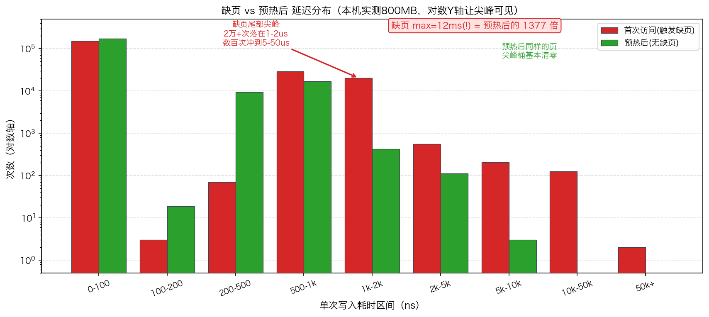
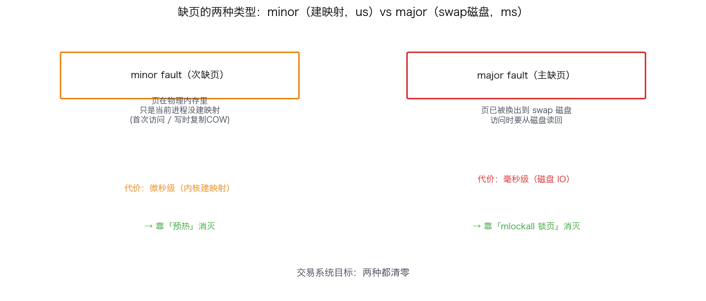
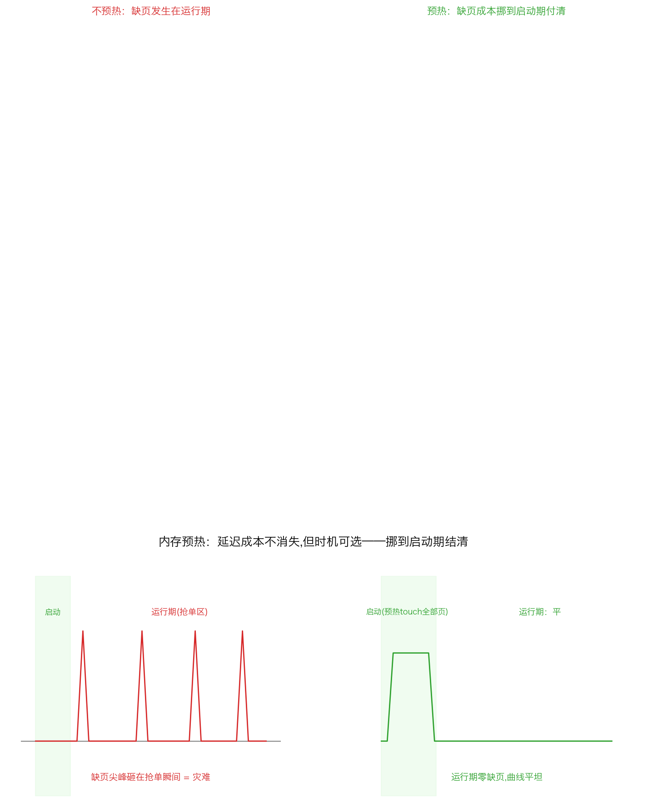
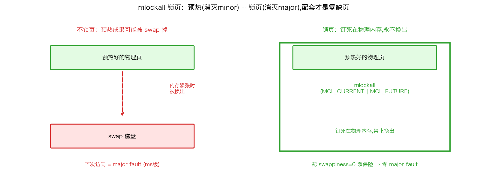

## 内存预热与锁页：把缺页尖峰消灭在启动阶段

> 阶段 O3 · 内存管理 ｜ 难度 🔴 硬核 ｜ 档位 A·低延迟核心
> 出处级别：`mlockall`/HugePages/缺页机制由 Linux man 手册与内核内存管理文档一手定义；缺页延迟为**本机实测**（Apple Silicon，复现脚本见文末）。**HugePages/`mlockall` 的具体系统配置为 Linux 用法，本机 macOS 未执行相关系统调优，已诚实标注。**
> **交易系统铁律**：「启动期预热全部内存，运行期零缺页」——缺页是微秒甚至毫秒级尖峰的隐形源头，是延迟尖峰溯源（O7）三大凶手之一。

---

### 一、缺页到底会造成多大的尖峰

先用本机实测建立敬畏心。我 `mmap` 一块 800MB 匿名内存，然后：**第一遍**逐页首次写入（触发缺页 page fault），**第二遍**再写同样的页（已分配，无缺页），对比每次写入的延迟分布（**本机真实数据**）：

| 场景 | p50 | p99 | p99.9 | **max（最坏一次）** |
|---|---|---|---|---|
| 首次访问（触发缺页） | 41 ns | 1667 ns | 8375 ns | **12,047,500 ns（12 ms!）** |
| 预热后访问（无缺页） | 0 ns | 750 ns | 1375 ns | 8750 ns |

**缺页的最坏一次尖峰高达 12 毫秒，是预热后的 1377 倍。** 对一个 tick-to-trade 目标几微秒的系统，一次 12ms 的缺页尖峰等于"这一单彻底废了"。



看直方图更直观：首次访问那一遍，有 **2 万多次**落在 1-2µs、几百次落在 5-50µs、甚至 2 次冲到 50µs+；而预热后同样的页，这些尖峰桶几乎全部清零。**缺页把一条本该平的延迟曲线，硬生生拉出了一条长尾。**

> 为什么缺页这么贵：`mmap`/`malloc` 只是保留虚拟地址，**物理页要等第一次访问时才由内核分配**（demand paging，惰性分配）。首次访问触发一次缺页异常 → 陷入内核 → 分配物理页 → 建立页表映射 → 可能还要清零页（安全要求）。这一整套是微秒级；如果页被换出到 swap（major fault），还要从磁盘读回，直接飙到毫秒级——就是上面那个 12ms。

---

### 二、缺页的两种类型



| 类型 | 触发条件 | 代价 |
|---|---|---|
| **minor fault（次缺页）** | 页在物理内存里，但当前进程还没建立映射（首次访问、写时复制 COW） | 微秒级（内核建映射） |
| **major fault（主缺页）** | 页已被换出到 swap 磁盘，要从磁盘读回 | **毫秒级**（磁盘 IO） |

交易系统的目标是**两种都清零**：minor fault 靠"预热"（首次访问提前做完），major fault 靠"锁页"（`mlockall` 禁止被换出到 swap）。

---

### 三、第一招：内存预热（touch 全部内存）

既然物理页是"首次访问才分配"，那就在**启动阶段主动把所有会用到的内存全部访问一遍**，把缺页的代价提前在"不影响交易"的启动期付掉，运行期就不再有缺页：

```cpp
// 预热：启动时逐页 touch 一遍，强制内核当场分配所有物理页
void prewarm(char* buf, size_t size) {
    const size_t PAGE = 4096;
    for (size_t i = 0; i < size; i += PAGE)
        buf[i] = 0;                    // 每页写一个字节，触发缺页、当场分配
    // 更彻底：memset(buf, 0, size);
}
```



**核心思想**：延迟成本不会消失，但**时机可以选择**。缺页那 1-12µs 的开销，发生在启动期无所谓，发生在抢单瞬间就是灾难。预热就是把这笔账挪到启动期结清——这正是本课实测第二遍（预热后）尖峰消失的原因。

对象池 / arena allocator 同理：启动期一次性分配好大块内存池并预热，运行期从池里取，**绝不在热路径 `new`/`malloc`**（呼应 C5-28 热路径零分配）。

---

### 四、第二招：mlockall 锁页，禁止换出

预热解决了 minor fault，但如果内存压力大，内核可能把你预热好的页**换出到 swap**——下次访问就变成毫秒级的 major fault。`mlockall` 把进程的页**钉死在物理内存里，禁止换出**：

```cpp
#include <sys/mman.h>
// 锁定当前所有页 + 未来分配的所有页，禁止 swap 换出
mlockall(MCL_CURRENT | MCL_FUTURE);
```



- `MCL_CURRENT`：锁定当前已映射的所有页。
- `MCL_FUTURE`：连之后新分配的页也自动锁定。
- 配合 `vm.swappiness=0`（系统层面尽量不用 swap）双保险。

> **预热 + 锁页是配套的**：预热把物理页分配出来（消灭 minor fault），锁页保证它们不被换出去（消灭 major fault）。只预热不锁页，内存紧张时预热成果可能被 swap 掉；只锁页不预热，第一次访问仍要缺页。两个一起，才实现"运行期零缺页"。

---

### 五、第三招：HugePages 降 TLB miss（配套优化）

这一招治的是另一个相关问题——TLB（页表缓存）不够用。默认页 4KB，一个大数据集要成千上万个页表项，TLB 装不下就频繁 TLB miss（每次要走多级页表翻译，几十~上百 ns）。

**HugePages** 用 2MB（甚至 1GB）的大页替代 4KB 小页：

- 覆盖同样的内存，页表项数量减少 512 倍（2MB/4KB）→ TLB 命中率大幅提升。
- 缺页次数也大减（一次缺页搞定 2MB）。

```bash
# 预留 1024 个 2MB 大页（Linux）
echo 1024 > /sys/kernel/mm/hugepages/hugepages-2048kB/nr_hugepages
```

```cpp
// 用 MAP_HUGETLB 申请大页内存
void* p = mmap(nullptr, size, PROT_READ|PROT_WRITE,
               MAP_PRIVATE|MAP_ANONYMOUS|MAP_HUGETLB, -1, 0);
```

> **注意区分**：要用**显式 HugePages**（预留的静态大页），**不要用 THP（透明大页，Transparent Huge Pages）**——THP 的后台合并/拆分（khugepaged）本身会引入抖动尖峰，低延迟系统通常反而要**关闭 THP**（见 O8-46）。这是个经典反直觉点：大页要用，但要用"显式"的，THP 要关。

---

### 六、完整配方与面试答法

启动期内存治理的标准流程：

1. **一次性分配**所有会用到的内存（对象池 / arena，别在运行期 malloc）。
2. **预热**：`memset` 或逐页 touch，强制分配所有物理页（消灭 minor fault）。
3. **锁页**：`mlockall(MCL_CURRENT|MCL_FUTURE)` + `swappiness=0`（消灭 major fault）。
4. **大页**：显式 HugePages（`MAP_HUGETLB`）降 TLB miss；**关闭 THP** 避免其抖动。
5. **验证**：运行期用 `/proc/<pid>/stat` 看 majflt/minflt 是否为 0（呼应 O7 缺页监控）。

面试被问"怎么保证交易线程运行期零缺页"，就答这套：
> **「缺页是微秒到毫秒级尖峰（可引本课实测 max 12ms）。启动期一次性分配 + 预热 touch 全部页消灭 minor fault，mlockall 锁页 + swappiness=0 消灭 major fault，显式 HugePages 降 TLB miss 但要关 THP 避免抖动，运行期查 majflt/minflt 归零验证。」**

---

### 七、和其他知识点的关系

- **上游**：O3-12 虚拟内存/页表/TLB（缺页和 TLB 的机制基础）、O3-13 HugePages、O3-16 mlockall。
- **配套**：C5-28 热路径零分配（内存池预热是其内存侧的落地）、O2 绑核（绑核后还要防缺页才完整）。
- **呼应**：O7-41 延迟尖峰溯源（缺页是三大凶手之一，本课是其治本手段）、O8-46 关 THP / swappiness=0（本课的系统层配套）、O8-48 抖动清单。

---

### 证据清单

| 声明 | 来源 | 级别 |
|---|---|---|
| 缺页延迟 p99=1667ns / p99.9=8375ns / max=12ms；预热后尖峰清零；缺页max是预热后1377倍 | 本机 benchmark 实测（`scripts/bench_pagefault.cpp`，Apple Silicon） | 一手（本机实测） |
| 物理页在首次访问时才分配（demand paging 惰性分配） | Linux 内核内存管理文档 + `mmap(2)` 手册 | 一手（内核文档+手册） |
| minor fault（建映射，µs级）vs major fault（swap 磁盘IO，ms级） | Linux 内核缺页处理文档 | 一手（内核文档） |
| `mlockall(MCL_CURRENT\|MCL_FUTURE)` 锁定页禁止换出 | Linux man7 `mlockall(2)` | 一手（手册页） |
| HugePages 2MB/1GB 大页减少页表项与 TLB miss；`MAP_HUGETLB` | Linux 内核 `Documentation/admin-guide/mm/hugetlbpage.rst` + `mmap(2)` | 一手（内核文档+手册） |
| THP（透明大页）后台合并会引入抖动，低延迟系统建议关闭 | Linux 内核 THP 文档 + 低延迟领域共识 | 一手（内核文档）+ 领域共识 |
| **HugePages/mlockall 系统配置本机未执行**（macOS 无对应接口语义） | 平台限制声明 | 诚实标注 |
| 「要求到 A 档才考」的深度标定 | 领域经验判断，非真实 JD 原文 | 经验归纳 |
