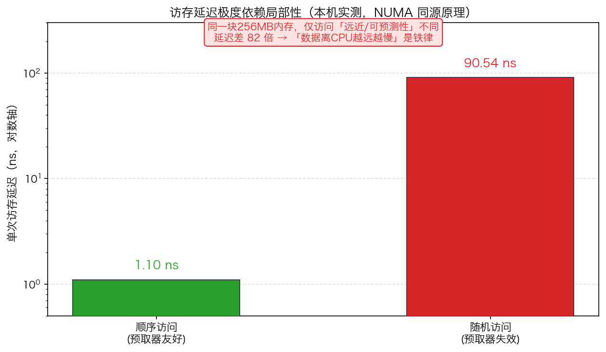
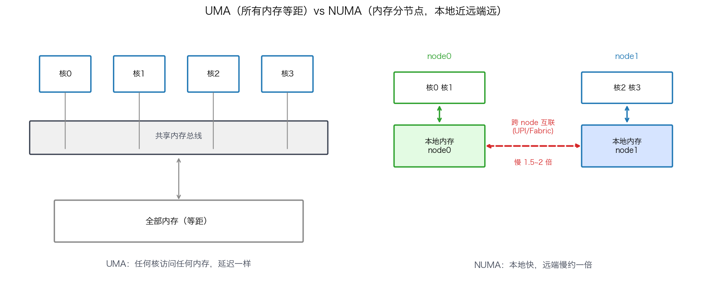
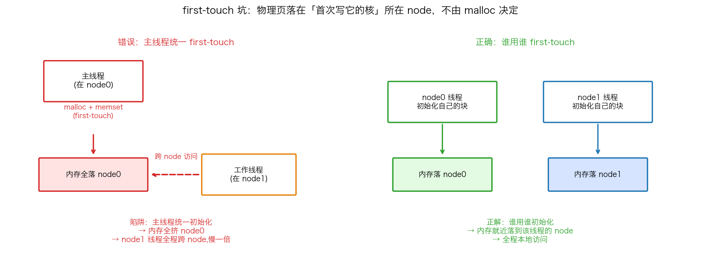
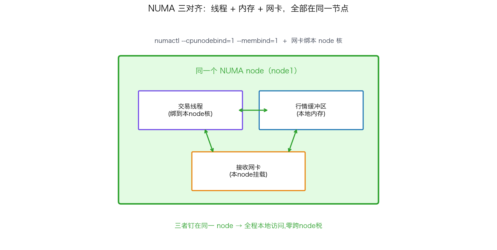

## NUMA 架构：为什么线程、内存、网卡必须在同一个节点

> 阶段 O2 · 进程调度与 CPU ｜ 难度 🔴 硬核 ｜ 档位 A·低延迟核心 / B·HPC平台
> 出处级别：NUMA 概念、`numactl`/`numa_alloc_onnode`、first-touch 策略由 Linux 内核 NUMA 文档与 man 手册一手定义；跨 node 延迟"约翻倍"为体系结构领域公认量级。访存局部性延迟差为**本机实测**（Apple Silicon，复现脚本见文末）。**本机为统一内存架构（UMA），无 NUMA 节点，跨 node 延迟无法本机实测，已诚实标注。**
> **HPC/低延迟硬核高频题**：「什么是 NUMA、跨 node 访存为什么慢、怎么避免」——多路服务器上不懂 NUMA，性能会莫名其妙掉一半。

---

### 一、先建立直觉：访存延迟高度依赖"远近"

在讲 NUMA 之前，先用本机实测确立一个底层事实：**内存访问的延迟，极度依赖数据离 CPU 有多"近"。** 我在本机跑了一个实验——同一块 256MB 的内存（远大于 cache），一次按顺序走、一次按随机置换环走（pointer chasing）：

| 访问模式 | 单次访存延迟 | 差距 |
|---|---|---|
| 顺序访问（预取器友好） | **1.10 ns** | 基准 |
| 随机访问（预取器失效，几乎每跳必 miss） | **90.54 ns** | **慢 82 倍** |



同一块内存、同样的读取次数，仅仅因为**访问位置的远近/可预测性**不同，延迟差了 82 倍。这背后是硬件预取器 + cache 层级在起作用：顺序访问能被预取器提前拉进 cache，随机访问则每次都要穿透到主存。

**记住这个直觉：「数据离 CPU 越远，访问越慢」是内存系统的铁律。** NUMA 就是把这条铁律从"cache vs 主存"放大到了"本地主存 vs 远端主存"——它是同一个原理在更大尺度上的体现。

---

### 二、什么是 NUMA：内存也分"本地"和"远端"

早期多核 CPU 共享一条内存总线访问所有内存，叫 **UMA（Uniform Memory Access，统一内存访问）**——任何核访问任何内存，延迟都一样（本机 Apple Silicon 就是 UMA）。

但服务器 CPU 核越来越多，一条总线成了瓶颈。于是现代多路服务器改用 **NUMA（Non-Uniform Memory Access，非统一内存访问）**：



- 每个 **NUMA 节点（node）** = 一组 CPU 核 + 直连它们的一块**本地内存（local memory）** + 该节点的内存控制器。
- 一个核访问**本节点的本地内存**：直连，快。
- 一个核访问**其他节点的内存（远端内存 remote memory）**：要跨过 CPU 之间的互联总线（Intel UPI / AMD Infinity Fabric），**延迟约为本地的 1.5~2 倍，带宽也更低**。

这就是"Non-Uniform"的含义：**同一个核，访问不同位置的内存，延迟不一样。** 在双路服务器上，跨 node 访存的代价是实打实的——一个本该 80ns 的访存，跨 node 可能变成 130~160ns。

> 查看本机 NUMA 拓扑（Linux）：`numactl --hardware` 或 `lscpu | grep NUMA`——会列出有几个 node、每个 node 有哪些核、node 间的距离矩阵（distance）。

---

### 三、隐形的坑：first-touch 分配策略

NUMA 最容易踩的坑，是**内存到底分配在哪个 node 上，不由 `malloc` 决定，由「谁第一个写它」决定。** 这叫 **first-touch（首次访问）策略**：



```cpp
// 陷阱：主线程 malloc + 初始化，内存全落在主线程所在的 node0
char* buf = (char*)malloc(SIZE);
memset(buf, 0, SIZE);        // ← 主线程 first-touch，buf 物理内存分配在 node0

// 之后把 buf 交给绑在 node1 的工作线程用
// → 工作线程每次访问 buf 都是【跨 node 远端访问】，慢 1.5~2 倍！
```

`malloc` 只是保留了虚拟地址，**物理页要等第一次写入时才真正分配，且分配在「执行首次写入的那个核所在的 node」**。所以"主线程统一初始化、再分给各线程用"这种常见写法，会让所有内存挤在 node0，其他 node 的线程全程跨 node 访问——性能凭空掉一截，还查不出原因。

**正解：谁用谁初始化（让每个线程 first-touch 自己要用的那块内存），内存就会就近落到该线程所在 node。**

---

### 四、NUMA 优化三原则：线程、内存、网卡同 node

低延迟/HPC 系统的 NUMA 铁律：**让一条数据处理链路上的线程、它访问的内存、它用的网卡，全部待在同一个 NUMA 节点。**



三个层面的对齐手段：

```bash
# 1. 把进程绑到 node1 的核 + 只用 node1 的本地内存（一条命令搞定线程+内存对齐）
numactl --cpunodebind=1 --membind=1 ./trading_app

# 2. 只绑内存策略（分配走 node1 本地）
numactl --membind=1 ./app
```

```cpp
// 3. 代码里在指定 node 上分配（libnuma）
void* p = numa_alloc_onnode(size, 1);   // 显式在 node1 分配
```

- **线程 ↔ 内存对齐**：绑核（O2 上一节）+ `--membind` / first-touch，保证线程访问的是本地内存。
- **网卡 ↔ node 对齐**：网卡也挂在某个 NUMA node 上（看 `/sys/class/net/<dev>/device/numa_node`）。行情/下单线程要绑到**网卡所在 node** 的核上，否则每个收到的包都要跨 node 搬一次——对 tick-to-trade 是致命的额外延迟。
- **验证**：`numastat -p <PID>` 看进程的 `numa_hit`（本地命中）vs `numa_miss`（跨 node），miss 高说明对齐没做好。

> 量化实战：行情组播接收线程 + 行情缓冲区 + 接收网卡，三者必须钉在同一个 node。跨 node 意味着每个 tick 都多付一次远端访存/搬运的延迟税，在高频场景直接体现为 tick-to-trade 的尾部变差。

---

### 五、面试怎么答

被问 NUMA，按"是什么→为什么慢→怎么优化"答：

1. **是什么**：NUMA = 内存按节点划分，每个 node 有本地内存，核访问本地快、访问远端要跨 CPU 互联总线慢约 1.5~2 倍。对比 UMA 所有访存等距。
2. **为什么在意**：访存延迟本就极度依赖远近（可引本课实测顺序 vs 随机差 82 倍的直觉），跨 node 把这个代价放大到主存层面。
3. **first-touch 坑**：内存分配在哪个 node 由"谁第一个写"决定，不是 malloc 决定——主线程统一初始化会让内存全挤 node0。正解谁用谁初始化。
4. **三对齐**：线程（绑核）+ 内存（membind/first-touch）+ 网卡（绑到网卡所在 node），全在同一 node。
5. **工具**：`numactl --hardware` 看拓扑、`numactl --cpunodebind --membind` 绑定、`numastat` 看 hit/miss 验证。

> 一句话记牢：**「NUMA 下访问远端内存比本地慢约一倍；内存落在哪个 node 由 first-touch 决定；优化就是把线程、内存、网卡三者钉死在同一个 node，用 numactl 绑定、numastat 验证 hit/miss。」**

---

### 六、和其他知识点的关系

- **上游**：O2-8/9 绑核与核隔离（NUMA 对齐的前提是先能把线程绑到指定 node 的核）、本课的访存局部性直觉与 C4-20 cache line、C5-30 DOD 同源。
- **配套**：O5-29 网卡多队列/RSS（网卡收包要落到本 node 的核）、O3 内存管理（HugePages 也有 NUMA 归属）。
- **呼应**：O5-30 tick-to-trade（跨 node 访存是尾部延迟的隐形来源）、O8 抖动清单（NUMA 未对齐是抖动源之一）。

---

### 证据清单

| 声明 | 来源 | 级别 |
|---|---|---|
| 访存局部性：顺序 1.10ns vs 随机 90.54ns，差 82 倍 | 本机 benchmark 实测（`scripts/bench_mem_locality.cpp`，Apple Silicon） | 一手（本机实测） |
| NUMA 每 node 含本地内存，跨 node 访问需经 CPU 互联，延迟约本地 1.5~2 倍 | Linux 内核 NUMA 文档 + 体系结构公认量级（Intel UPI / AMD Infinity Fabric） | 一手（内核文档）+ 领域公认 |
| first-touch：物理页在首次写入时分配到执行该写入的核所在 node | Linux 内核内存管理 NUMA 策略文档 | 一手（内核文档） |
| `numactl --cpunodebind/--membind`、`numa_alloc_onnode`、`numastat` 用法 | Linux man7 `numactl(8)`/`numa(3)`/`numastat(8)` | 一手（手册页） |
| 网卡有 NUMA 归属（`/sys/class/net/*/device/numa_node`） | Linux sysfs 网络设备接口 | 一手（内核接口） |
| **跨 node 延迟本机无法实测**（Apple Silicon 为 UMA 统一内存） | 平台限制声明 | 诚实标注 |
| 「要求到 A/B 档才考」的深度标定 | 领域经验判断，非真实 JD 原文 | 经验归纳 |
