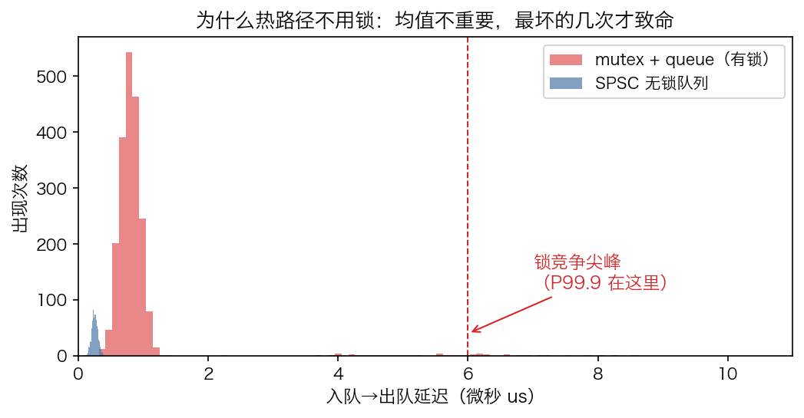
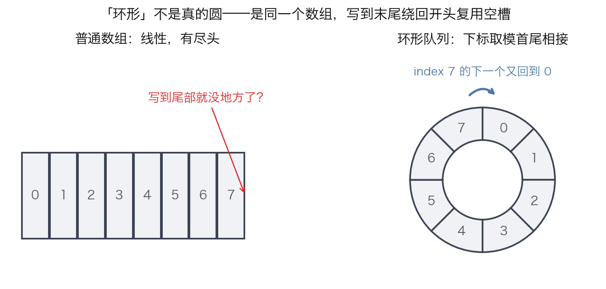
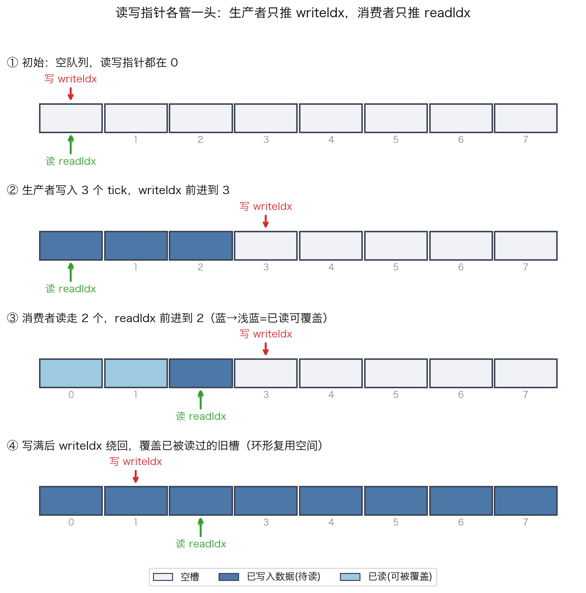
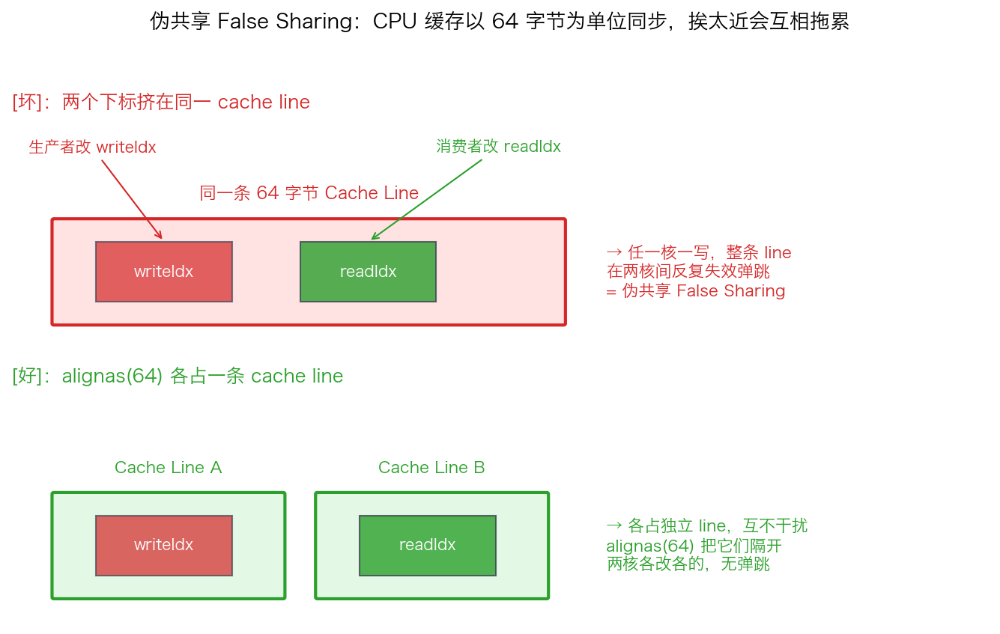
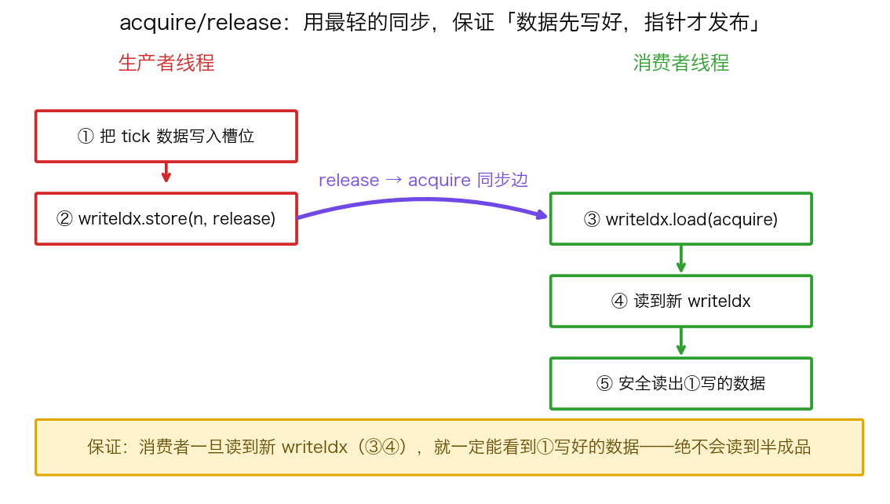

## 手写单生产者单消费者无锁环形队列（SPSC Ring Buffer）

> 阶段 C4 · 内存模型与并发 ｜ 难度 🔴 硬核 ｜ 档位 A·低延迟核心
> 出处级别：Erik Rigtorp《Correctly implementing a ring buffer》一手原文（rigtorp.se/ringbuffer/）+ LMAX Disruptor 官方白皮书旁证。文末附证据清单与级别。

---

### 一、先搞清楚要解决什么问题

在一个交易系统里，数据是**一个线程交给另一个线程**接力处理的：

- 行情线程：收到行情，解析成一个个 tick（一条最新报价），交给策略线程；
- 策略线程：算出要下的单，交给下单线程发出去。

这种"一个线程往里放、另一个线程往外取"的结构，本质就是一个**队列（queue）**：先放进去的先被取走（FIFO）。

你在课上学过最直接的做法：`std::queue` 配一把锁 `std::mutex`。放数据前先锁住、放完解锁；取数据前也先锁住、取完解锁。这样保证两个线程不会同时动这个队列，逻辑是对的。

**但在交易系统里这样做有个致命问题**：锁会带来不确定的延迟尖峰。当两个线程同时想拿锁，一个就得**等**——等多久？不确定。操作系统可能把等待的线程挂起，过一会儿再唤醒它，这一挂一醒就是微秒级、且时高时低的延迟。

为什么这要命？看下面这张图：

蓝色（无锁）和红色（有锁）大部分时候延迟都很低，差别不大。**但红色拖着一条长尾**——偶尔几次会飙到 6 微秒。交易系统不在乎"平均多快"，在乎的是**最坏的那几次**（业内叫 P99.9，即一千次里最慢的那一两次）。因为最慢的那一次，可能就是你想吃的那笔单被别人抢走、或者价格已经滑走了。

所以热路径（最在意延迟的那条链路）的标配是：**单生产者单消费者无锁队列**，英文缩写 **SPSC**（Single Producer Single Consumer）。一个线程只负责写、另一个只负责读，全程不用锁。

---

### 二、"环形"是什么意思

无锁队列的底层是一个**环形缓冲区（ring buffer）**。名字听着玄，其实就是**一个普通数组**，只不过用的时候让它"首尾相接"。

左边是普通数组：从 0 写到 7，写到头就没地方了。难道要不停地申请更大的数组吗？那样太慢（申请内存是重操作）。

右边是环形思路：**写到下标 7 之后，下一个位置不报错，而是绕回到下标 0**。实现上就一行：下一个下标 = `(当前下标 + 1) % 数组长度`（取模运算）。这样一个固定大小的数组就能循环复用，**永远不需要在运行时申请新内存**。

> 注意：图里画成圆只是帮你理解"绕回"这件事。内存里它仍然是一段连续的、线性的数组，没有真的弯成圆。

---

### 三、读写指针：各管一头，互不打扰

队列要记住两件事：**下一个该往哪写**、**下一个该从哪读**。于是用两个下标（这里叫"指针"，但不是 C++ 的裸指针，就是两个整数下标）：

- `writeIdx`（写指针）：下一个要写入的位置。**只有生产者改它。**
- `readIdx`（读指针）：下一个要读出的位置。**只有消费者改它。**

判断队列状态也靠这两个指针：
- 当 `readIdx == writeIdx` → 队列**空**（读追上了写，没东西可读）；
- 当 `writeIdx` 再走一步就会撞上 `readIdx` → 队列**满**（写追上了读，没空位可写）。

下面四个快照展示了它们怎么动：

跟着看一遍：
1. **初始**：两个指针都在 0，队列空。
2. **写入 3 个 tick**：生产者把数据放进 0、1、2，writeIdx 前进到 3。readIdx 没动，还在 0。
3. **读走 2 个**：消费者从 0、1 取走数据，readIdx 前进到 2。被读过的槽位（浅蓝）现在是空闲的，可以被覆盖。
4. **写指针绕回**：继续写，writeIdx 写到数组末尾后绕回开头，覆盖那些已经被读过的旧槽位——这就是环形复用空间。

**关键点：生产者永远只碰 writeIdx，消费者永远只碰 readIdx。** 没有任何一个变量被两个线程同时"写"。这是无锁能成立的第一块基石——既然没人抢着改同一个东西，自然不需要锁来排队。

---

### 四、第一个陷阱：别用一个 `size` 计数器

新手很容易这样想：再加一个变量 `size` 记录"当前队列里有几个元素"，生产者写一个就 `size++`，消费者读一个就 `size--`，用它判断空和满多直观。

**这恰恰是性能杀手。** 因为 `size` 会被两个线程同时改（生产者 ++、消费者 --），它成了一个"两个线程抢着写的共享变量"。要让它正确，得把它变成原子变量；而原子变量被两个 CPU 核来回写，会触发下面要讲的 cache 同步开销，让性能暴跌。

正确做法（前面已经用了）：**不要 `size`，只用 writeIdx 和 readIdx 两个指针，靠它俩的相对位置判断空/满。** 每个指针只有一个线程写，从根上避免了"抢着写"。

---

### 五、第二个陷阱：伪共享（False Sharing）

这是整节最反直觉、也是面试最爱考的点。要先知道一个硬件事实：

> **CPU 读写内存不是一个字节一个字节来的，而是一次搬一整块连续的 64 字节，这一块叫一条 "cache line"（缓存行）。**

也就是说，哪怕你只改了一个 8 字节的整数，CPU 缓存系统也是以包含它的那整条 64 字节为单位来同步的。

现在问题来了：如果 `writeIdx` 和 `readIdx` 这两个变量在内存里挨得很近，**正好落在同一条 cache line 上**，会发生什么？

看上半部分（坏的情况）：生产者改 writeIdx、消费者改 readIdx，**它俩本来互不相关**。但因为在同一条 cache line 上，生产者一改，这条 line 在消费者那个核上的缓存副本就被判为"失效"，消费者要重新从内存加载；反过来也一样。两个核就这样为了一条 line 反复"抢来抢去、来回失效"，明明各改各的变量，却互相拖累——**这就叫伪共享（false sharing）**，"伪"在于它们逻辑上根本没共享数据，纯粹是物理上挨太近被连累。

解决办法看下半部分（好的情况）：用 C++ 的 **`alignas(64)`** 强制让每个指针**独占一条 cache line**，中间用填充字节隔开。这样生产者改 writeIdx 完全不会惊动消费者那条 line，两个核各干各的，互不干扰。

Rigtorp 原文就是这么做的：

> "read (readIdx_) and write (writeIdx_) indices are aligned to the size of a cache line (alignas(64))... to reduce cache coherency traffic."

> 为什么是 64？因为主流 x86_64 和 ARM 的 cache line 就是 64 字节。代码里可以不写死 64，用 C++17 的 `std::hardware_destructive_interference_size` 来代替，更可移植。

**进阶 trick（Rigtorp 实现比教科书快数倍的核心）**：连"每次都去读对方的真实指针"都嫌慢。高手让每个线程在本地存一份**对方指针的缓存副本**（`writeIdxCached_` / `readIdxCached_`），只有当本地副本判断"满了/空了"时，才真的去读对方那个原子指针刷新一次。这样把昂贵的跨核同步降到了最低频率。

---

### 六、第三个陷阱：怎么保证"数据写好了，指针才告诉对方"

还有一个隐蔽问题。生产者做两件事：① 把 tick 数据写进槽位；② 把 writeIdx 前进一格（告诉消费者"有新数据了"）。

**这两步的顺序，在多核 CPU 上不保证按你写的来。** 现代 CPU 和编译器为了快，会"乱序执行"——它可能先让②对其他核可见，再让①可见。后果是：消费者看到 writeIdx 变了，兴冲冲去读那个槽位，结果①还没真正写完，**读到了半成品数据**。

C++ 给了你精确控制这个顺序的工具，叫 **memory order（内存序）**。这里要用的一对是 **release / acquire**：

- 生产者发布指针时用 `writeIdx.store(新值, std::memory_order_release)`；
- 消费者读指针时用 `writeIdx.load(std::memory_order_acquire)`。

它俩配成一对后，给你一个铁保证：

**只要消费者通过 acquire 读到了生产者 release 出来的新 writeIdx，那么生产者在 release 之前写的所有数据（①那一步），消费者都一定看得到。** 换句话说，release 像一道"封口"：封口之前的写操作，不会被乱序跑到封口之后。消费者 acquire 一旦"开封"，就保证看到完整内容，绝不会读到半成品。

> 为什么不直接用最强的 `std::memory_order_seq_cst`（顺序一致，默认值）？因为它更慢——它要求全局所有原子操作有统一顺序，会插入更重的屏障指令。release/acquire 只保证"这一对之间"的可见性，**刚好够用、且更便宜**。能讲清"这里为什么 relaxed 不够、acquire/release 刚好够"，是 A 档面试的分水岭题。

> 补充一个硬件冷知识：在 x86 上，store-release 几乎是免费的（x86 是 TSO 强内存模型，本来就不太乱序）。所以"无锁队列在 x86 上特别快"是有硬件原因的。但代码里该写的 memory_order 一个都不能省——因为同一份代码可能要跑在 ARM（弱内存模型，乱序更凶）上，那里就真的需要这些屏障。

---

### 七、什么时候用、什么时候别用（适用边界）

- **SPSC 只对"一个生产者 + 一个消费者"成立。** 一旦有多个线程往里写，writeIdx 就又变成"多个线程抢着改"了，前面的无锁前提就崩了。多生产者要换成更复杂的 MPMC 方案（Disruptor 模式或 CAS 循环），延迟和复杂度都更高。
- **预分配，热路径绝不申请内存。** 环形缓冲区在程序启动时一次性把数组分配好（呼应 LMAX Disruptor 原文 "All memory for the ring buffer is pre-allocated on start up"），运行中只是覆盖复用，绝不 `new`/`malloc`——申请内存是不确定延迟的来源。
- **无锁 ≠ 无等待。** 这是 lock-free（无锁），不是 wait-free（无等待）。lock-free 保证"整个系统总有线程在推进"，但不保证"每个线程都有延迟上界"。要严格的最坏延迟上界得上 wait-free，少数顶尖岗会深挖这个区别。

---

### 八、和其他知识点的关系

- **上游（先学这个）**：C4-18 六种 memory_order——本课用的 acquire/release 就是那节的实战应用。
- **下游（之后展开）**：C4-22 MPMC & Disruptor（推广到多生产者）、C5-28 内存池（预分配理念的延伸）。
- **系统侧呼应**：O3-15 false sharing（伪共享在 OS 课的对应章节）、O3-13 HugePages（大缓冲降低 TLB miss）。

---

### 证据清单

| 声明 | 来源 | 级别 |
|---|---|---|
| 读写下标各对齐到独立 cache line（alignas(64)）以减少缓存一致性流量 | Rigtorp《Correctly implementing a ring buffer》原文逐字引用 | 一手（作者原文） |
| cache line 在 x86_64/ARM 上是 64 字节；可用 hardware_destructive_interference_size 替代 | Rigtorp 原文 + cppreference | 一手 |
| 用本地缓存副本减少读取对方原子下标的频率 | Rigtorp 原文实现 | 一手（作者原文） |
| 环形缓冲区启动时一次性预分配、热路径不分配 | LMAX Disruptor 官方白皮书 "All memory ... pre-allocated on start up" | 一手（官方白皮书） |
| release/acquire 配对保证数据可见性、比 seq_cst 更轻 | C++ 标准内存模型（cppreference memory_order 条目） | 一手（标准文档） |
| x86 为 TSO 模型、store-release 近乎免费 | 体系结构常识，可在 Intel SDM 内存序章节核验 | 一手（手册）+ 领域常识 |
| "要求到 A 档才考"的深度标定 | 领域经验判断，非真实 JD 原文 | 经验归纳 |
