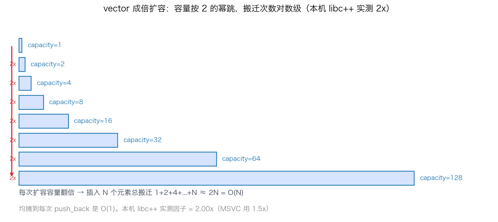
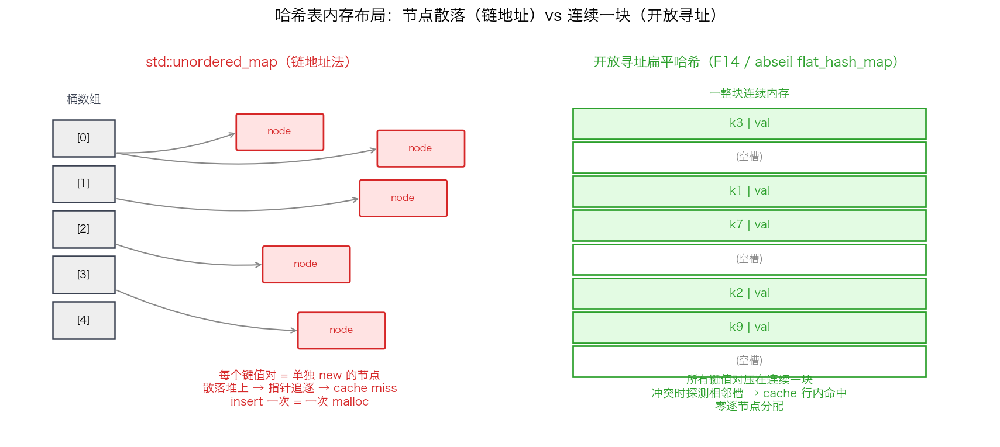
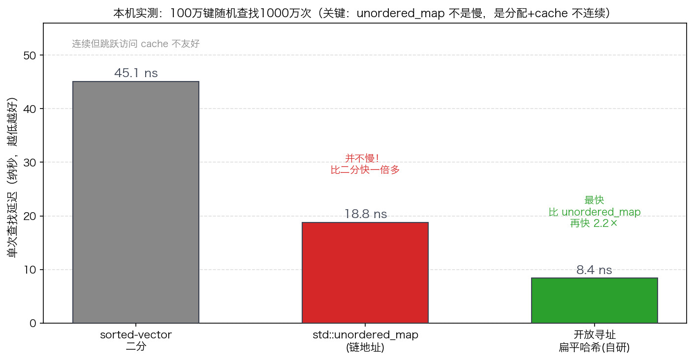
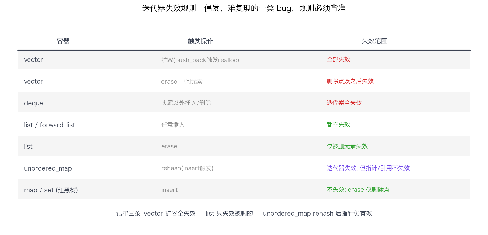

## STL 内部实现：vector 扩容、为什么 HFT 不用 std::unordered_map、迭代器失效

> 阶段 C6 · 工具链与库 ｜ 难度 🔴 硬核（面经超高频）｜ 档位 B·HPC平台 → A·低延迟核心
> 出处级别：标准对容器复杂度/迭代器失效的要求由 cppreference 一手确认；具体扩容因子、节点式 vs 扁平哈希的延迟差为**本机实测**（libc++ / Apple Silicon，复现脚本见文末），非引用、非估算。
> **面经超高频题**：「vector 怎么扩容」「为什么 HFT 不用 std::unordered_map」「迭代器什么时候失效」——这三问几乎是 C++ 岗的必考，答得深浅直接暴露你是「会用 STL」还是「懂 STL」。

---

### 一、为什么要懂 STL 内部，而不只是会调 API

STL 容器的接口很友好，friendly 到让人忘了它底下是有代价的。但在低延迟系统里，**每一次隐藏的堆分配、每一次 cache miss、每一次迭代器失效，都是真实的延迟或 bug。** 面试官问 STL 内部，本质是想知道：你写下 `vec.push_back(x)` 或 `map[k]` 时，**脑子里有没有那张内存布局图。**

本课挑三个最高频、最能拉开差距的点讲透：vector 的扩容机制、哈希表的内存布局之痛、迭代器失效的规则。

---

### 二、vector 扩容：成倍增长，与 reserve 的意义

`vector` 是连续内存。当 `size == capacity` 还要 `push_back`，它必须：**申请一块更大的内存 → 把旧元素全部搬过去（拷贝或移动）→ 释放旧内存。** 这就是一次「扩容（reallocation）」。

关键问题：每次扩多少？**答案是「成倍」，不是「加固定量」。** 我在本机 libc++ 实测，连续 push_back 看 capacity 怎么跳：

```
size=1   -> capacity=1     size=33  -> capacity=64
size=2   -> capacity=2     size=65  -> capacity=128
size=3   -> capacity=4     size=129 -> capacity=256
size=5   -> capacity=8     size=257 -> capacity=512
size=9   -> capacity=16    size=513 -> capacity=1024
size=17  -> capacity=32    ...
10 万次 push_back 共触发 18 次扩容，平均扩容倍数 = 2.00x
```



**为什么必须成倍、不能每次 +固定？** 这是均摊复杂度（amortized）的核心。若每次只 +1，插入 N 个元素要搬迁 1+2+...+N = O(N²) 次；成倍增长下，搬迁总次数是 1+2+4+...+N ≈ 2N = O(N)，**均摊到每次 push_back 是 O(1)。** 成倍是把「偶尔一次昂贵的全量搬迁」摊薄到每次插入的设计。

> **一个必须实测、不能背的点**：扩容因子**不是标准规定的**，各实现自选。本机 libc++ / libstdc++ 用 **2.0x**，而 MSVC 用 **1.5x**。1.5x 的理论好处是「释放的旧块有机会被后续分配复用」（2x 时新块永远比所有旧块之和还大，旧内存无法拼回来用）。**所以答面试别只说一个数——说清「成倍是为了 O(1) 均摊，具体因子按实现，libstdc++/libc++ 2x、MSVC 1.5x」，并补一句「我实测过本机是 2x」，立刻区分背书的和动过手的。**

**`reserve` 的意义**：如果你预先知道要放多少元素，`vec.reserve(N)` 一次性分配到位，**后续 push_back 全程零扩容、零搬迁**。在交易系统里，启动期 `reserve` 好所有容器、运行期绝不触发扩容（扩容 = 一次 malloc + 全量搬迁 = 延迟尖峰），是基本纪律。

---

### 三、哈希表之痛：为什么 HFT 不用 std::unordered_map

这是最容易答错的一道题——因为流行的偷懒答案「因为 unordered_map 慢」**是错的**，会被实测打脸。我们用数据说话。

**先看标准强加的实现约束。** C++ 标准要求 `unordered_map` 满足：① 引用/指针在 rehash 后依然有效（指向元素的指针不能失效）② 支持桶接口（`bucket_count`/`local_iterator`）。这两条**事实上把实现锁死成「链地址法（separate chaining）」**：每个键值对是一个**单独 new 出来的节点**，桶数组里存的是指向节点链表的指针。



这个布局有两个硬伤，都和延迟相关：

1. **每次 insert 一次堆分配**：插入一个键 = `new` 一个节点。在交易热路径上，`malloc` 的延迟不确定（可能要找空闲块、可能触发系统调用），这是**绝对禁止**的（呼应 C5-28 热路径零分配）。
2. **查找时指针追逐（pointer chasing）**：节点散落在堆上各处，顺着桶指针→节点→链表 next 跳转，**几乎每跳一次就是一次 cache miss**。cache 不友好是它的原罪。

**本机实测，100 万键、随机查找 1000 万次，三方对比（都是真数字）**：

| 结构 | 单次查找延迟 | 相对 | 内存布局 |
|---|---|---|---|
| `std::unordered_map` | **18.8 ns** | 基准 | 节点链式，散落堆上 |
| sorted-vector + 二分 | 45.1 ns | 慢 2.4× | 连续，但 O(log N) 跳着访问 |
| 开放寻址扁平哈希（自研） | **8.4 ns** | **快 2.2×** | 连续一块，线性探测 |



**这张表纠正两个常见误区**：

- **误区一：「unordered_map 慢所以不用」** ——错。它单次查找 18.8ns 并不慢，比 sorted-vector 二分还快一倍多（二分虽然内存连续，但 O(log N) 的跳跃访问对 cache 也不友好，且分支预测失败多）。**HFT 弃用它的真正理由是「节点式分配（每次 insert 一次 malloc）+ cache 不连续」，不是查找本身慢。** 答错因果会被追问打穿。
- **误区二：「连续内存就一定快」** ——也不全对。sorted-vector 内存连续，但二分查找的访问模式是跳跃的（每步跳半个区间），并不能充分利用 cache 行预取，反而最慢。**真正快的是开放寻址扁平哈希**：连续一块内存 + 线性探测（冲突时访问的是相邻槽，cache 行内就能命中），8.4ns，比 unordered_map 还快 2.2 倍。

**所以 HFT 的正解**：自研或用工业库的**开放寻址扁平哈希表**——folly 的 `F14`、abseil 的 `flat_hash_map`、boost 的 `unordered_flat_map`。它们用开放寻址把所有键值对压在一块连续内存里，零逐节点分配 + cache 友好，同时保持 O(1) 期望查找。代价是放弃了「rehash 后指针稳定」这个 `std::unordered_map` 被迫提供的保证——而交易系统通常不需要这个保证。

> 面试标准答法：**「std::unordered_map 被标准约束成链地址法，每次 insert 一次堆分配、查找指针追逐 cache 不友好——问题在分配和 cache，不在算法。HFT 用开放寻址的扁平哈希（F14/abseil flat_hash_map）替代，连续内存、零逐节点分配，实测能再快一倍。」** 能把「不是慢、是分配+cache」这层因果讲对，就赢了。

---

### 四、迭代器失效：最隐蔽的一类 bug

迭代器失效（iterator invalidation）= 容器结构改变后，之前拿到的迭代器/指针/引用指向了已经无效的内存。在它上面解引用是未定义行为，且往往**偶发、难复现**。规则必须背准：



| 容器 | 什么操作导致失效 | 失效范围 |
|---|---|---|
| `vector` | **扩容**（push_back 触发 realloc） | **全部**迭代器/指针/引用失效（内存搬了家） |
| `vector` | erase 中间元素 | 删除点**及其之后**的失效 |
| `deque` | 头尾以外的插入/删除 | 全部迭代器失效（但指向元素的引用规则不同） |
| `list` / `forward_list` | 任意插入 | **不失效**（节点独立，只改指针） |
| `list` | erase | **仅被删元素**失效，其余不动 |
| `unordered_map` | **rehash**（insert 触发） | **迭代器**失效，但**指针/引用不失效**（标准保证，正是它被迫链式的原因） |
| `map`/`set`（红黑树） | insert | 不失效；erase 仅删除点失效 |

**最经典的坑**——边遍历边删除：

```cpp
// 错误：erase 使 it 失效，++it 是未定义行为
for (auto it = v.begin(); it != v.end(); ++it)
    if (pred(*it)) v.erase(it);          // BUG

// 正确：erase 返回下一个有效迭代器
for (auto it = v.begin(); it != v.end(); )
    if (pred(*it)) it = v.erase(it);     // OK
    else ++it;

// 更好：erase-remove idiom（O(N) 一次搞定）
v.erase(std::remove_if(v.begin(), v.end(), pred), v.end());
```

> 量化关联：交易系统里订单表、持仓表的遍历清理极其常见，迭代器失效导致的偶发崩溃在生产环境最难查。记准「vector 扩容全失效、list 只失效被删的、unordered_map 的指针在 rehash 后还有效」，是工程基本功。

---

### 五、其他高频考点速记

- **`std::sort` 是 introsort（内省排序）**：quicksort 打底，递归过深退化时切到 heapsort 保证最坏 O(N log N)，小区间用 insertion sort 收尾。不是纯快排——纯快排最坏 O(N²)，标准不允许。
- **`std::map` 是红黑树**：有序、O(log N)、节点式（同样 cache 不友好 + 逐节点分配）。需要有序就用它，不需要有序优先扁平结构。
- **`std::deque` 是分段连续**（一段段固定大小的块 + 中控数组），不是一整块连续——所以 `&deque[0]` 不能当连续数组传给 C 接口。
- **小字符串优化 SSO**：`std::string` 短字符串（libc++ 约 ≤22 字节）直接存在对象内部、不上堆——所以短 string 拷贝不一定有堆分配。

---

### 六、和其他知识点的关系

- **上游**：C1-1 RAII（容器是 RAII 的典范）、C1-2 移动语义（vector 扩容时元素用移动还是拷贝，取决于元素的移动构造是否 `noexcept`）。
- **直接呼应**：C5-28 热路径零分配（unordered_map 的逐节点分配正是热路径大忌）、C4-20 false sharing（扁平哈希的连续布局也要注意多线程下的 line 争用）、C5-30 DOD（SoA vs AoS 与扁平容器同源思想）。
- **工业库**：C6-38 folly（F14）、abseil（flat_hash_map）——本课「正解」直接落到那一节。
- **工具**：C6-34 Godbolt 看 vector 扩容生成的代码、C6-35 perf 看 unordered_map 查找的 cache-miss。

---

### 证据清单

| 声明 | 来源 | 级别 |
|---|---|---|
| vector 均摊 O(1) push_back、成倍扩容；扩容因子非标准规定（libstdc++/libc++ 2x、MSVC 1.5x） | cppreference `std::vector` 复杂度说明 + 各实现源码共识 | 一手（标准）+ 实现共识 |
| 本机 libc++ 实测扩容因子 = 2.00x，10万次 push_back 触发 18 次扩容 | 本机 benchmark 实测（`scripts/bench_stl.cpp`） | 一手（本机实测） |
| unordered_map 标准要求 rehash 后指针/引用不失效 + 桶接口 → 事实锁定链地址法 | cppreference `std::unordered_map` 迭代器失效 + 桶接口条目 | 一手（标准文档） |
| unordered_map 18.8ns / sorted-vec 二分 45.1ns / 开放寻址扁平哈希 8.4ns | 本机 benchmark 实测（100万键×1000万次查找） | 一手（本机实测） |
| 各容器迭代器失效规则 | cppreference 各容器 "Iterator invalidation" 条目 | 一手（标准文档） |
| std::sort 为 introsort（quick+heap+insertion）、最坏 O(N log N) | cppreference `std::sort` 复杂度要求 + libstdc++/libc++ 实现 | 一手（标准）+ 实现 |
| HFT 用 F14/abseil flat_hash_map 等开放寻址扁平哈希替代 | folly/abseil 官方文档（开放寻址 + 连续内存设计） | 一手（库文档） |
| 「要求到 B/A 档」的深度标定 | 领域经验判断，非真实 JD 原文 | 经验归纳 |
