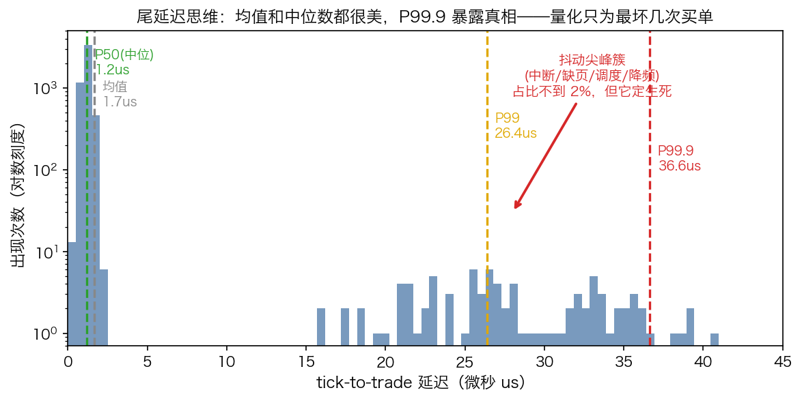
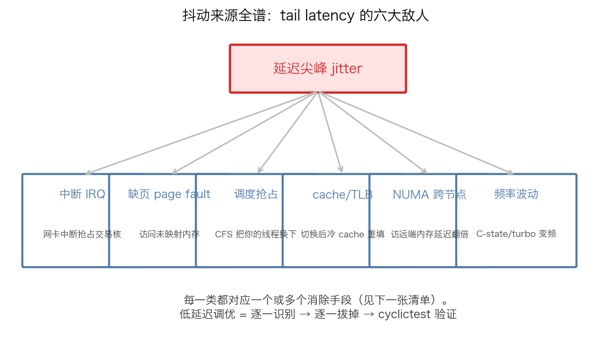
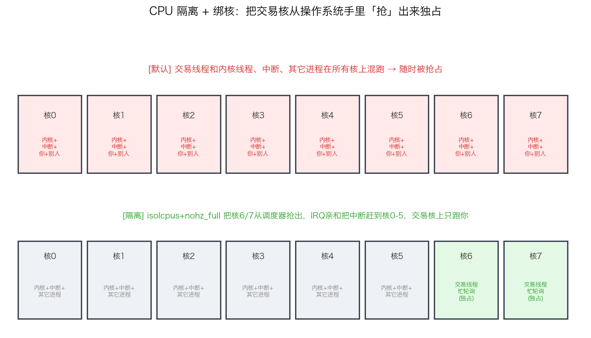
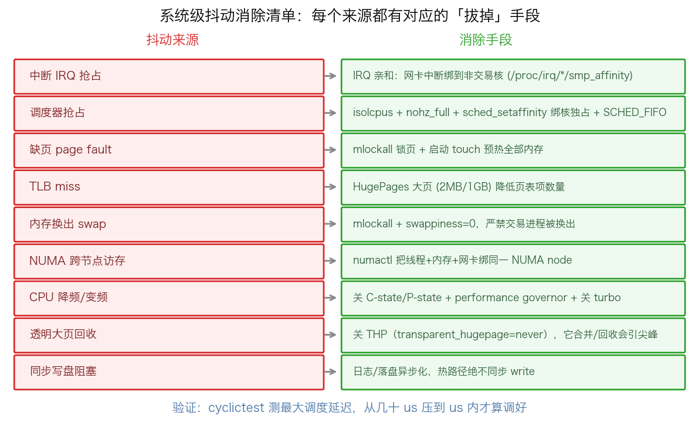
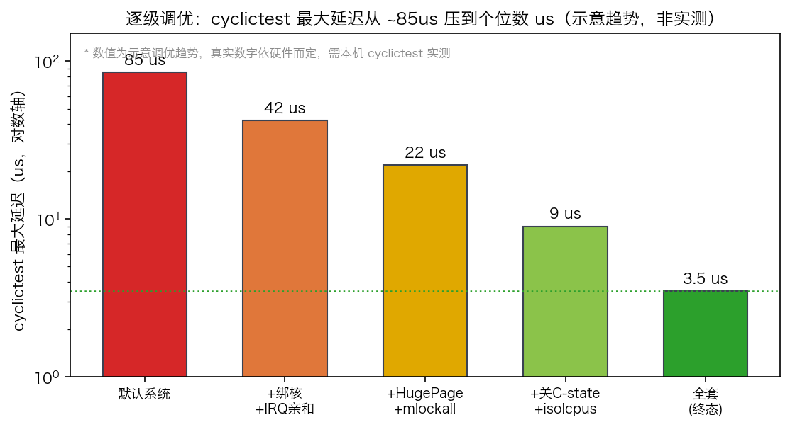

## 系统级抖动消除清单：把整台机器调成一条「安静的跑道」

> 阶段 O8 · 操作系统调优 ｜ 难度 🔴 硬核（实战必备）｜ 档位 A·低延迟核心
> 出处级别：Linux 内核文档（isolcpus / nohz_full / IRQ affinity）+ man7（mlock / sched_setaffinity）+ `cyclictest`（rt-tests 官方工具）。文末附证据清单与级别。

---

### 一、一句话先把结论钉死

**低延迟交易系统的性能上限，不在你的 C++ 代码，而在你脚下那台机器有多「安静」。** 你可以把热路径写得零分配、无锁、cache 友好（前面 C4/C5 那几节），但只要操作系统还会在任意时刻把你的线程换下、把网卡中断塞到你的核上、让 CPU 偷偷降频——你辛苦省下的纳秒，会被一次几微秒的系统抖动一口吃光。

这一节就是一张**可以照着逐条执行的「机器调优清单」**，外加一套贯穿整个专栏的心智：**尾延迟思维**。

---

### 二、先建立心智：你要消灭的是「尾巴」，不是「均值」

上图是同一个交易循环测出来的延迟分布。绝大多数请求（主峰）都很快，这部分早就被你的代码优化到位了。真正的敌人是右边那一簇**尖峰**——P99 / P99.9 / P99.99 这几条竖线之后拖出去的长尾。

为什么只盯尾巴？因为**最慢的那一次，往往就是最重要的那一次**。行情剧烈波动、所有人都在抢同一个价位的那一刻，正是系统最容易被抖动击中的时刻；你被换下 CPU 的那 8 微秒，单子就被别人吃掉了。

> 这是整个专栏的同一个世界观：C4 的内存序、C5 的零分配、O8 的系统调优，做的都是同一件事——**消灭尾部的不确定性**。均值是给 PPT 看的，尾延迟才是真金白银。

衡量工具只有一个权威：**`cyclictest`**（rt-tests 套件）。它在指定核上反复睡眠 → 唤醒，测「实际唤醒时刻 - 应该唤醒时刻」的偏差，直接打印 Max / Avg。**调优的唯一验收标准就是它的 Max 值往下掉**，而不是你「感觉变快了」。

---

### 三、抖动从哪来：六大敌人

在动手拔之前，先认全敌人。一次延迟尖峰，通常是下面六类来源之一（或几个叠加）：

1. **中断 IRQ**：网卡、磁盘、时钟中断随时可以抢占你的交易核，把你的线程踢下去处理中断。高频场景下网卡中断尤其凶。
2. **缺页 page fault**：访问一块还没真正映射物理页的虚拟内存，触发缺页中断，内核现场建页表——微秒级尖峰（这正是 C5 零分配那节的延伸）。
3. **调度抢占**：Linux 默认的 CFS 调度器是「公平」的，它会为了照顾别的进程，把你的线程换下来。公平对交易是灾难。
4. **cache / TLB 污染**：线程被换下又换上、或迁移到别的核，原来热的 cache 全冷了，重新填充就是几百纳秒到微秒。
5. **NUMA 跨节点访问**：多路服务器上，访问「远端」内存节点的延迟是本地的近两倍。线程和它的内存不在同一个 NUMA 节点就会中招。
6. **频率波动**：CPU 的 C-state 省电休眠、turbo 变频，会让指令执行速度忽快忽慢，引入不可预测的延迟。

**调优 = 逐一识别 → 逐一拔掉 → cyclictest 验证。** 下面就是拔掉它们的标准手段。

---

### 四、核心武器：CPU 隔离 + 绑核

六大敌人里，**前四个（中断、抢占、cache、迁移）都可以用同一招根治：把几个 CPU 核从操作系统手里「抢」出来，让交易线程独占。**

- **默认状态**：8 个核全部混跑——内核线程、中断、你的交易线程、别人的进程，全挤在一起，你随时被抢占。
- **隔离状态**：用 `isolcpus=6,7` + `nohz_full=6,7` 把核 6、7 从调度器手里抢出来，再用 IRQ 亲和把所有中断赶到核 0-5。最后用 `taskset` / `sched_setaffinity` 把交易线程钉死在核 6/7 上——**这两个核上只剩你一个人，没人能抢你**。

这一招同时干掉了：调度抢占（调度器不再管这俩核）、中断（中断被赶走）、cache 污染 + 核间迁移（线程不再被换下也不再乱跑）。是低延迟调优里**性价比最高的一步**。

---

### 五、逐条执行清单

把六大敌人对应到可执行的命令，就是下面这张清单。这是可以贴在工位上、逐条打勾的实战表：

| 目标 | 手段 | 干掉的敌人 |
|---|---|---|
| 隔离交易核 | 内核启动参数 `isolcpus=6,7 nohz_full=6,7 rcu_nocbs=6,7` | 调度抢占 |
| 绑核 | `taskset -c 6` 或代码里 `sched_setaffinity` | 核间迁移 / cache 污染 |
| 赶走中断 | IRQ affinity：`echo <mask> > /proc/irq/<n>/smp_affinity`，把中断绑到核 0-5 | 中断 IRQ |
| 锁住内存 | `mlockall(MCL_CURRENT\|MCL_FUTURE)` + 启动期预触摸（touch）所有页 | 缺页 page fault |
| 大页 | HugePage（2MB/1GB），减少 TLB miss 和缺页次数 | cache/TLB |
| 关省电 | 关 C-state（`idle=poll` 或 `cpupower idle-set`）、锁定频率、关 turbo 抖动 | 频率波动 |
| 就近内存 | `numactl --cpunodebind --membind` 把线程和内存绑到同一 NUMA 节点 | NUMA 跨节点 |
| 实时优先级 | `SCHED_FIFO` 给交易线程最高实时优先级（隔离核上锦上添花） | 调度抢占（兜底） |

**铁律：每改一条，都用 `cyclictest` 重测一遍 Max**。不验证的调优等于没调，甚至可能改坏。

---

### 六、效果：逐级调优把 Max 压下去

把上面的手段逐级叠加，`cyclictest` 的最大延迟会一级一级往下掉：

> ⚠️ 上图为**示意趋势，非实测**——真实数字强依赖你的硬件（CPU 型号、主板、内核版本），必须本机 `cyclictest` 实测。这里只表达「每加一层手段，尾延迟台阶式下降」这个定性规律。

从默认系统的几十微秒级 Max，逐步叠加绑核+IRQ 亲和、HugePage+mlockall、关 C-state+isolcpus，最终到全套调优后的个位数微秒——**注意 Y 轴是对数轴**，每一级的下降都是数量级意义上的。这就是把一台普通服务器调成「实时跑道」的全过程。

---

### 七、一句话总结

- **代码优化有天花板，系统调优才是地基。** 热路径再快，跑在一台会随时抖动的机器上也是白搭。
- **核心招式是 CPU 隔离 + 绑核**——一招同时干掉抢占、中断、cache 污染、核间迁移。
- **配套清单**：mlockall 防缺页、HugePage 降 TLB miss、关 C-state 稳频率、numactl 就近访存、SCHED_FIFO 兜底。
- **唯一验收标准是 `cyclictest` 的 Max**，每改一条都重测，盯尾延迟不盯均值。

---

### 证据清单与级别

| # | 论点 | 来源 | 级别 |
|---|---|---|---|
| 1 | `isolcpus` / `nohz_full` / `rcu_nocbs` 把 CPU 核从调度器隔离 | Linux 内核文档 `admin-guide/kernel-parameters.txt`、`Documentation/timers/no_hz.rst` | 一手·官方文档 |
| 2 | IRQ affinity 通过 `/proc/irq/<n>/smp_affinity` 重定向中断 | Linux 内核文档 `Documentation/core-api/irq/irq-affinity.rst` | 一手·官方文档 |
| 3 | `mlockall` 锁定进程内存、避免缺页 | man7 `mlockall(2)` | 一手·man page |
| 4 | `sched_setaffinity` 绑核、`SCHED_FIFO` 实时调度 | man7 `sched_setaffinity(2)`、`sched(7)` | 一手·man page |
| 5 | `cyclictest` 测量调度延迟 Max/Avg | rt-tests 项目（kernel.org，官方 RT 测试套件） | 一手·官方工具 |
| 6 | NUMA 本地/远端访存延迟差异、`numactl` 绑定 | man7 `numactl(8)`、`numa(7)` | 一手·man page |
| 7 | C-state / 频率变化引入延迟抖动 | Linux 内核 `Documentation/admin-guide/pm/cpuidle.rst` | 一手·官方文档 |
| 8 | 图 5 的具体微秒数值 | **示意趋势，非实测**——真实值依硬件而定，需本机实测 | 推断·示意 |

> 透明声明：本文所有调优手段与机制描述均来自上述一手文档；图 1（延迟分布）与图 5（逐级调优数值）为**示意性绘制**，用于表达定性规律，绝对数值不代表任何实测基准，落地前必须在目标硬件上用 `cyclictest` 实测校准。
