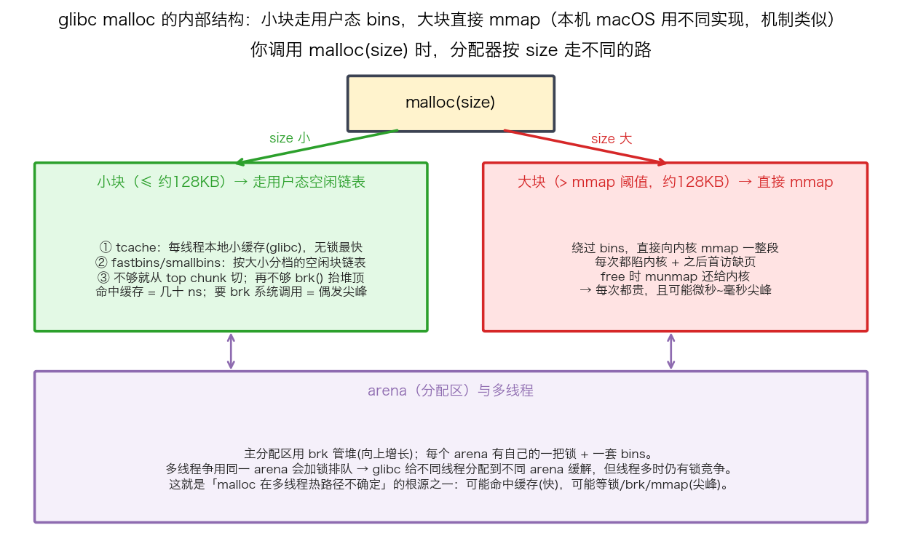
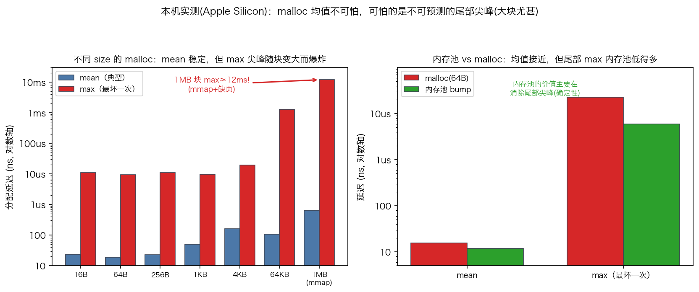

## malloc 原理：从 brk/mmap 到 bins/arena，以及为什么热路径禁用它

> 阶段 C5 · 性能优化 / C6 · 工具链 ｜ 难度 🔴 硬核（面经高频）｜ 档位 A·低延迟核心 / B·HPC平台
> 出处级别：`brk`/`sbrk`/`mmap` 系统调用由 man7 手册一手定义；bins/arena/tcache/mmap 阈值为 **glibc malloc（ptmalloc2）实现**，出处为 glibc 源码与官方 malloc 文档；分配延迟长尾/大小块尖峰/内存池对照为**本机实测**（`scripts/bench_malloc.cpp`，Apple Silicon）。**⚠️ 重要：bins/arena/tcache 是 glibc 特有实现，本机 macOS/ARM64 用的是不同分配器（Apple libmalloc），机制细节不同；但"小块快、偶发尖峰、大块更贵、内存池确定性更好"的定性行为跨平台通用，实测数字属本机 libmalloc，已诚实标注。**
> **一句话定位**：姊妹课《热路径零分配》讲了"热路径禁 malloc、用内存池"这个结论；本课补齐**结论背后的机制**——malloc 内部到底在干什么、慢和不确定从哪来。懂了机制，才知道内存池到底绕开了什么。

---

### 一、malloc 不是一个函数，是一个"内存批发商"

很多人以为 `malloc(size)` 就是"问内核要 size 字节"。**不是**。直接问内核要内存（`brk`/`mmap` 系统调用）非常贵——每次都要陷内核。所以 malloc 是一个**用户态的内存管理层**：它**一次性向内核批发一大块**，然后在用户态把这大块**零售**给你的每次 `malloc` 调用，`free` 的块也**留着复用**而不是立刻还给内核。

它向内核拿内存有两条路：
- **`brk`/`sbrk`**：把进程堆的"顶部"往上抬，扩大堆区。用于常规的小块内存增长。
- **`mmap`**：直接映射一整段匿名内存。用于大块。

关键是：**这两个系统调用 malloc 都尽量少调**——批发一次，零售很多次。这就是为什么大多数 `malloc` 很快（纯用户态操作），但偶尔会有一次慢（正好赶上要 `brk`/`mmap` 补货）。

---

### 二、glibc malloc 的内部结构：小块走 bins，大块走 mmap

以最有代表性的 **glibc malloc（ptmalloc2）** 为例（⚠️ 本机 macOS 用 Apple 的 libmalloc，结构不同但思想类似）：

**按申请大小走两条完全不同的路：**

- **小块（≤ 约 128KB，mmap 阈值以下）→ 走用户态空闲链表**：
  - **tcache**（thread cache）：每线程一个本地小缓存，**无锁**，最快，命中就是几十 ns。
  - **fastbins / smallbins / largebins**：按大小分档的空闲块链表，`free` 的块挂回对应 bin 等复用。
  - 都没有合适的 → 从 **top chunk**（堆顶那块大空闲）切一块；top chunk 也不够 → `brk()` 抬堆顶（**系统调用，偶发尖峰**）。
- **大块（> mmap 阈值，约 128KB）→ 直接 mmap**：
  - **绕过所有 bins**，直接向内核 `mmap` 一整段，`free` 时 `munmap` 还给内核。
  - **每次都陷内核 + 之后首次访问还要缺页**（见 O3 换页课）——所以大块分配**每次都贵**，且可能微秒到毫秒尖峰。

**arena（分配区）与锁**：每个 arena 有自己的一把锁 + 一套 bins。多线程同时 malloc 会**争用同一 arena 的锁 → 排队**。glibc 的缓解办法是给不同线程分配到不同 arena，但线程一多仍有锁竞争。**这是"malloc 在多线程热路径不确定"的核心根源之一。**

> tcache 正是为了减少这个锁竞争——每线程本地缓存，命中就完全不碰 arena 锁。但 tcache 容量有限，装不下就还得回到加锁的 bins。

---

### 三、一次 malloc 可能踩中的 5 层开销

把上面的机制翻译成"一次调用的开销分布"——这就是为什么 malloc 延迟**方差巨大**：

| 层 | 触发 | 代价 |
|---|---|---|
| ① tcache/fastbin 命中 | 拿现成空闲块，无锁 | 快，几十 ns（**快路径**） |
| ② 需要加 arena 锁 | 多线程争用 → 等锁 | 不确定 |
| ③ bins 都空 → 切 top chunk / `brk()` | 系统调用抬堆顶 | 微秒级 |
| ④ 大块 → `mmap` 一整段 | 陷内核映射 | 微秒级 |
| ⑤ 首次访问新内存 → 缺页 | 内核分配物理页（见 O3） | 微秒~毫秒尖峰 |

**①是快路径，绝大多数调用命中。但②③④⑤随时可能发生、且不可预测**——你无法保证下一次 `malloc` 走哪条路。**交易热路径要的是"每次都一样快"（低延迟 + 确定性），而 malloc 恰恰给不了确定性。**

---

### 四、本机实测：均值不可怕，尾部尖峰才可怕

用 `bench_malloc.cpp` 实测本机（Apple Silicon / libmalloc）不同大小的分配延迟，各 50 万次：

| size | mean | **max（最坏一次）** |
|---|---|---|
| 16B–256B | ~20 ns | ~9–11 µs |
| 1KB | 51 ns | ~10 µs |
| 4KB | 163 ns | ~19 µs |
| 64KB | 107 ns | **~1.3 ms** |
| **1MB（走 mmap）** | 648 ns | **~12 ms!** |

两个铁一样的结论：
1. **均值很稳**（几十到几百 ns），单看 mean 会以为 malloc 很快很安全。
2. **max 尖峰随块变大而爆炸**：小块偶发 ~10µs，1MB 大块 max 高达 **12 毫秒**——正是"大块每次 mmap + 缺页"的代价。**对一个 tick-to-trade 目标几微秒的系统，一次 12ms 尖峰 = 这一单彻底废了。**

> 量化关心的从来不是均值，是**最坏几次**（P99.9/max，呼应 O8 tail latency）。malloc 的问题不是"平均慢"，而是"你不知道哪次会慢、能慢多少"——这种不确定性对低延迟是致命的。

---

### 五、内存池：绕开整套 malloc 逻辑

既然 malloc 的不确定来自"运行期可能触发锁/brk/mmap/缺页"，对策就是**启动期一次性把内存批发好、运行期从池里零售，根本不调 malloc**：

**本机实测**（右图）：64B 对象，malloc vs 内存池 bump 分配：
| | mean | max |
|---|---|---|
| malloc(64B) | 15.6 ns | 22.8 µs |
| 内存池 bump | 11.8 ns | **6.0 µs** |

诚实说明：本机 libmalloc 小块本身很快，所以**均值只快 1.3 倍**（不夸张）。但**内存池的真正价值在尾部**——max 从 22.8µs 降到 6µs。**内存池换来的是"确定性"（每次都是一条加法指令 bump 指针，没有任何隐藏路径），不是均值上的巨大领先。** 这跟姊妹课《热路径零分配》的实测互补：那里对象更重、malloc 尖峰更极端，内存池优势更明显。

内存池的三种形态（详见 C5-28）：
- **对象池 / free list**：固定大小对象借还，O(1)。
- **arena / bump allocator**：一批同生共死的对象，分配 = 指针 +size，整批一次 reset。
- **栈上 / `std::array`**：生命周期不超出函数、大小已知的小对象。

---

### 六、面试答法与量化落点

被问"malloc 底层怎么实现的 / 为什么 HFT 热路径禁 malloc"，串这条：
> **malloc 是用户态内存管理层，用 brk/mmap 向内核批发大块、在用户态零售。glibc 用 tcache（每线程无锁缓存）+ fastbins/smallbins（按档空闲链表）管小块，大块（>约128KB）直接 mmap。慢和不确定来自五层：arena 锁竞争、brk/mmap 系统调用、首访缺页——命中缓存几十 ns，踩中尖峰可到微秒甚至毫秒（实测大块 max 12ms）。交易热路径要确定性低延迟，malloc 给不了，所以启动期预分配内存池、运行期只在池内借还，绕开整套逻辑。**

**别过度**：非热路径（启动、配置、日志）用 malloc 完全没问题——它的通用性和便利性值这点开销。只在"每 tick 百万次分配的交易热路径"才上内存池。

---

### 七、和其他知识点的关系

- **姊妹课**：C5-28《热路径零分配》（本课机制的对策落地——内存池/arena/对象池的写法与实测）。
- **上游**：O3《虚拟内存·页表·换页》（malloc 第⑤层"首访缺页"的机制根源；brk/mmap 抬堆和映射的底层）、O1-5 mmap（大块分配走的系统调用）。
- **配套**：C6-38 工业级库（jemalloc/tcmalloc 是 glibc malloc 的高性能替代，减少锁竞争和碎片）、O8 tail latency（本课"关注 max 不关注 mean"的思维）。

---

### 证据清单

| 声明 | 来源 | 级别 |
|---|---|---|
| 分配延迟：小块 mean ~20ns/max ~10µs；1MB 块 mean 648ns/max ~12ms | 本机 benchmark 实测（`scripts/bench_malloc.cpp`，50 万次，Apple Silicon libmalloc） | 一手（本机实测） |
| 内存池 bump vs malloc(64B)：mean 11.8 vs 15.6ns；max 6.0 vs 22.8µs | 本机 benchmark 实测（同脚本） | 一手（本机实测） |
| malloc 用 brk/sbrk 抬堆、mmap 映射大块，向内核批发、用户态零售 | man7 `brk(2)`/`sbrk(3)`/`mmap(2)` + glibc malloc 文档 | 一手（手册页+glibc 文档） |
| glibc：tcache 每线程无锁缓存、fastbins/smallbins 按档链表、arena+锁、mmap 阈值约 128KB | glibc 源码（malloc/malloc.c）+ glibc malloc 官方文档 | 一手（源码+官方文档） |
| 大块 free 走 munmap 还内核；首访触发缺页 | man7 `munmap(2)` + Linux 内核缺页机制（本专栏 O3 课） | 一手（手册页+内核文档） |
| **⚠️ bins/arena/tcache 是 glibc 特有；本机 macOS 用 Apple libmalloc，机制细节不同** | 平台差异声明（glibc vs libmalloc） | 诚实标注 |
| **内存池均值只快 1.3 倍，价值主要在消除尾部尖峰（本机小块 libmalloc 本身快）** | 对实测的诚实归因 | 诚实标注 |
| 「A/B 档热路径才深究」的档位标定 | 领域经验判断，非真实 JD 原文 | 经验归纳 |
