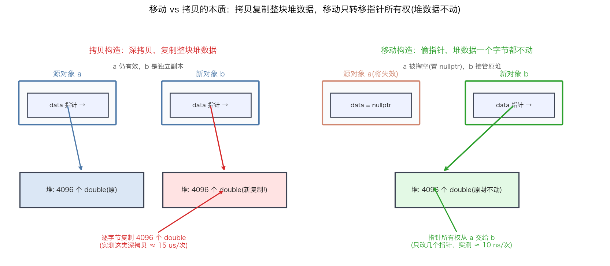
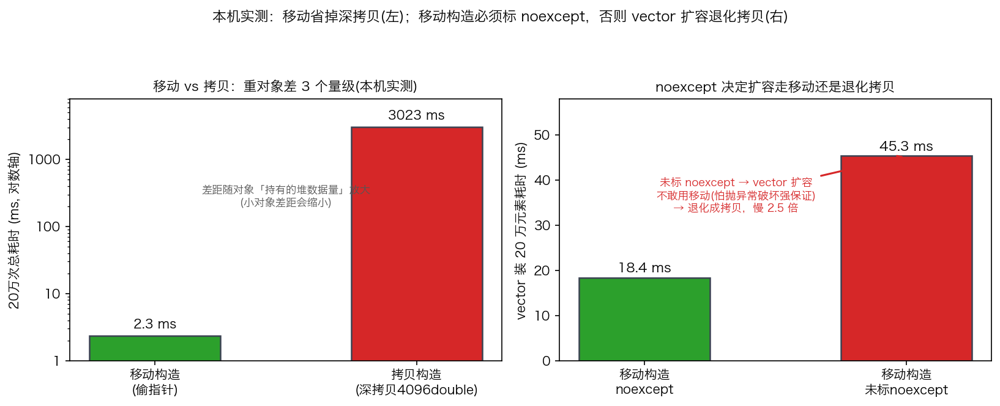
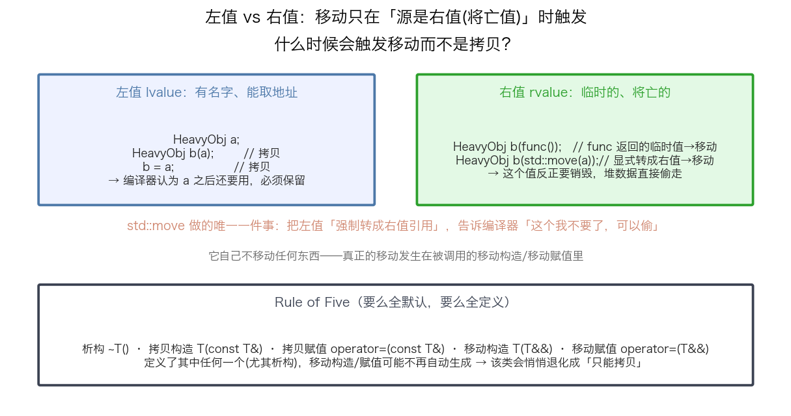

## 移动语义：右值引用、零拷贝对象传递与 noexcept

> 阶段 C1 · 现代 C++ 地基 ｜ 难度 🟡 进阶（面试几乎必问）｜ 档位 C·研究员（全员必过）
> 出处级别：右值引用/移动语义/`std::move`/Rule of Five/移动构造对 vector 扩容的影响为 C++ 标准语义（cppreference 一手）；移动 vs 拷贝、noexcept 对扩容的开销为**本机实测**（`scripts/bench_move.cpp`，Apple Silicon）。**具体倍数依赖对象持有的堆数据量，已诚实标注。**
> **一句话定位**：这是现代 C++ 最基础也最高频的面试题。移动语义解决的核心问题是——**把对象在管线间传来传去时，别再傻乎乎地深拷贝整块堆数据**。对量化的行情/订单对象在流水线间传递，这是零拷贝的地基。

---

### 一、移动 vs 拷贝：本质是「复制堆数据」还是「转移指针」

大多数"重"对象（`vector`、`string`、持有大 buffer 的行情快照）真正占空间的是**堆上那块数据**，对象本身只是持有一个**指向堆的指针**。理解这一点，移动和拷贝的区别就一目了然：



- **拷贝构造（深拷贝）**：给新对象**分配一块新堆内存，逐字节复制**原对象的全部数据。两个对象各自独立，源对象 `a` 拷贝后仍然有效。代价 = 复制整块数据（重对象是微秒级）。
- **移动构造（偷指针）**：新对象**直接接管源对象的堆指针**，源对象的指针被置空（`nullptr`）。**堆数据一个字节都不复制**，只改了几个指针。源对象 `a` 被"掏空"，之后不该再用它的数据。代价 = 改几个指针（纳秒级）。

> 核心洞察：移动不是"更快的拷贝"，而是**所有权转移**。它成立的前提是"源对象反正要没了，那把它的家当直接搬走，而不是复制一份再把原件扔掉"。

---

### 二、本机实测：移动到底省多少

用 `bench_move.cpp` 实测：一个持有 4096 个 double + 一个 string 的重对象，移动 vs 拷贝各 20 万次（结果都落地到容器，防止编译器把循环优化掉）：



| 操作 | 20 万次总耗时 | 说明 |
|---|---|---|
| 移动构造（偷指针） | **≈ 2.3 ms** | 只转移指针 |
| 拷贝构造（深拷贝 4096 double） | **≈ 3023 ms** | 每次都 memcpy 整块 |

差了 **约 1300 倍**。但必须诚实标注：**这个倍数依赖对象持有的堆数据量**——这里对象很重（4096 doubles ≈ 32KB），所以差距被放大。如果是个只持有几个 int 的小对象，移动和拷贝几乎没区别（都是复制那几个字节，没有堆数据可偷）。**结论不是"移动永远快 1300 倍"，而是"对象持有的堆数据越大，移动相对拷贝的优势越大；小对象无所谓"。**

量化落点：行情快照、订单批、回测中间结果这类持有大 buffer 的对象，在流水线各阶段间传递时用移动（或直接用引用/`string_view` 零拷贝），能省掉大量无谓的深拷贝。

---

### 三、什么时候触发移动：左值 vs 右值

移动不是你想移就移——编译器只在**源对象是"右值"（临时的、将亡的）**时才自动选移动构造。这是移动语义最核心的规则：



- **左值（lvalue）**：有名字、能取地址的东西。`HeavyObj a; HeavyObj b(a);` —— `a` 是左值，编译器认为**你之后还要用 `a`**，所以必须**拷贝**（不能把 `a` 掏空）。
- **右值（rvalue）**：临时的、马上要销毁的值。`HeavyObj b(func());` —— `func()` 返回的临时对象是右值，反正它下一刻就要析构，**堆数据直接偷走**（移动）。

**`std::move` 是关键但常被误解**：它**自己不移动任何东西**，它做的唯一一件事是**把一个左值强制转换成右值引用**——相当于告诉编译器"这个 `a` 我不要了，你可以把它当右值、可以偷它的家当"。真正的移动发生在被调用的**移动构造/移动赋值**里。

```cpp
HeavyObj a;
HeavyObj b(a);              // a 是左值 → 拷贝
HeavyObj c(std::move(a));   // std::move(a) 把 a 转成右值 → 移动，之后 a 被掏空
// 注意：这行之后 a 处于"有效但未指定"状态，不要再依赖 a 的内容
```

> **陷阱**：`std::move(a)` 之后 `a` 仍然是个合法对象（可以析构、可以重新赋值），但它的内容已经"未指定"——不要再读它的数据。对 `const` 对象用 `std::move` 是无效的（`const` 不能被移动，会静默退化成拷贝）。

---

### 四、Rule of Five 与"悄悄退化成只能拷贝"

一个管理资源的类，五个特殊成员函数是一套：**析构、拷贝构造、拷贝赋值、移动构造、移动赋值**。规则（Rule of Five）：**要么全用默认，要么全部显式定义。**

**最常见的坑**：你给类**定义了析构函数**（比如打日志、释放句柄），**编译器就不再自动生成移动构造/移动赋值**了——这个类会**悄悄退化成"只能拷贝"**。你以为在移动，其实每次都在深拷贝，性能白白流失且难以察觉。

```cpp
struct Bad {
    std::vector<double> data;
    ~Bad() { /* 做了点什么 */ }   // 定义了析构 → 移动构造不再自动生成!
    // 此时 Bad 只能拷贝，std::move(bad) 会静默退化成拷贝
};

struct Good {
    std::vector<double> data;
    ~Good() { /* ... */ }
    Good(Good&&) noexcept = default;             // 显式恢复移动
    Good& operator=(Good&&) noexcept = default;
    Good(const Good&) = default;
    Good& operator=(const Good&) = default;
};
```

---

### 五、为什么移动构造必须标 noexcept（面试高频）

这是移动语义里最容易被忽略、但对性能影响最直接的一点，**面经高频**。

`std::vector` 扩容时（容量满了要搬到更大的新内存），要把旧元素**一个个搬到新内存**。搬的时候它面临一个选择：用移动还是用拷贝？

- 如果元素的**移动构造是 `noexcept`**（保证不抛异常）→ vector **放心用移动**搬迁（快）。
- 如果移动构造**没标 noexcept**（可能抛异常）→ vector **被迫退化用拷贝**搬迁（慢）。

为什么？因为 vector 要保证**强异常安全**：搬到一半如果移动构造抛了异常，旧数据已经被掏空、新数据没搬完，**没法回滚**，对象就毁了。而拷贝不破坏源数据，抛异常了还能回退。所以标准库的策略是：**移动构造不保证 noexcept，我就不敢用它，退回到安全的拷贝。**

**本机实测**（右图）：装 20 万个元素触发多次扩容搬迁：
| 元素的移动构造 | 耗时 | 结果 |
|---|---|---|
| 标 `noexcept` | **≈ 18 ms** | 扩容走移动 |
| 未标 `noexcept` | **≈ 45 ms** | 扩容退化成拷贝，**慢 2.5 倍** |

> **一句话记住**：**移动构造/移动赋值永远加 `noexcept`**。不加，你精心写的移动语义会在 `vector`/容器扩容时被静默退化成拷贝——这正是大纲 C1-5「noexcept 让移动/容器优化生效」的实证。

---

### 六、量化落点与总结

- **零拷贝传递**：行情/订单/回测对象在流水线间传递，用移动（或引用、`string_view`）避免深拷贝。持有大 buffer 的对象受益最大。
- **两个必守纪律**：① 移动构造/赋值**永远标 noexcept**；② 定义了析构就用 Rule of Five 把移动**显式补回来**，别让类悄悄退化成只能拷贝。
- **别过度**：小对象（无堆数据）移动和拷贝没区别，不必为它纠结；热路径真正的极致是**根本不传对象、直接在预分配内存/无锁队列里操作**（呼应 C5-28 零分配）。

---

### 七、和其他知识点的关系

- **本阶段**：C1-1 RAII（移动是资源所有权转移，RAII 的延伸）、C1-5 noexcept（本课第五节的核心）。
- **配套**：C2-7 完美转发（`std::forward` + 万能引用，emplace 类接口靠它把值类别透传）、C6-37 STL 内部（vector 扩容策略——本课 noexcept 实测的机制背景）。
- **呼应**：C5-28 热路径零分配（移动省拷贝，零分配更进一步连对象都不新建）、C3-11 对象布局（POD vs 非 POD 影响能否 memcpy）。

---

### 证据清单

| 声明 | 来源 | 级别 |
|---|---|---|
| 移动 2.3ms vs 拷贝 3023ms（20万次，4096 double 重对象）；差约 1300 倍 | 本机 benchmark 实测（`scripts/bench_move.cpp`，Apple Silicon） | 一手（本机实测） |
| 移动构造 noexcept 18ms vs 未标 noexcept 45ms（vector 装 20 万元素）；慢 2.5 倍 | 本机 benchmark 实测（同脚本，5 轮取最小） | 一手（本机实测） |
| 移动=转移指针所有权，拷贝=深拷贝堆数据；源对象移动后处于有效但未指定态 | cppreference（移动语义、`std::move`） | 一手（标准参考） |
| std::move 只做左值→右值引用的强制转换，本身不移动 | cppreference（`std::move`、值类别） | 一手（标准参考） |
| vector 扩容：元素移动构造 noexcept 才用移动，否则退化拷贝（强异常保证） | cppreference（`std::vector` 扩容、`move_if_noexcept`） | 一手（标准参考） |
| Rule of Five：定义析构则移动构造/赋值不再自动生成 | cppreference（特殊成员函数生成规则） | 一手（标准参考） |
| **移动 vs 拷贝的倍数依赖对象堆数据量，小对象无差别** | 对实测的诚实归因 | 诚实标注 |
| 「C 档全员必过」的档位标定 | 领域经验判断，非真实 JD 原文 | 经验归纳 |
