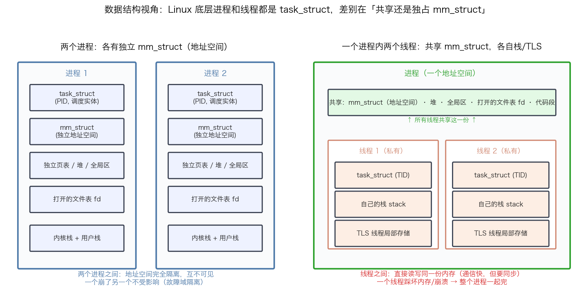
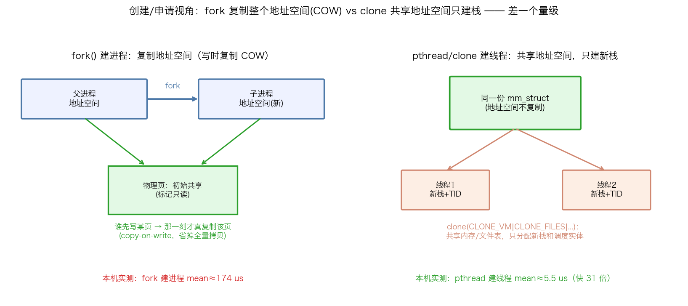
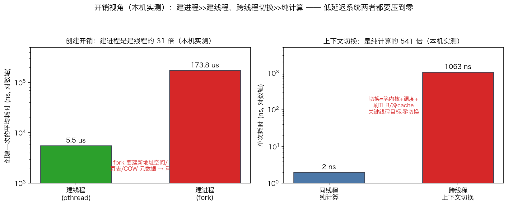

## 进程 vs 线程：从 task_struct 到隔离、通信与开销的全维对比

> 阶段 O1 · Linux 系统编程地基 ｜ 难度 🟡 进阶 ｜ 档位 C·研究员（全员必过的地基题）
> 出处级别：进程/线程/`fork`/`clone`/`task_struct`/`mm_struct`/COW 机制由 Linux 内核文档与 man7 手册页一手定义；创建开销与上下文切换延迟为**本机实测**（`scripts/bench_proc_thread.cpp`、`scripts/bench_ctxsw.cpp`，Apple Silicon）。**Linux 特有的「进程线程都是 task_struct」为内核实现事实；本机为 macOS/ARM64，`fork`/`pthread` 语义通用，绝对数值随平台浮动，已诚实标注。**
> **一句话定位**：这是量化 OS 面试几乎必问的开场题，也是系统设计的第一个决策点——**行情/策略/下单该分进程还是分线程？** 本课从五个维度把二者拆开对比，每个维度都落到量化系统的实际取舍。

---

### 一、先破一个误解：Linux 底层没有"线程"这种东西

很多人以为进程和线程是两种完全不同的内核对象。**在 Linux 里不是**——内核的调度单位统一叫 **`task_struct`**（任务）。所谓"进程"和"线程"，只是**在创建时（`clone` 系统调用）选择共享多少资源**的结果：

- 什么都不共享（复制一份地址空间）→ 你叫它**进程**。
- 共享地址空间、文件表等（只分自己的栈）→ 你叫它**线程**。

`fork()` 和 `pthread_create()` 底层都走 `clone()`，区别只在传给 `clone` 的**共享标志位**（`CLONE_VM | CLONE_FILES | CLONE_FS | ...`）。理解这一点，下面五个维度的差异就全部统一到"共享还是独占"这一根轴上了。

---

### 二、维度一 · 数据结构：共享还是独占 mm_struct

这是所有差异的根源。

| 内核结构 | 进程 | 线程 |
|---|---|---|
| **`task_struct`（调度实体）** | 各有一个（有独立 PID） | 各有一个（有独立 TID，同属一个 TGID/进程） |
| **`mm_struct`（地址空间描述符）** | **各有独立一份** | **共享同一份** |
| 页表 / 堆 / 全局区 / 代码段 | 各自独立 | 共享 |
| 打开的文件表（fd 表） | 各自独立 | 共享 |
| 栈 | 各自独立 | **各有自己的栈** |
| TLS（线程局部存储） | —— | 各有一份 |

**核心就一句：进程独占 `mm_struct`（各看各的地址空间），线程共享 `mm_struct`（同一个地址空间里各跑各的栈）。** 上面那张图左边两个进程各有一份完整的 `mm_struct`，右边一个进程里两个线程共用顶部那条绿色的共享区、只私有自己的栈和 TLS。

> 一个线程 = 「共享的地址空间」+「私有的栈 + TID + 寄存器上下文」。这就是为什么线程也叫 LWP（Light-Weight Process，轻量级进程）——它是"共享了大部分资源的 task"。

---

### 三、维度二 · 申请/创建：fork 复制地址空间 vs clone 只建栈

创建方式的差异，直接决定了开销的量级（下面维度五量化）。

- **`fork()` 建进程**：要给子进程一份**独立的地址空间**。但内核不傻——它用**写时复制（Copy-On-Write, COW）**：`fork` 瞬间父子**共享同一批物理页并标记只读**，谁先写某一页，那一刻才真正复制那一页。这省掉了全量拷贝，但仍要复制页表、建 `mm_struct`、设置 COW 元数据——**是重活**。
- **`pthread_create()` / `clone(CLONE_VM|...)` 建线程**：地址空间**根本不复制**，直接共享父进程的 `mm_struct`，内核只需分配一个**新栈**和一个新的调度实体（`task_struct`）。**是轻活**。

> COW 是个关键考点：`fork` 之后马上 `exec` 别的程序，是常见模式——这时候刚 COW 的页立刻被丢弃，所以内核干脆用 COW 避免"复制了又马上扔"的浪费。但注意：**`fork` 一个占用大量内存、多线程的进程仍有坑**（页表复制成本、fork 只复制调用线程、锁状态可能不一致），HFT 里通常在**启动早期**就把进程结构定好，运行期不 `fork`。

---

### 四、维度三 · 权限/隔离：独立地址空间 vs 一崩全崩

这是决定"分进程还是分线程"最重要的一条——**故障域（fault domain）隔离**。

| | 进程 | 线程 |
|---|---|---|
| **地址空间隔离** | 完全隔离，A 进程访问不到 B 进程的内存 | 无隔离，任一线程能读写整个进程的内存 |
| **故障传播** | 一个进程崩溃/段错误，**其他进程不受影响** | 一个线程踩坏内存/触发段错误，**整个进程一起挂** |
| **安全边界** | 内核强制的硬边界（MMU + 页表权限） | 无硬边界，全凭程序员自律 + 同步 |

**量化落点**：交易系统常把**行情接收、策略计算、下单执行拆成独立进程**，正是为了故障域隔离——策略进程如果因为一个 bug 崩了，**不能把正在管理真实仓位/挂单的下单进程也带崩**。这个可靠性收益，往往值得多付一点跨进程通信的成本。反过来，一个策略内部的多个并行计算单元（它们本来就要频繁共享大量中间数据），用线程更合适。

---

### 五、维度四 · 数据通信：共享内存 vs 直接共享变量

"要不要隔离"和"通信有多方便"是同一枚硬币的两面——**隔离得越彻底，通信就越费劲**。

| | 进程间通信（IPC） | 线程间通信 |
|---|---|---|
| **手段** | 管道 pipe、消息队列、信号、socket、**共享内存(shm)** | **直接读写共享变量/堆对象** |
| **是否跨地址空间** | 是，要内核参与或显式建立共享内存 | 否，本来就在同一地址空间 |
| **默认代价** | 较高（多数 IPC 要陷内核、拷贝数据） | 极低（就是一次内存访问） |
| **同步需求** | 共享内存仍需自己同步 | **必须同步**（否则数据竞争） |

**量化落点**：线程间通信快，但代价是"必须正确同步"——这就接上了 C++ 并发那条主线（C4 memory_order、SPSC 无锁队列、false sharing）。而跨进程要低延迟通信，HFT 的标准做法是**共享内存 `/dev/shm` + 无锁队列**：把行情/订单结构直接放在 `mmap` 出来的共享内存段里，进程 A 写、进程 B 读，**零拷贝、不陷内核**，用无锁环形队列同步——**既拿到了进程的隔离，又拿到了接近线程的通信速度**。这是"分进程"方案能兼顾可靠性与低延迟的关键技巧（呼应 O1-5 mmap/共享内存、C4-21 SPSC）。

---

### 六、维度五 · 开销：本机实测，两个数量级差距

前面全是定性，这一维用**本机实测**说话。我写了两个 benchmark：一个测**创建开销**（`fork` 建进程 vs `pthread_create` 建线程各 2000 次），一个测**上下文切换开销**（两线程 pipe 乒乓，每轮强制 2 次切换）。

| 开销项 | 实测值 | 对比 |
|---|---|---|
| 建线程（pthread_create） | mean ≈ **5.5 µs** | 基准 |
| 建进程（fork） | mean ≈ **174 µs** | **是建线程的 31 倍** |
| 同线程一次纯计算 | ≈ **2 ns** | 基准 |
| 跨线程一次上下文切换 | ≈ **1063 ns** | **是纯计算的 541 倍** |

两个结论都很硬：
1. **创建：建进程比建线程贵一个量级（31 倍）**——因为 `fork` 要复制页表、建 `mm_struct`、设 COW，`clone` 建线程只建个栈。
2. **切换：上下文切换比纯计算贵近三个量级（541 倍）**——切换要陷内核、跑调度器，还可能刷 TLB、丢冷 cache（**切进程还要换 CR3 → 整个 TLB 失效**，比切同进程内的线程更贵，呼应换页课第九节）。

**量化落点**：这正是低延迟系统"**关键线程绑核 + 忙轮询、追求零上下文切换**"的数据依据（O2 绑核、O4 busy-polling）。一次 1µs 级的切换，对 tick-to-trade 目标几微秒的系统就是可观的抖动。所以交易核上只跑一个钉死的忙轮询线程，把切换从路径上彻底消灭。

> **注意平台差异**：上面是 macOS/ARM64 的绝对值，Linux x86 服务器的数值会不同（通常上下文切换在 1–3µs 量级、`fork` 因内存规模而异）。但**"建进程 >> 建线程、切换 >> 纯计算"的量级关系是普适的**，这才是要记住的结论，不是具体数字。

---

### 七、一张总表 + 决策原则

| 维度 | 进程 | 线程 | 量化取舍 |
|---|---|---|---|
| **数据结构** | 独占 `mm_struct` | 共享 `mm_struct`，私有栈/TLS | —— |
| **创建** | fork 复制地址空间(COW)，重（≈174µs） | clone 只建栈，轻（≈5.5µs） | 都在启动期建好，运行期不动 |
| **权限/隔离** | 地址空间硬隔离，一崩不传染 | 无隔离，一崩全崩 | 关键角色分进程隔离故障域 |
| **数据通信** | IPC / 共享内存，要跨地址空间 | 直接共享变量，快但要同步 | 分进程 + `/dev/shm` 无锁队列兼得 |
| **开销** | 创建重、切换换页表刷 TLB（更贵） | 创建轻、切换省 | 关键线程绑核追求零切换 |

**决策原则（量化视角）**：
- **要故障隔离、要可靠性** → 分进程（行情/策略/下单分离），用**共享内存 + 无锁队列**补回通信速度。
- **要频繁共享大量数据、要低通信开销** → 同进程内多线程，用**无锁队列 + cache 对齐**处理同步。
- **两者都要压到零**：关键线程绑核（O2）消灭切换，启动期建好结构、运行期不 fork 不频繁创建线程。

---

### 八、和其他知识点的关系

- **上游/本阶段**：本课是 O1 系统编程地基的开篇；O1-5 mmap/共享内存（跨进程零拷贝通信的落地）。
- **配套**：C4 并发全家桶（线程共享内存 → 必须 memory_order/无锁队列/false sharing 处理同步）、O2-7 上下文切换开销（本课开销维度的深化）、O2-8/9 绑核隔离（消灭切换）。
- **呼应**：O3《虚拟内存·页表·换页》（进程切换换 CR3 刷 TLB 是切换更贵的机制根源）、O4 busy-polling（用忙轮询换零切换）。

---

### 证据清单

| 声明 | 来源 | 级别 |
|---|---|---|
| 建进程 fork mean≈174µs / 建线程 pthread mean≈5.5µs / 建进程是建线程 31 倍 | 本机 benchmark 实测（`scripts/bench_proc_thread.cpp`，2000 次，Apple Silicon） | 一手（本机实测） |
| 上下文切换≈1063ns / 纯计算≈2ns / 切换是纯计算 541 倍 | 本机 benchmark 实测（`scripts/bench_ctxsw.cpp`，pipe 乒乓，Apple Silicon） | 一手（本机实测） |
| Linux 进程/线程底层都是 task_struct，clone 标志位决定共享；进程独占、线程共享 mm_struct | Linux `clone(2)` man7 手册 + 内核进程管理文档 | 一手（手册页+内核文档） |
| fork 写时复制 COW：父子初始共享物理页标记只读，先写才复制该页 | Linux `fork(2)` man7 手册 + 内核内存管理文档 | 一手（手册页+内核文档） |
| 线程共享地址空间→一线程崩全进程崩；进程地址空间硬隔离（MMU+页表） | Linux 进程管理文档 + 体系结构公认定义 | 一手（内核文档） |
| 跨进程共享内存 /dev/shm + 无锁队列实现零拷贝低延迟通信 | Linux `shm_overview(7)` / `mmap(2)` man7 + 低延迟领域共识 | 一手（手册页）+ 领域共识 |
| **本机为 macOS/ARM64，绝对数值随平台浮动**；量级关系普适，Linux x86 数值不同 | 平台差异声明 | 诚实标注 |
| 「C 档全员必过」的档位标定 | 领域经验判断，非真实 JD 原文 | 经验归纳 |
