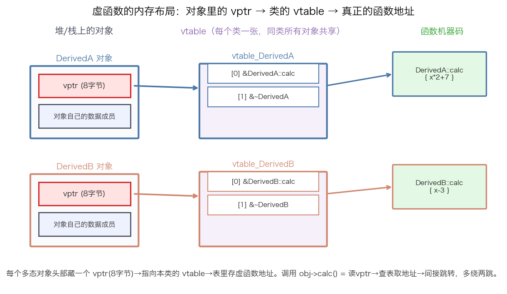
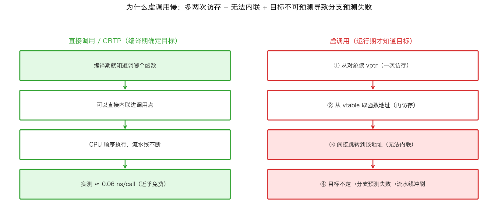
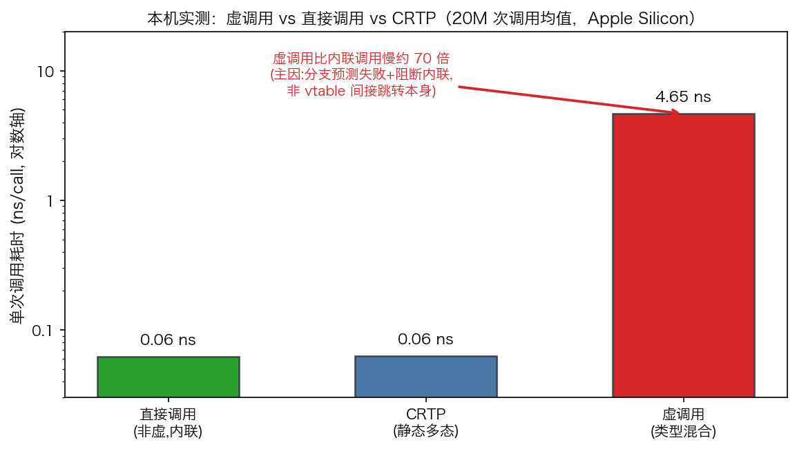

## 虚函数与 vtable：虚调用开销、去虚化与量化取舍

> 阶段 C3 · 对象模型与底层 ｜ 难度 🟡→🔴 进阶到硬核（面经常考）｜ 档位 B·HPC平台 / A·低延迟核心（热路径去虚化）
> 出处级别：vtable/vptr 内存布局、虚调用机制为 C++ 对象模型公认硬知识（Itanium C++ ABI 定义 vtable 布局）+ cppreference；虚调用 vs 直接调用 vs CRTP 的开销为**本机实测**（`scripts/bench_vtable.cpp`，Apple Silicon，20M 次调用）。**具体 ns 值随 CPU/编译器浮动，量级关系普适，已诚实标注。**
> **一句话定位**：这是 C++ 面试挖底层深度的高频题——"虚函数怎么实现的"、"虚调用为什么慢"、"怎么去虚化"。本课从内存布局讲到 CPU 执行路径，用本机实测量化开销，落到量化热路径的取舍。

---

### 一、虚函数的实现：vptr + vtable 两级间接

C++ 的运行时多态（`Base* p = new Derived; p->calc()` 调到 Derived 的版本）不是魔法，是**两级指针间接**实现的：



- **vtable（虚函数表）**：**每个多态类一张**（不是每个对象一张），是一个函数指针数组，按声明顺序存着这个类所有虚函数的地址。`DerivedA` 有自己的 vtable、`DerivedB` 有自己的，各表 `[0]` 都放各自的 `calc` 地址。
- **vptr（虚表指针）**：**每个多态对象头部**藏一个隐藏指针（8 字节），指向它所属类的 vtable。构造时由编译器自动设好。
- **调用 `p->calc()` 的实际步骤**：① 从对象读出 vptr → ② 从 vtable 对应槽位取出函数地址 → ③ 间接跳转过去。**编译期不知道调哪个，运行期才靠 vptr 确定。**

> **两个直接后果，都是面试考点**：
> 1. **每个多态对象都多占 8 字节**（vptr）。实测 `sizeof` 一个只有虚函数的对象 = 8 字节（就是那个 vptr），而无虚函数的同等类只有 1 字节。对海量小对象（订单、行情 tick），这 8 字节 × N 是实打实的内存和 cache 开销。
> 2. **有虚函数的类不再是 POD**，不能简单 `memcpy`/`reinterpret_cast` 按二进制布局映射——这跟量化"按协议布局直接映射行情结构体"（C3-11）是冲突的，所以**行情结构体通常不用虚函数**。

---

### 二、虚调用为什么慢：三个真实原因

"虚调用慢"是常识，但**慢在哪**是区分深度的地方。拆成三层：



1. **多两次访存**：读 vptr（一次）+ 读 vtable 槽位（一次），才拿到函数地址。这两次访存如果 cache 命中其实很便宜，不是主因。
2. **无法内联**（往往是最大的损失）：编译期不知道跳到哪，就**没法把函数体内联进调用点**。内联不只是省一次 call，更是让编译器能跨调用做常量传播、循环优化、向量化——**虚调用把这些优化全堵死了**。一个本可以内联成 1 条指令的 `calc`，变成一次真实的函数调用。
3. **分支预测失败**（类型混合时的致命伤）：间接跳转的目标地址由数据（vptr）决定。如果连续调用的对象**类型来回变**（一会 DerivedA 一会 DerivedB），CPU 的间接分支预测器猜不中，**每次预测失败都要冲刷流水线**（十几个周期）。如果类型稳定（一直是同一个），预测器能学会，这项开销就小很多。

---

### 三、本机实测：到底慢多少

用 `bench_vtable.cpp` 实测：20M 次调用，对比虚调用（类型随机混合）、直接调用（非虚可内联）、CRTP（静态多态）：



| 调用方式 | 实测 | 说明 |
|---|---|---|
| 直接调用（非虚，内联） | **≈ 0.06 ns/call** | 内联后近乎免费（不是 0，是编译器把它优化到极小） |
| CRTP 静态多态 | **≈ 0.06 ns/call** | 和直接调用同级——这就是 CRTP 的意义：多态却零开销 |
| 虚调用（类型混合） | **≈ 4.65 ns/call** | 比内联慢 **约 70 倍** |

**必须诚实拆解这个"70 倍"**（否则会误导）：这 70 倍**绝大部分来自"无法内联"+"类型混合的分支预测失败"，不是 vtable 间接跳转指令本身**。如果我把测试改成类型稳定（一直调同一个派生类）、且函数体足够大以至于内联收益不明显，差距会缩小到几倍甚至可忽略。**所以正确的结论不是"虚函数固有 70 倍开销"，而是"在热路径上、小函数、类型混杂时，虚调用的间接性会摧毁内联和分支预测，代价可以很大"。**

> 量化落点：交易热路径上一个每 tick 调用几百万次的小分派函数，如果用虚函数且类型混杂，这 4~5ns × 调用次数就是可观的延迟。这就是为什么低延迟代码在热路径追求**去虚化**。

---

### 四、怎么去虚化：四条路

既然虚调用的代价主要来自"编译期不知道目标"，**去虚化的核心就是把'调哪个'的决定挪到编译期**：

| 手段 | 原理 | 适用 |
|---|---|---|
| **CRTP 静态多态** | 用模板在编译期绑定派生类型（`Base<Derived>`），调用直接内联 | 编译期就知道具体类型的框架（策略/handler） |
| **`std::variant` + `std::visit`** | 用闭合类型集合替代开放继承，编译期生成分派 | 类型种类固定且已知 |
| **模板 + 函数对象** | 直接传具体类型的 functor，无虚调用 | 回调、比较器（对比 `std::function` 的堆分配+虚调用） |
| **`final` 关键字** | 给类/虚函数加 `final`，编译器可能对确定类型**去虚化并内联** | 继承树的叶子类 |

**CRTP 是量化最常用的去虚化手法**（大纲 C3-13）——策略框架、事件 handler 用 CRTP，既有"多态"的代码组织，又是编译期绑定、零虚调用开销（上面实测 CRTP 和直接调用同为 0.06ns 就是证据）。

```cpp
// 虚函数版（运行期分派，热路径慢）
struct Strategy { virtual void on_tick(const Tick&) = 0; };

// CRTP 版（编译期分派，可内联，零虚调用开销）
template <class D>
struct StrategyBase {
    void on_tick(const Tick& t) { static_cast<D*>(this)->on_tick_impl(t); }
};
struct MyStrategy : StrategyBase<MyStrategy> {
    void on_tick_impl(const Tick& t) { /* ... */ }  // 会被内联
};
```

---

### 五、什么时候虚函数完全没问题

**别矫枉过正**——不是所有虚函数都要消灭。虚调用该留的场景：
- **不在热路径**：配置加载、启动初始化、日志、控制面——这些每秒调用几次的地方，4ns 完全无所谓，用虚函数换来的可扩展性/可读性更值。
- **类型稳定的调用点**：如果一个调用点长期只面对一种派生类型，CPU 分支预测器会学会，且 `final` 可能让编译器去虚化。
- **调用开销相对函数体可忽略**：如果 `calc` 本身要跑 1µs，那 4ns 的分派开销占比 0.4%，不值得为它上 CRTP 的模板复杂度。

**判断原则**：**先测再优化**。用 perf 找到真正的热点，只在"每 tick 百万次调用的小分派函数"这种地方去虚化，不要为了消灭虚函数把整个代码库 CRTP 化——那会带来编译期膨胀和可读性灾难。

---

### 六、和其他知识点的关系

- **上游**：C3-11 对象内存布局（vptr 是对象布局的一部分，破坏 POD 性）、C3-13 CRTP 静态多态（本课去虚化的主力）。
- **配套**：C1-3 `std::function` 堆分配陷阱（`std::function` = 类型擦除，也有间接调用开销，热路径同样避）、C5-25 zero-cost abstraction（CRTP 是零成本抽象的典范）、C5-26 内联与分支预测（虚调用堵死内联 + 间接分支预测失败是本课核心）。
- **呼应**：C6-34 Godbolt（去 Compiler Explorer 看虚调用 vs CRTP 生成的汇编差异，眼见为实）、C5-31 延迟测量（本课 benchmark 方法论）。

---

### 证据清单

| 声明 | 来源 | 级别 |
|---|---|---|
| 虚调用 4.65ns / 直接调用 0.06ns / CRTP 0.06ns；虚调用比内联慢约 70 倍 | 本机 benchmark 实测（`scripts/bench_vtable.cpp`，20M 次，Apple Silicon） | 一手（本机实测） |
| 含虚函数对象 sizeof=8B(vptr) / 无虚函数同类=1B | 本机实测（同脚本 sizeof 输出） | 一手（本机实测） |
| vtable 每类一张、vptr 每对象一个、虚调用=读vptr→查表→间接跳转 | Itanium C++ ABI（vtable 布局标准）+ cppreference | 一手（ABI 规范+标准参考） |
| 虚调用慢的三主因：多两次访存 / 无法内联 / 类型混合分支预测失败 | C++ 对象模型 + 体系结构公认知识（间接分支预测、流水线冲刷） | 一手（体系结构公认） |
| CRTP/variant/final 去虚化把分派移到编译期 | cppreference（CRTP 惯用法、final、std::variant/visit） | 一手（标准参考） |
| **"70 倍"主因是无法内联+分支预测失败，非 vtable 间接跳转本身** | 对实测结果的诚实归因（改类型稳定/大函数体差距会缩小） | 诚实标注 |
| 「B/A 档热路径才深究」的档位标定 | 领域经验判断，非真实 JD 原文 | 经验归纳 |
