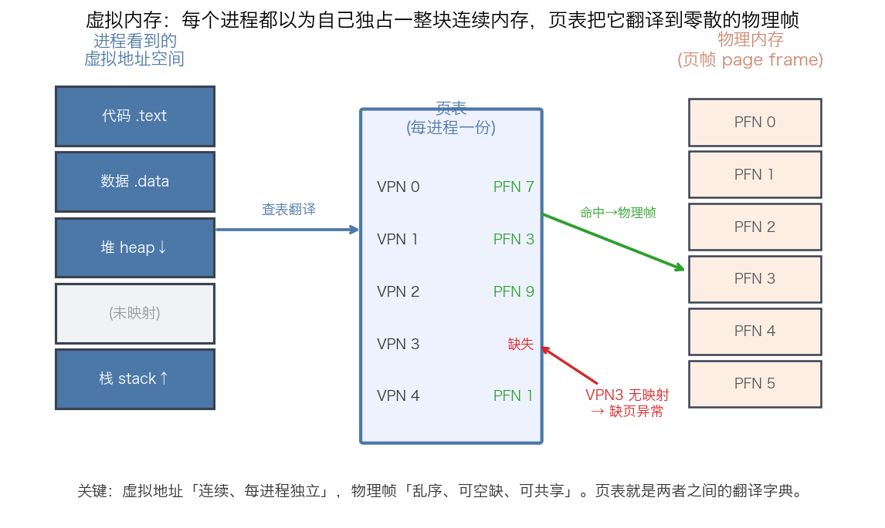
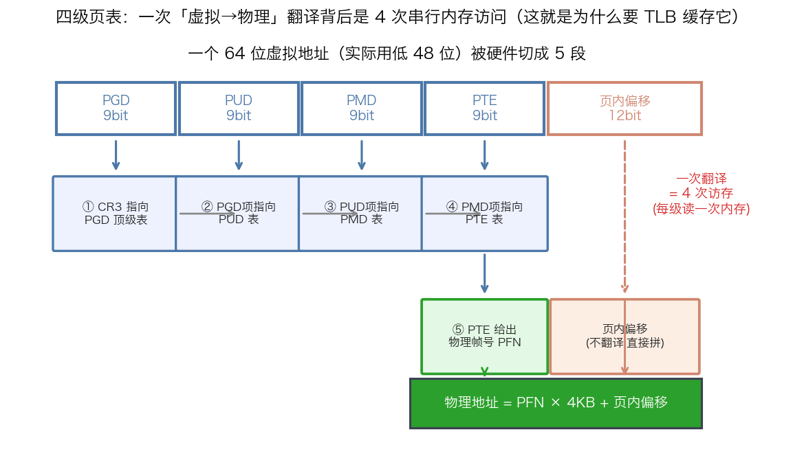
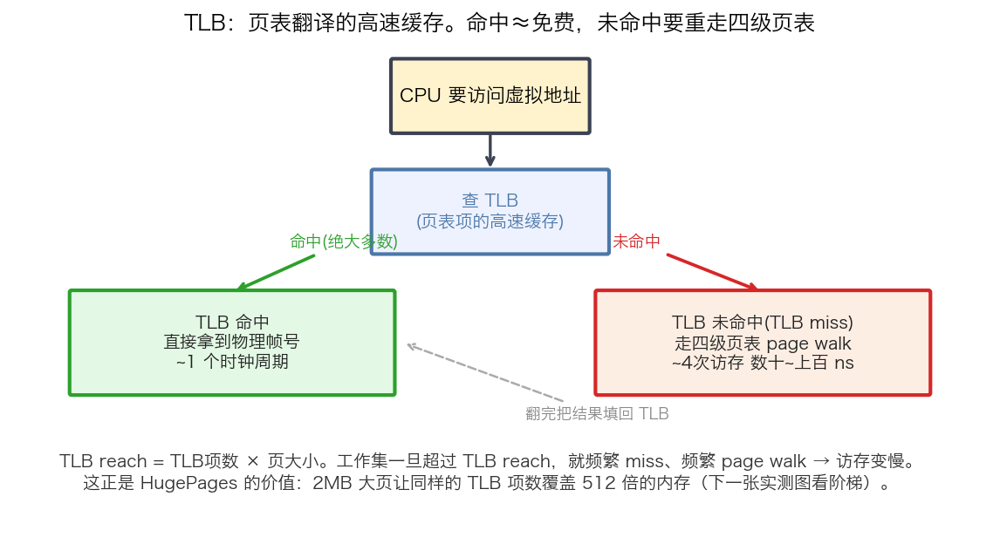
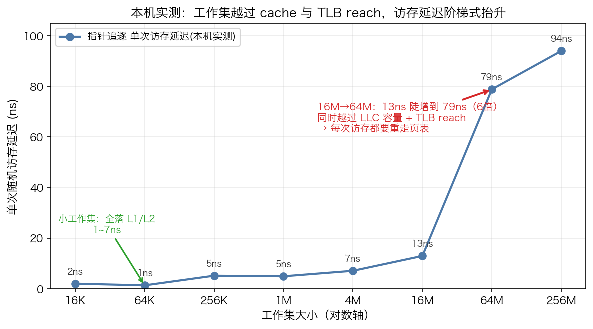
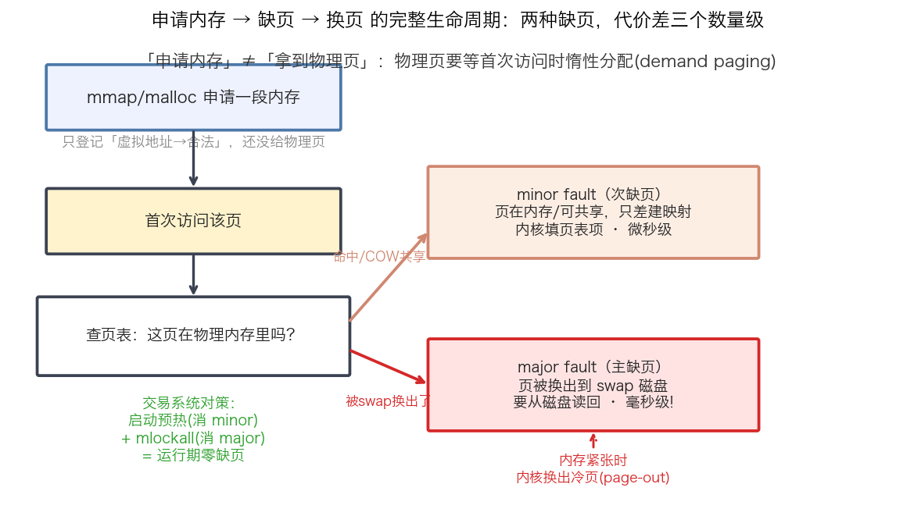
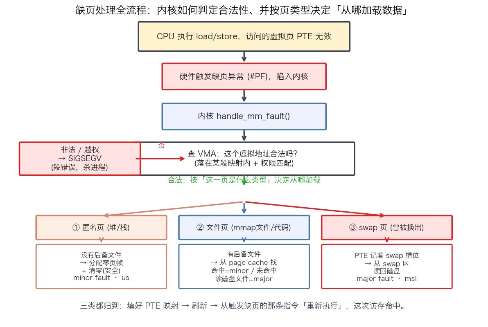
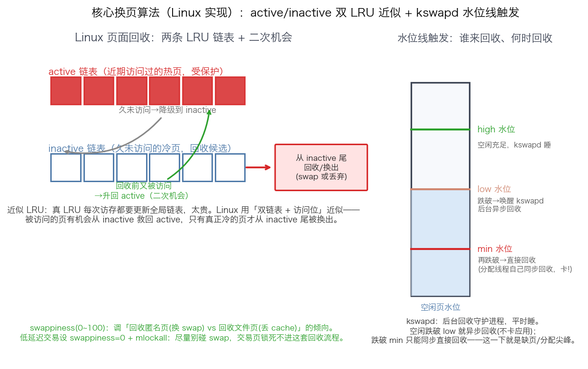

## 虚拟内存·页·页表·缺页与换页：地址翻译的全链路机制

> 阶段 O3 · 内存管理 ｜ 难度 🟡→🔴 进阶到硬核 ｜ 档位 B·HPC平台（机制理解）/ A·低延迟核心（抖动溯源）
> 出处级别：虚拟内存/分页/四级页表/缺页/换页机制由 Intel SDM、Linux 内核内存管理文档、man7 手册页一手定义；访存延迟阶梯为**本机实测**（Apple Silicon，指针追逐 benchmark，复现脚本 `scripts/bench_tlb.cpp`）。**页表级数、页大小 4KB/48 位地址为 x86-64 语义；本机为 ARM64，机制同构但具体位宽/页大小可不同，已诚实标注。**
> **一句话定位**：这是内存管理阶段的**机制地基**——`new`/`mmap` 到底做了什么、CPU 每次访存背后藏着多少翻译开销、为什么缺页是微秒到毫秒的尖峰。姊妹课《内存预热与锁页》讲「怎么治」，本课讲「机制本身」，两篇互补。

---

### 一、为什么要有虚拟内存：进程以为自己独占内存

现代 OS 里，你的程序访问的每一个地址都是**虚拟地址**，不是真实的物理内存地址。每个进程都以为自己独占一整块从 0 开始、连续的地址空间——代码段、数据段、堆、栈各就各位。但物理内存（RAM）是所有进程共享的、零散的、有限的。**页表**就是把「进程眼里连续的虚拟地址」翻译成「物理内存里零散的真实位置」的那本字典。

- **虚拟地址空间**：连续、每进程独立、可以有大片"未映射"的空洞（图中灰色块）。
- **物理内存**：以固定大小的**页帧（page frame）**为单位管理，编号乱序、可空缺、可被多进程共享（比如同一份 .so 库、写时复制的 fork 页）。
- **页表**：每进程一份，记录「虚拟页号 VPN → 物理帧号 PFN」的映射。图中 VPN3 标"缺失"，就是尚未建立映射——一访问它就触发**缺页异常**（后面第四节讲）。

为什么量化要懂这个：**虚拟内存不是免费的抽象**。每一次访存，硬件都要先做一次"虚拟→物理"的翻译，这个翻译本身有开销、有缓存（TLB）、会失效、会缺页。低延迟系统的很多尖峰，根子就在这条翻译链路上。

> **页（page）是内存管理的基本单位**：虚拟地址空间和物理内存都被切成固定大小的页（x86-64 默认 4KB）。分配、映射、换出、保护，全部以页为粒度。理解"页"是理解后面一切的前提——**内存不是按字节管理的，是按页管理的**。

---

### 二、页表的翻译：一次访存背后是 4 次访存

一个虚拟地址怎么变成物理地址？x86-64 用**四级页表**（PGD→PUD→PMD→PTE），硬件把地址的高位切成 4 段索引，逐级查表：

- 64 位虚拟地址实际用低 48 位，被切成 **9+9+9+9+12**：前四个 9bit 分别索引四级页表，最后 12bit 是**页内偏移**（$2^{12}=4096=$ 4KB，正好一页）。
- **CR3 寄存器**指向顶级页表（PGD）的物理地址（切进程时换 CR3，这也是为什么进程切换要刷 TLB）。
- 逐级：CR3→PGD 项→PUD 项→PMD 项→PTE，**PTE 里存着最终的物理帧号 PFN**。
- 物理地址 $=$ PFN $\times$ 4KB $+$ 页内偏移。偏移不翻译，直接拼上。

**关键代价**：一次地址翻译要**串行读 4 次内存**（每级页表都在内存里）。也就是说，你程序里一条 `load` 指令，最坏情况背后是 4 次访存翻译 + 1 次真正的数据访存 = 5 次访存。这显然不可接受——所以有了 TLB。

> 为什么是"四级"而不是一级：一级页表要覆盖 48 位地址空间需要巨大的连续表（$2^{36}$ 项），根本放不下。多级页表是**稀疏**的——只为实际用到的地址范围分配下级表，没用到的高级项直接空着。用"多一点翻译访存"换"页表本身省内存"。

---

### 三、TLB：页表翻译的高速缓存

既然每次翻译要走 4 次页表访存太贵，CPU 就用一个专门的高速缓存 **TLB（Translation Lookaside Buffer）** 把"最近翻译过的 VPN→PFN"缓存起来：

- **TLB 命中**：直接拿到物理帧号，约 1 个时钟周期，几乎免费。绝大多数访存都命中。
- **TLB 未命中（TLB miss）**：要重走四级页表 page walk，约 4 次访存、数十到上百 ns。
- 翻完把结果填回 TLB，供下次复用。

**TLB reach（TLB 覆盖范围）= TLB 项数 × 页大小**。这是个关键概念：TLB 项数是固定的（几百到上千项），页 4KB 的话，TLB reach 也就几 MB。**工作集一旦超过 TLB reach，就频繁 TLB miss、频繁 page walk，访存实测变慢**——这不是玄学，下一节用本机实测把这条阶梯量出来。

这也直接解释了 **HugePages 的价值**（姊妹课细讲）：2MB 大页让**同样的 TLB 项数覆盖 512 倍的内存**（2MB/4KB），TLB reach 从几 MB 跳到几 GB，大数据集的 TLB miss 断崖式下降。

---

### 四、本机实测：访存延迟随工作集的阶梯

机制讲完，用真实数据建立敬畏心。我写了个**指针追逐（pointer chase）** benchmark：把 N 个 cache line 大小的节点连成一个随机置换的环，然后沿 `next` 指针一路跳 5000 万次。因为每次跳的地址依赖上一次的结果，CPU **无法预取、无法乱序**，测出的就是纯粹的"单次随机访存延迟"。工作集从 16KB 一路加到 256MB，看延迟怎么变（**本机真实数据**）：

| 工作集 | 单次访存延迟 | 落在哪 |
|---|---|---|
| 16KB–64KB | 1–2 ns | L1 cache |
| 256KB–4MB | 5–7 ns | L2 cache |
| 16MB | 13 ns | LLC 边缘 |
| **64MB** | **79 ns** | **越过 LLC + TLB reach** |
| 256MB | 94 ns | 主存 + 频繁 page walk |

**最刺眼的一跳：16MB→64MB，单次访存从 13ns 陡增到 79ns，6 倍。** 这一跳同时越过了两条线：LLC 容量（数据本身进不了 cache 了）和 **TLB reach**（页表项在 TLB 里装不下了，每次访存都要重走四级页表翻译）。两个效应叠加，把访存延迟从十几纳秒推到近百纳秒。

> **诚实标注**：这个实测把 cache miss 和 TLB miss 的效应**叠在一起**测（用户态无法干净隔离纯 TLB 开销），所以是"cache + TLB reach 共同作用"的阶梯，不是纯 TLB 曲线。但结论对量化足够有用：**工作集大小直接决定访存延迟量级，大数据结构（订单簿、大行情表）的随机访问会成倍变慢**——这正是 DOD 数据布局（C5-30 SoA、cache 友好）和 HugePages 要解决的问题。

---

### 五、申请内存 ≠ 拿到物理页：demand paging 与换页

最后一块，也是量化最该刻进 DNA 的一点：**`mmap`/`malloc` 申请内存时，内核并没有真的给你物理页**——它只是在页表里登记"这段虚拟地址合法"。**物理页要等你第一次访问那一页时，才由内核惰性分配**（demand paging，按需分页）。这个首次访问触发的就是**缺页异常（page fault）**：

缺页分两种，代价差三个数量级：

| 类型 | 触发条件 | 代价 |
|---|---|---|
| **minor fault（次缺页）** | 页在物理内存里（或可 COW 共享），只差建页表映射 | 微秒级（内核建映射） |
| **major fault（主缺页）** | 页已被换出到 **swap 磁盘**，要从磁盘读回 | **毫秒级**（磁盘 IO） |

**换页（swapping / paging）** 就是内存紧张时，内核把"冷"页写到磁盘 swap 区腾出物理内存（page-out），下次访问再读回（page-in，触发 major fault）。对普通程序这是内存不够时的救命机制；对交易系统，**一次 major fault 的毫秒级尖峰 = 这一单彻底废了**。

到这里还只讲了"缺页贵、换页存在"。但两个核心问题没答：**缺页那一刻内核具体怎么把数据加载进来？内存不够要换出时，凭什么决定换哪一页？** 下面两节把这两台机器拆开。

---

### 六、缺页时内核如何加载数据：handle_mm_fault 全流程

缺页异常发生后，控制权陷入内核的 `handle_mm_fault()`。它不是"随便找块内存给你"，而是一套严谨的判定 + 分类加载流程：

**第一步：合法性判定。** 内核先查这个虚拟地址落在哪个 **VMA（虚拟内存区域，vm_area_struct）** 里、权限对不对（写一个只读页也算越权）。**不合法或越权 → 直接 `SIGSEGV`（段错误）杀进程**——这就是野指针访问崩溃的底层来源。

**第二步：按"这一页是什么类型"决定从哪加载数据。** 合法的缺页分三类，加载路径完全不同：

| 页类型 | 有无后备存储 | 加载动作 | 代价 |
|---|---|---|---|
| **① 匿名页**（堆、栈、`MAP_ANONYMOUS`） | 无后备文件 | 分配一个物理页帧，**清零**（防信息泄漏），填 PTE | minor fault，微秒级 |
| **② 文件页**（`mmap` 文件、代码段、.so） | 有后备文件 | 先查 **page cache**：命中直接建映射（minor）；未命中**从磁盘文件读**该页（major） | minor 或 major |
| **③ swap 页**（曾被换出的匿名页） | swap 区 | PTE 里存着 swap 槽位号，**从 swap 区读回磁盘**该页 | major fault，毫秒级 |

**第三步：建映射 + 重执行。** 三类都殊途同归——把物理帧号填进 PTE 建立映射、刷新，然后**从最初触发缺页的那条指令重新执行**（re-execute），这次访存 TLB/页表命中，程序无感知地继续。

> **一个关键区分**：匿名页 vs 文件页决定"数据从哪来"。你 `new` 出来的对象、栈变量都是匿名页（首次访问只需清零，minor）；你 `mmap` 一个行情文件、程序代码本身是文件页（从 page cache 或磁盘读）；被 swap 出去过的页是 swap 页（从 swap 分区读回，最贵）。**交易系统预热时 touch 匿名页，走的就是①这条最便宜的 minor 路径，把它在启动期一次付清。**

---

### 七、核心换页算法：内核凭什么决定"换出哪一页"

上一节是"缺的页怎么加载进来"，这一节是反方向——**物理内存不够时，内核凭什么算法挑一页换出去**。这就是页面置换算法（page replacement）。

**为什么不用理想 LRU？** 理论最优近似是 LRU（换出最久未使用的页），但真 LRU 要求**每次访存都更新一个全局有序链表**——访存是纳秒级、每秒几十亿次的操作，维护全局链表的开销高到不可接受。所以所有真实内核都用 **LRU 的近似**。

**Linux 的做法：active/inactive 双 LRU 链表 + 二次机会。**

- 每个内存 zone 维护**两条链表**：`active`（近期访问过的热页，受保护）和 `inactive`（久未访问的冷页，回收候选）。
- **降级**：active 链表里久未访问的页，逐渐从尾部**降级到 inactive**。
- **二次机会**：inactive 里的页在**被回收之前又被访问**，就**升回 active**——这就是 "second chance"，避免刚要被换出的热页被误伤。
- **回收**：只有真正冷的页，才从 **inactive 链表尾部**被回收/换出。这个"访问位 + 双链表升降级"的机制，就是不用维护全局有序链表、却能近似 LRU 的工程手法（对应经典 **Clock/二次机会算法**思想）。

**谁来触发回收、何时触发？靠内存水位线（watermark）：**

| 水位 | 空闲页状态 | 谁回收 | 对延迟的影响 |
|---|---|---|---|
| **high** | 空闲充足 | `kswapd` 睡觉，不回收 | 无 |
| **low** | 跌破 low | **唤醒 `kswapd` 后台异步回收** | 应用基本不卡（异步） |
| **min** | 再跌破 min | **分配线程被迫同步"直接回收"**（direct reclaim） | **当场卡住申请内存的线程 → 分配尖峰** |

`kswapd` 是每个 NUMA node 一个的后台回收守护进程，平时睡，空闲页跌破 low 水位就被唤醒、异步把水位拉回 high。**最怕的是跌破 min 触发 direct reclaim**——申请内存的线程自己被拉去做回收，这一下就是不可控的延迟尖峰，是延迟溯源要抓的凶手之一。

**`swappiness`（0~100）** 调的是回收倾向：值越高越倾向**回收匿名页（换 swap，慢）**，越低越倾向**回收文件页（丢 page cache，快，可重新从文件读）**。

> **量化落点**：低延迟交易系统的策略是**尽量让交易进程根本不进这套回收流程**——`swappiness=0`（尽量别把匿名页换 swap）+ `mlockall` 锁页（交易页直接被钉死、免疫回收）。再叠加 `isolcpus` 把交易核隔离、大页减少页表压力，让 kswapd/direct reclaim 的抖动打不到交易线程上。**懂这套换页算法，才知道 `swappiness=0 + mlockall` 到底在关掉哪台机器。**

---

### 八、量化对策：把整条链路的抖动清零

前七节拆完机制，收敛到交易系统的实操。缺页/换页/页表翻译这条链上的每一个开销点，都有对应的治理手段——这也是姊妹课《内存预热与锁页》的完整配方：

1. **启动期预热**：主动 touch 全部内存，把 minor fault（走缺页全流程①匿名页清零路径）的代价提前在启动期付清 → 运行期无 minor fault。
2. **`mlockall` 锁页 + `swappiness=0`**：锁死交易页、免疫页面回收 → 根除 major fault 和 direct reclaim 抖动。
3. **显式 HugePages**：2MB 大页把 TLB reach 从几 MB 抬到几 GB，根治第三/四节测出的大工作集 TLB miss；但**关闭 THP**避免其后台合并引入抖动。
4. 合起来 = **运行期零缺页、低 TLB miss、不触发回收**。本课讲清了"为什么"（机制），姊妹课给出了"怎么做"（治理）。

> **面试串讲**：被问"从 `mmap` 到真正用上这块内存，中间发生了什么"，串这条完整链：**mmap 只登记 VMA（虚拟地址合法）→ 首次访问触发缺页 → `handle_mm_fault` 查 VMA 合法性（非法即 SIGSEGV）→ 按页类型加载（匿名页清零 / 文件页读 page cache 或磁盘 / swap 页读 swap 区）→ 分配物理帧、填 PTE、重执行指令 → CPU 走 page walk 填 TLB → 之后 TLB 命中。内存紧张时内核用 active/inactive 双 LRU + kswapd 水位线回收，跌破 min 触发 direct reclaim 尖峰。交易系统靠启动预热 + mlockall + swappiness=0 + HugePages 把整条链的抖动清零。**

---

### 九、和其他知识点的关系

- **下游（治理落地）**：O3-14《内存预热与锁页》（本课机制的对策）、O3-13 HugePages（治 TLB reach 不足）、O3-16 mlockall（治 major fault）。
- **配套**：C5-28 热路径零分配 / 内存池（避免运行期 malloc 触发缺页）、C5-30 DOD/SoA（cache 友好布局，缓解本课测出的大工作集访存惩罚）、O3-15 cache line 对齐。
- **呼应**：O2-7 上下文切换（切进程换 CR3 → 刷 TLB → 冷 TLB 抬 tail latency）、O7-41 延迟尖峰溯源（缺页是三大凶手之一，本课是其机制根源）。

---

### 证据清单

| 声明 | 来源 | 级别 |
|---|---|---|
| 访存延迟阶梯：16MB=13ns / 64MB=79ns（6倍跳）/ 256MB=94ns；小工作集 1–7ns | 本机 benchmark 实测（`scripts/bench_tlb.cpp`，指针追逐，Apple Silicon） | 一手（本机实测） |
| 四级页表 PGD/PUD/PMD/PTE、48 位地址切 9+9+9+9+12、4KB 页、CR3 顶级表 | Intel SDM Vol.3《Paging》+ Linux 内核内存管理文档 | 一手（架构手册+内核文档） |
| TLB 缓存页表项、TLB miss 触发 page walk、TLB reach = 项数×页大小 | Intel SDM《Translation Lookaside Buffers》+ 体系结构公认定义 | 一手（架构手册） |
| demand paging 惰性分配：mmap 只登记，物理页首次访问才分配 | Linux 内核内存管理文档 + `mmap(2)` man7 手册 | 一手（内核文档+手册） |
| 缺页处理 handle_mm_fault：查 VMA 合法性→非法 SIGSEGV；按匿名页(清零)/文件页(page cache 或磁盘)/swap 页分类加载→填 PTE 重执行 | Linux 内核 `mm/memory.c` 缺页处理路径 + 内核内存管理文档 | 一手（内核文档/源码路径） |
| 页面回收 active/inactive 双 LRU 链表 + 二次机会近似 LRU；kswapd 后台回收 + high/low/min 水位线 + direct reclaim；swappiness 语义 | Linux 内核 `Documentation/admin-guide/mm/` + `vm.rst`（swappiness/watermark）+ mm/vmscan.c 机制 | 一手（内核文档） |
| minor fault（建映射，µs级）vs major fault（swap 磁盘IO，ms级） | Linux 内核缺页处理文档 | 一手（内核文档） |
| 换页/swap：内存紧张时换出冷页，swappiness 控制倾向 | Linux 内核 `Documentation/admin-guide/sysctl/vm.rst` | 一手（内核文档） |
| **本机为 ARM64，页表级数/页大小/地址位宽用 x86-64 语义讲解**；机制同构但细节可不同 | 平台差异声明 | 诚实标注 |
| cache miss 与 TLB miss 在本实测中叠加、未干净隔离纯 TLB | 测量方法局限声明 | 诚实标注 |
| 「B/A 档才深考」的档位标定 | 领域经验判断，非真实 JD 原文 | 经验归纳 |
